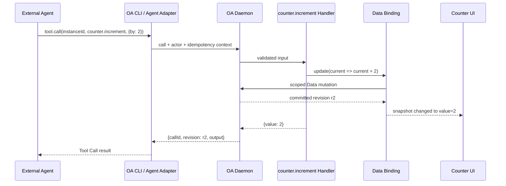

# OA SDK API 设计与使用说明

> 状态：架构设计草案，供 Review；当前仓库尚未实现本文 API。
>
> 适用对象：Artifact Package 作者。
>
> 目标版本：OA Runtime 的下一版 Package Contract。当前 `react-render/v0` 仍只向
> `<Render data={input} />` 传入初始数据，不具备本文的 `activate`、OA SDK、持久 Data Binding
> 或 Tool Registry。
>
> 关联文档：[`CONTEXT.md`](../../CONTEXT.md)、
> [`architecture.html`](../architecture.html) 与
> [`SDK Framework Data Adapter 调研`](../research/sdk-framework-data-adapters.md)。

## 1. 设计目标

OA SDK 是 OA Runtime 注入 Artifact Package 的、自动限定当前 Artifact Instance 的程序化
Interface。它让 Artifact UI 与 Tool Handler：

1. 通过同一份 Data Binding 读取、修改和订阅 Instance Data；
2. 向当前 Runtime 注册可被外部 Agent 发现和调用的 Artifact Tool；
3. 为 Selection、右键菜单和悬浮面板提供 Package 自定义的 Annotation Target Context；
4. 不接触 `instanceId`、Daemon transport、Git、`baseRevision` 或 `idempotencyKey`；
5. 在 Human、Agent 或其他 Actor 修改 Data 后，收敛到同一个权威 revision。

```text
Artifact Package
    |
    +-- activate({ oa, input })
    |       |
    |       +---------------------------> oa.tool.register(...)
    |       |                                      |
    |       |                                      v
    |       |                             External Agent 可发现
    |       |
    |       +---------------------------> oa.annotation.registerTargetProvider(...)
    |
    +-- Render({ oa, input }) ----------> oa.data.bind(...)
    |                                      |
    |                                      v
    |                               Artifact UI 同步
    |
    +-- useAnnotationTarget(...) -------> Selection · 右键 · 悬浮

               Tool Handler 与 Artifact UI
                          |
                          v
                  同一个 Data Binding
                          |
                          v
                 OA Daemon / Data Authority
```

OA SDK 不负责：

- 供外部 Agent 直接调用；外部 Agent 使用 OA CLI 或其他 Agent Adapter；
- 暴露任意宿主文件系统权限；
- 把 cursor、hover、selection、scroll 等 UI State 自动持久化；
- 让 Package 自己保存 Annotation、thread 或 status；
- 替 Package 定义领域 Tool；
- 让 Redux、CodeMirror、Yjs 等框架成为第二个 Data Authority。

## 2. Package 中如何获得 SDK

建议把 SDK 发布为独立 Package：

```json
{
  "peerDependencies": {
    "@open-artifacts/sdk": "^0.1.0",
    "react": "^19.0.0"
  }
}
```

`@open-artifacts/sdk` 提供类型与 framework-neutral Interface；
`@open-artifacts/sdk/react` 提供 React Data Binding 与 Annotation Target Hook。OA Runtime
提供真正的 scoped SDK implementation，并通过两个入口注入同一个 `oa`：

```ts
export interface ArtifactActivationContext<TInput> {
  input: Readonly<TInput>;
  oa: OaSdk;
}

export interface ArtifactRenderProps<TInput> {
  input: Readonly<TInput>;
  oa: OaSdk;
}
```

Package 不创建 SDK Client，不读取全局变量，也不传 `instanceId`：

```ts
export function activate({ oa, input }: ArtifactActivationContext<MyInput>) {
  // Runtime 启动时调用一次。
}

export default function Render({ oa, input }: ArtifactRenderProps<MyInput>) {
  // Runtime 渲染 Artifact UI。
}
```

Runtime 的启动顺序是：

```text
validate Artifact Input
        |
create Instance-scoped OA SDK
        |
call activate({ oa, input })
        |
publish registered Tools and Annotation Target Providers
        |
render <Render oa={oa} input={input} />
```

Runtime 停止或热重载时，会先调用 `activate` 返回的 disposer，再销毁 scoped SDK。

## 3. Quick Start：Counter Artifact

这个 Counter 同时展示：

- Human 点击按钮，通过 Data API 增加计数；
- Package 注册 `counter.increment` Tool；
- Package 把计数值注册为稳定的 Annotation Target，并为选择、右键和悬浮面板提供领域上下文；
- Agent 调用 Tool 后，同一 UI 自动显示新的计数；
- UI 与 Tool Handler 都不传 `instanceId`、revision 或幂等键。

### 3.1 完整 Package 入口

```tsx
import type { ArtifactActivationContext, ArtifactRenderProps, OaSdk } from '@open-artifacts/sdk';
import { useAnnotationTarget, useDataBinding } from '@open-artifacts/sdk/react';

interface CounterInput {
  initialValue?: number;
}

interface CounterData {
  value: number;
}

interface IncrementInput {
  by?: number;
}

interface IncrementOutput {
  value: number;
}

interface CounterSelection {
  dataPath: 'counter.json';
  field: 'value';
}

interface CounterAnnotationContext {
  dataPath: 'counter.json';
  field: 'value';
  value: number;
}

const counterDataSchema = {
  $schema: 'https://json-schema.org/draft/2020-12/schema',
  type: 'object',
  required: ['value'],
  additionalProperties: false,
  properties: {
    value: { type: 'integer' },
  },
} as const;

function bindCounter(oa: OaSdk, input: CounterInput) {
  return oa.data.bind<CounterData>('counter.json', {
    initial: {
      value: input.initialValue ?? 0,
    },
    schema: counterDataSchema,
  });
}

export function activate({ oa, input }: ArtifactActivationContext<CounterInput>) {
  const counter = bindCounter(oa, input);

  const counterTarget = oa.annotation.registerTargetProvider<
    CounterSelection,
    CounterSelection,
    CounterAnnotationContext
  >({
    name: 'counter.value',
    title: 'Counter value',

    describe: async (selection) => {
      const current = await counter.read();

      return {
        selector: selection,
        context: {
          ...selection,
          value: current.data.value,
        },
        presentation: {
          title: 'Counter value',
          summary: `Current value is ${current.data.value}`,
          fields: [
            { label: 'Data', value: selection.dataPath },
            { label: 'Field', value: selection.field },
            { label: 'Revision', value: current.revision },
          ],
        },
      };
    },

    resolve: async (selector) => {
      if (selector.dataPath !== 'counter.json' || selector.field !== 'value') {
        return {
          status: 'unsupported',
          reason: 'The current Package no longer supports this counter target.',
        };
      }

      const current = await counter.read();

      return {
        status: 'resolved',
        context: {
          ...selector,
          value: current.data.value,
        },
        presentation: {
          title: 'Counter value',
          summary: `Current value is ${current.data.value}`,
          fields: [
            { label: 'Data', value: selector.dataPath },
            { label: 'Field', value: selector.field },
            { label: 'Revision', value: current.revision },
          ],
        },
      };
    },
  });

  const incrementTool = oa.tool.register<IncrementInput, IncrementOutput>({
    name: 'counter.increment',
    title: 'Increment counter',
    description: 'Increase the counter by a positive integer.',
    effects: {
      data: 'write',
    },
    inputSchema: {
      type: 'object',
      additionalProperties: false,
      properties: {
        by: {
          type: 'integer',
          minimum: 1,
          maximum: 100,
          default: 1,
        },
      },
    },
    outputSchema: {
      type: 'object',
      required: ['value'],
      additionalProperties: false,
      properties: {
        value: { type: 'integer' },
      },
    },
    handler: async ({ by = 1 }) => {
      const commit = await counter.update(
        (current) => ({
          value: current.value + by,
        }),
        {
          reason: 'tool.counter.increment',
        },
      );

      return {
        value: commit.data.value,
      };
    },
  });

  return () => {
    counterTarget.dispose();
    incrementTool.dispose();
  };
}

export default function CounterArtifact({ oa, input }: ArtifactRenderProps<CounterInput>) {
  const counter = bindCounter(oa, input);
  const snapshot = useDataBinding(counter);
  const counterTarget = useAnnotationTarget<CounterSelection>({
    oa,
    provider: 'counter.value',
    selection: {
      dataPath: 'counter.json',
      field: 'value',
    },
  });

  if (snapshot.status === 'loading') {
    return <p>Loading counter…</p>;
  }

  return (
    <main>
      <p>Current value</p>
      <strong {...counterTarget.props}>{snapshot.data.value}</strong>

      <button
        type="button"
        disabled={snapshot.status === 'saving'}
        onClick={() => {
          void counter
            .update(
              (current) => ({
                value: current.value + 1,
              }),
              {
                reason: 'ui.counter.increment',
              },
            )
            .catch((error: unknown) => {
              // snapshot.status 会反映 conflict / offline；
              // 产品 UI 仍应记录或展示其他未知错误。
              console.error(error);
            });
        }}
      >
        +1
      </button>

      <small>
        {snapshot.status} · {snapshot.revision ?? 'not committed'}
      </small>
    </main>
  );
}
```

### 3.2 Agent 如何调用

`oa.tool.register` 是 Package 侧注册入口。外部 Agent 不导入 OA SDK，而是通过 Agent Interface
发现和调用 Tool。以下命令是目标 CLI 映射，当前尚未实现：

```bash
oa tool list --instance <instanceId>

oa tool call \
  --instance <instanceId> \
  counter.increment \
  --json '{"by": 2}'
```

Agent 获得的 Tool Call 结果由 OA 包装：

```json
{
  "callId": "call_01K...",
  "status": "succeeded",
  "revision": "01K...",
  "output": {
    "value": 2
  }
}
```

Handler 只返回领域 `output`。`callId`、最终 Data `revision`、actor、幂等处理与审计记录由 OA
添加。

### 3.3 Human 如何使用自定义 Annotation Context

`useAnnotationTarget` 把 UI 区域关联到 Package 定义的 Selection。它不会直接创建 Annotation，
而是让 OA 在三种交互中调用 `counter.value` Target Provider：

| Human 交互                | OA 行为                                                             |
| ------------------------- | ------------------------------------------------------------------- |
| 选择数字                  | 使用 `{dataPath, field}` 显示领域级选中状态                         |
| 在数字上右键              | 显示 “Annotate Counter value” 以及当前值、Data 路径和 revision      |
| 悬浮已选目标或 Annotation | 在 Workbench 悬浮面板中展示 Provider 返回的 `presentation`          |
| 提交 Annotation           | 再次调用 `describe`，冻结 Target Descriptor 与 revision 为 Snapshot |

例如，Human 在数字 `2` 上右键，输入“为什么这个值变成了 2？”。OA 保存的概念结果如下；最终交换
Schema 仍需单独冻结：

```json
{
  "id": "annotation_01K...",
  "body": "为什么这个值变成了 2？",
  "status": "open",
  "target": {
    "provider": "counter.value",
    "selector": {
      "dataPath": "counter.json",
      "field": "value"
    }
  },
  "targetSnapshot": {
    "dataRevision": "r2",
    "context": {
      "dataPath": "counter.json",
      "field": "value",
      "value": 2
    },
    "presentation": {
      "title": "Counter value",
      "summary": "Current value is 2"
    }
  }
}
```

如果之后 Counter 变成 `3`，Agent 仍能看到 Snapshot 中的 `2`；执行前重新进行 Target
Resolution，则得到当前 revision 下的 `3`。Snapshot 是历史证据，Resolution 是当前定位，二者不能
互相替代。

```text
Human 选择 / 右键 / 悬浮
            |
            v
useAnnotationTarget(selection)
            |
            v
Target Provider.describe
            |
            +----> presentation ----> Workbench 菜单 / 悬浮面板
            |
            +----> selector + context
                         |
Human 提交 Annotation    v
------------------> Target Snapshot ----> Annotation Store
                         |
Agent 处理前             v
------------------> Target Provider.resolve(current Data)
                         |
                         v
          resolved | ambiguous | orphaned | unsupported
```

Package 提供领域 Target、Agent-readable context 与 UI presentation；Annotation body、thread、
status、Snapshot 持久化和 Workbench 外壳仍由 OA 负责。

### 3.4 一次 Tool 调用的完整闭环



## 4. 顶层 Interface

首版 SDK 只暴露当前 Instance 的三类 namespace。本文给出 `data`、`tool.register` 与 Package
自定义 Annotation Target Provider 的候选形状；Annotation CRUD、thread 与 status lifecycle
另行设计：

```ts
export interface OaSdk {
  readonly data: DataApi;
  readonly tool: ToolRegistry;
  readonly annotation: AnnotationApi;
}
```

`OaSdk` 的生命周期等于当前 Artifact Runtime。它不是可序列化对象，也不能跨 Instance 复用。

## 5. Data API

### 5.1 `oa.data.bind`

```ts
interface DataApi {
  bind<T>(
    path: string,
    options: {
      initial: T | (() => T);
      schema: JsonSchema;
    },
  ): DataBinding<T>;
}
```

语义：

- `path` 是当前 Instance `data/` 中的逻辑相对路径，不是宿主绝对路径；
- 首版 `bind<T>` 面向 JSON-compatible Data；
- 绝对路径、`..` 和逃出 Instance Data 根目录的路径必须被拒绝；
- Data 不存在时，Daemon 校验 `initial` 后创建首个 committed revision；
- 同一个 scoped SDK 对同一路径重复 `bind`，必须返回同一 Data Binding；
- 同一路径使用不兼容 Schema 或不同 codec 重复绑定，必须失败；
- Schema 使用 JSON Schema 2020-12；
- Package TypeScript 泛型只改善开发体验，不能替代 Runtime Schema 校验。

首次 committed snapshot 返回前，`data` 使用已经通过 Schema 校验的 `initial` 投影，
`committed` 为 `null`，`status` 为 `loading`。

Markdown 等文本 Data 后续可增加：

```ts
oa.data.bindText('document.md', {
  initial: '# Untitled\n',
});
```

`bindText` 应与 `bind` 共享相同的 revision、订阅、冲突和审计语义，而不是形成另一套存储系统。

### 5.2 `DataBinding`

```ts
type BindingStatus = 'loading' | 'synced' | 'dirty' | 'saving' | 'conflict' | 'offline';

interface BindingSnapshot<T> {
  /**
   * UI 当前应该展示的投影。
   * 存在 Local Draft 时可能比 committed.data 更新。
   */
  data: T;

  /**
   * data 当前基于的 opaque OA Data revision。
   * 首次加载完成前为 null。
   */
  revision: string | null;

  status: BindingStatus;

  committed: null | {
    data: T;
    revision: string;
  };

  draft?: {
    data: T;
    baseRevision: string | null;
  };

  conflict?: {
    currentRevision: string;
  };
}

interface DataCommit<T> {
  data: T;
  revision: string;
  receiptId: string;
}

interface DataBinding<T> {
  getSnapshot(): BindingSnapshot<T>;

  subscribe(listener: () => void): () => void;

  read(): Promise<{
    data: T;
    revision: string;
  }>;

  update(
    updater: (current: Readonly<T>) => T,
    options?: {
      reason?: string;
    },
  ): Promise<DataCommit<T>>;
}
```

#### `getSnapshot` 与 `subscribe`

它们组成 framework-neutral 的 View Binding Interface。React 的 `useDataBinding` 应内部使用
`useSyncExternalStore`，Package 不需要自行维护第二份 React state：

```ts
const snapshot = useDataBinding(binding);
```

`getSnapshot()` 在 Binding 没有变化时必须返回引用稳定的对象。一次 committed change、Draft change
或 status change 才能产生新的 snapshot。

#### `read`

`read()` 返回 Data Authority 当前确认的 committed Data，不返回未提交的 UI Draft。Tool Handler
需要执行只读操作，或明确要求权威当前值时使用它。

#### `update`

`update` 是一次立即提交的 logical mutation：

1. SDK 用当前投影运行 `updater`，产生 Local Draft；
2. SDK 自动附加当前 `baseRevision`、actor context 和稳定幂等键；
3. Daemon 校验 Schema 与 revision；
4. 成功后产生新 revision、receipt 和 change event；
5. 所有订阅同一路径的 UI 收敛到新 committed Data。

Package 不得传入：

```text
instanceId
baseRevision
idempotencyKey
actor
Git commit
```

这些信息由 scoped SDK 与 Daemon 管理。

`reason` 只是 Package 提供的可读操作说明，不能代替 OA 记录的 actor、权限判断或审计身份。

首版不自动重新执行发生冲突的 `updater`。如果其他 Actor 已经提交了新 revision，`update` 必须抛出
结构化 `REVISION_CONFLICT`，保留 Local Draft，并把 Binding 置为 `conflict`，不能静默覆盖远端
Data。

`update` 适合 Counter、表单提交和明确的领域按钮。文本编辑器逐键输入不应逐次调用它；CodeMirror
等编辑器应通过 Framework Adapter 聚合 Local Draft，在 debounce、Save、blur 或领域动作结束时
形成一次 logical commit。

### 5.3 Data 错误

SDK 至少需要提供稳定的错误码：

| code                  | 含义                                         | 默认结果                       |
| --------------------- | -------------------------------------------- | ------------------------------ |
| `DATA_NOT_READY`      | Binding 尚未完成初始化                       | 等待加载或重试                 |
| `DATA_SCHEMA_INVALID` | 新 Data 不满足 Package 声明的 Schema         | 不提交，保留最后有效 committed |
| `REVISION_CONFLICT`   | mutation 基于的 revision 已过期              | 保留 Draft，进入 `conflict`    |
| `INSTANCE_STOPPED`    | 当前 Runtime / Instance 不允许继续写入       | 失败                           |
| `INSTANCE_ARCHIVED`   | Instance 已归档                              | 失败                           |
| `DATA_OFFLINE`        | 暂时无法连接 Data Authority                  | 保留 Draft，进入 `offline`     |
| `DATA_PATH_INVALID`   | path 为空、为绝对路径或逃出 Instance Data 根 | 拒绝绑定                       |

## 6. Tool Registry

### 6.1 `oa.tool.register`

```ts
interface ToolEffects {
  /**
   * Tool 是否读取或修改 Instance Data。
   */
  data: 'none' | 'read' | 'write';

  /**
   * 是否会调用 OA Data Authority 之外的系统。
   */
  external?: boolean;

  /**
   * 是否可能产生难以恢复的删除或覆盖。
   */
  destructive?: boolean;
}

interface ToolCallContext {
  readonly callId: string;
  readonly actor: {
    type: 'agent' | 'human' | 'system';
    id?: string;
  };
  readonly signal: AbortSignal;
  readonly annotation?: {
    id: string;
  };
}

interface ToolRegistration {
  dispose(): void;
}

interface ToolRegistry {
  register<TInput, TOutput>(definition: {
    name: string;
    title: string;
    description: string;
    effects: ToolEffects;
    inputSchema: JsonSchema;
    outputSchema: JsonSchema;
    handler(input: TInput, context: ToolCallContext): Promise<TOutput> | TOutput;
  }): ToolRegistration;
}
```

### 6.2 Tool 定义规则

- `name` 是 Package 内稳定、唯一的领域操作名，建议使用 `domain.verb`，例如
  `counter.increment`、`timeline.split`；
- Tool 名称与 Schema 在一次 Runtime 生命周期中必须稳定，不能根据 UI hover 或临时 Data 动态变化；
- `inputSchema` 和 `outputSchema` 使用 JSON Schema 2020-12；
- input 在进入 Handler 前校验，output 在返回 Agent 前校验；
- Handler 输入与输出必须 JSON-compatible；
- `effects` 的三个维度彼此独立，例如外部 Tool 也可能同时修改 Data 并具有 destructive 风险；
- `effects` 是 OA 权限与 Human approval policy 的输入，不代表 OA 已自动判断 Tool 是否安全；
- 同一 Runtime 中重复注册相同 `name` 必须返回 `TOOL_ALREADY_REGISTERED`，避免 disposer
  所有权不明确；
- Tool 只在 Active Instance 的 Runtime 中可调用；
- Runtime 停止时所有 Registration 自动失效。

### 6.3 为什么在 `activate` 中注册

Tool 不应在 React Render 或 `useEffect` 中注册：

```tsx
// 不推荐
function Render() {
  useEffect(() => {
    oa.tool.register(...);
  }, []);
}
```

React Strict Mode、错误恢复和 UI remount 都可能使注册次数与 Tool 生命周期变得不确定。`activate`
是 Runtime 管理的一次性生命周期入口，Tool 在 UI render 前即可发现，UI 即使重新挂载也不会改变
Tool Registry。

### 6.4 Handler 的责任

Handler 负责：

- 解释已经通过 Schema 校验的领域输入；
- 通过 scoped OA SDK 读取或修改当前 Instance Data；
- 返回领域结果；
- 响应 `context.signal` 取消长任务；
- 对 OA Data 之外的外部副作用做显式、可审计处理。

Handler 不负责：

- 解析 `instanceId`；
- 检查调用幂等键；
- 为 Data 分配 revision；
- 把 Agent 请求直接转换为 DOM 点击；
- 把 Annotation 自动标记为 resolved；
- 包装 `{ callId, revision, output }`。

### 6.5 Tool Call 的 OA Envelope

外部 Agent 调用时，OA Daemon 在 Handler 外层负责：

```text
Instance 状态检查
      |
Tool 是否存在
      |
权限 / approval policy
      |
幂等键去重
      |
input Schema 校验
      |
Handler
      |
output Schema 校验
      |
audit + result envelope
```

建议的 Agent-facing 结果：

```ts
type ToolCallResult<TOutput> =
  | {
      callId: string;
      status: 'succeeded';
      revision?: string;
      output: TOutput;
    }
  | {
      callId: string;
      status: 'failed';
      error: {
        code: string;
        message: string;
        details?: unknown;
      };
    };
```

`revision` 表示本次 Tool Call 最终提交的 Instance Data revision；只读 Tool 或没有产生 Data
mutation 的 Tool 可以不返回。

### 6.6 Tool 错误

Agent-facing Tool API 至少需要区分：

| code                         | 失败阶段                          |
| ---------------------------- | --------------------------------- |
| `TOOL_NOT_FOUND`             | 当前 Active Runtime 没有该 Tool   |
| `TOOL_ALREADY_REGISTERED`    | Package 重复注册同名 Tool         |
| `TOOL_INPUT_INVALID`         | input 不满足 `inputSchema`        |
| `TOOL_OUTPUT_INVALID`        | Handler 输出不满足 `outputSchema` |
| `TOOL_PERMISSION_DENIED`     | Actor 没有调用权限                |
| `TOOL_CONFIRMATION_REQUIRED` | Tool 需要 Human approval          |
| `TOOL_CALL_ABORTED`          | 调用被取消                        |
| `TOOL_HANDLER_FAILED`        | Handler 抛出未映射的领域错误      |

Data mutation 失败时保留 Data 错误码，例如 `REVISION_CONFLICT`，不能统一折叠成
`TOOL_HANDLER_FAILED`。

## 7. Custom Annotation Target Provider

自定义 Annotation 的核心不是让 Package 自建评论系统，而是在 Selection、右键菜单和悬浮面板中，
提供比 DOM Inspector 更精确的领域 Target 与上下文。

### 7.1 `oa.annotation.registerTargetProvider`

```ts
type TargetInteraction = 'selection' | 'context-menu' | 'hover' | 'capture';

interface TargetPresentation {
  title: string;
  summary?: string;
  fields?: Array<{
    label: string;
    value: string;
  }>;
}

interface TargetDescriptor<TSelector, TContext> {
  selector: TSelector;
  context: TContext;
  presentation: TargetPresentation;
}

type TargetResolution<TContext> =
  | {
      status: 'resolved';
      context: TContext;
      presentation: TargetPresentation;
    }
  | {
      status: 'ambiguous' | 'orphaned' | 'unsupported';
      reason: string;
    };

interface TargetProviderContext {
  trigger: TargetInteraction;
  signal: AbortSignal;
}

interface AnnotationApi {
  registerTargetProvider<TSelection, TSelector, TContext>(provider: {
    name: string;
    title: string;

    describe(
      selection: TSelection,
      context: TargetProviderContext,
    ): Promise<TargetDescriptor<TSelector, TContext>> | TargetDescriptor<TSelector, TContext>;

    resolve(
      selector: TSelector,
      context: {
        signal: AbortSignal;
      },
    ): Promise<TargetResolution<TContext>> | TargetResolution<TContext>;
  }): {
    dispose(): void;
  };
}
```

`TSelection`、`TSelector` 与 `TContext` 必须 JSON-compatible：

- `Selection` 是当前交互中的短生命周期抽象规则；
- `Selector` 是写入持久 Annotation Target 的稳定身份；
- `Context` 是给 Human 和 Agent 阅读的有限领域信息；
- `Presentation` 是 OA 用来渲染 selection outline、右键菜单和悬浮面板的结构化 UI 模型。

OA 自动把 Provider name、Selector、capture-time Data revision、Context 与 Presentation 冻结成
Target Snapshot。Package 不生成 Annotation ID，也不把 Snapshot 写进 Instance Data。

### 7.2 同一个 Provider 服务四种交互

```text
Selection        --trigger=selection----+
右键菜单         --trigger=context-menu-+--> describe(selection)
悬浮面板         --trigger=hover--------+          |
提交 Annotation  --trigger=capture------+          v
                                             Target Descriptor

Agent 处理 Annotation ----------------------> resolve(selector, current Data)
```

同一个 Selection 在四种 `trigger` 下必须产生相同的 durable Selector。Provider 可以根据 trigger
控制昂贵 preview 的计算，但不能让“右键得到一个 Target、提交时变成另一个 Target”。

OA Runtime 应短时缓存 hover 的 `describe` 结果，并在目标移出或 revision 变化后取消旧请求；
Provider 必须响应 `AbortSignal`。提交时必须以 `capture` 重新调用，不能直接持久化过期的 hover
cache。

### 7.3 React 的 `useAnnotationTarget`

```ts
type AnnotationTargetProps = React.HTMLAttributes<HTMLElement> & {
  ref: React.RefCallback<Element>;
};

function useAnnotationTarget<TSelection>(options: {
  oa: OaSdk;
  provider: string;
  selection: TSelection;
}): {
  props: AnnotationTargetProps;
};
```

Package 只把 `props` spread 到对应 UI 元素。具体 DOM attribute、event bridge 和 hover tracking
属于 React Adapter implementation，不能成为 Package Contract。未调用该 Hook 的区域继续使用
Workbench DOM Inspector fallback。

### 7.4 Presentation 与 Agent Context 同源

首版由 Package 返回结构化 `presentation`，OA 控制右键菜单和悬浮面板外壳：

```ts
presentation: {
  title: 'Counter value',
  summary: 'Current value is 2',
  fields: [
    { label: 'Data', value: 'counter.json' },
    { label: 'Field', value: 'value' },
    { label: 'Revision', value: 'r2' },
  ],
}
```

它确保 Human 看到的上下文与 Agent 获得的结构化 `context` 来自同一个 Provider。首版不允许
Provider 向 Workbench 注入任意 JSX；等两个以上真实 Artifact 证明需要图表、视频帧等富媒体预览后，
再为 `TargetPresentationRenderer` 建立独立 Adapter seam。

### 7.5 Target Resolution

Agent 根据 Annotation 工作前，OA 必须使用当前 Data 重新调用 `resolve`：

| status        | 含义                             | 是否允许继续相关 Tool |
| ------------- | -------------------------------- | --------------------- |
| `resolved`    | 当前 Data 中唯一找到目标         | 是                    |
| `ambiguous`   | 匹配到多个目标                   | 否，要求 Human 重选   |
| `orphaned`    | 目标曾经存在，但当前已经消失     | 否，保留 Snapshot     |
| `unsupported` | 当前 Package 不再理解该 Selector | 否，要求迁移或重选    |

Snapshot 保留创建时证据；Resolution 只描述当前 Data 中的定位结果。

## 8. Data、Annotation 与 Tool 的组合规则

```text
oa.data.bind('counter.json')
          |
          +----------------------+
          |                      |
          v                      v
   Artifact UI            Tool Handler
          |                      |
          +----------+-----------+
                     |
                     v
              Data Authority
```

1. UI 与 Tool Handler 对同一路径 `bind` 时必须获得同一 Binding；
2. Tool 修改 Data 后，Binding subscription 必须推动 UI 更新；
3. UI 修改 Data 后，后续 Tool Handler `read()` 必须看到新的 committed revision；
4. Tool Handler 不得直接修改 React state 来伪造持久结果；
5. UI 本地 Draft 不是 Agent 可读取的 committed Data；
6. Tool 调用可以引用 Annotation 作为上下文，但 Annotation 与 Tool Call 仍是两个独立记录；
7. OA 的幂等保证只覆盖同一个 Tool Call / Data mutation envelope。Handler 对外部系统产生的副作用，
   仍需要 Package 自己使用外部系统的幂等机制。

8. Annotation 只传递 Human context，不自动触发 Tool，也不因 Tool 成功而自动 resolved；
9. Agent 执行与 Target 有关的 Tool 前，必须得到唯一的 `resolved` 结果。

## 9. React Binding

`@open-artifacts/sdk/react` 首版提供两个 Hook：

```ts
function useDataBinding<T>(binding: DataBinding<T>): BindingSnapshot<T>;

function useAnnotationTarget<TSelection>(options: {
  oa: OaSdk;
  provider: string;
  selection: TSelection;
}): {
  props: AnnotationTargetProps;
};
```

它是 `getSnapshot + subscribe` 的 React Adapter：

```ts
import { useSyncExternalStore } from 'react';

export function useDataBinding<T>(binding: DataBinding<T>) {
  return useSyncExternalStore(
    (listener) => binding.subscribe(listener),
    () => binding.getSnapshot(),
    () => binding.getSnapshot(),
  );
}
```

OA SDK 不应同时发明另一套 Store。Redux、Zustand、CodeMirror、ProseMirror 或 Yjs 的接入放在独立
Framework Adapter 中；Adapter 只能作为 Data 的 projection、Draft 与 transaction translator，
不能绕过 Daemon 成为第二个 authority。

## 10. 最小测试 Interface

SDK 的公开 Interface 也应成为测试接缝。建议提供独立测试包：

```ts
import { createOaTestRuntime } from '@open-artifacts/sdk/testing';
import { activate } from './index';

test('captures counter context and resolves it after an Agent increment', async () => {
  const runtime = createOaTestRuntime({
    input: { initialValue: 0 },
  });

  await runtime.activate(activate);

  const annotationTarget = await runtime.annotation.capture({
    provider: 'counter.value',
    selection: {
      dataPath: 'counter.json',
      field: 'value',
    },
  });

  const result = await runtime.tool.call('counter.increment', {
    by: 2,
  });
  const counter = await runtime.data.read('counter.json');
  const resolution = await runtime.annotation.resolve(annotationTarget.target);

  expect(annotationTarget.snapshot.context).toMatchObject({ value: 0 });
  expect(result.output).toEqual({ value: 2 });
  expect(counter).toMatchObject({
    data: { value: 2 },
    revision: expect.any(String),
  });
  expect(resolution).toMatchObject({
    status: 'resolved',
    context: { value: 2 },
  });
});
```

测试 Runtime 必须复用与生产 Daemon 相同的 Schema、revision、幂等和状态规则；不能把错误行为隐藏在
只会返回成功的浅 mock 中。

## 11. 首版需要冻结的 Contract

进入实现前，至少要用 Counter PoC 与一个真实编辑器 PoC 验证：

- [ ] Runtime 在 `activate` 与 Render 中注入同一个 scoped `OaSdk`；
- [ ] Package 调用 SDK 时不传 `instanceId`；
- [ ] `data.bind` 对同路径返回稳定 Binding；
- [ ] `update` 自动携带 revision、actor 与幂等上下文；
- [ ] Daemon 校验 Schema，并以 opaque revision 返回 receipt；
- [ ] Tool 在 `activate` 中注册，停止 Runtime 后注销；
- [ ] Tool input/output 都经过 Schema 校验；
- [ ] Tool Handler 修改 Data 后，React UI 无需刷新即可收敛；
- [ ] Counter value 的 selection、右键与 hover 使用同一个 Target Provider；
- [ ] Annotation Snapshot 保留 capture-time value 与 revision；
- [ ] Target Resolution 使用当前 Data，并区分四种 resolution status；
- [ ] 重复 Tool Call 幂等返回首次结果，不重复增加 Counter；
- [ ] revision 冲突不静默覆盖 Data；
- [ ] Git 只是首版 managed Data revision 的内部实现，不泄漏进 SDK；
- [ ] 当前 `react-render/v0` 到目标 Runtime Contract 的迁移有独立 ADR 与兼容策略。

## 12. 暂不在本文冻结的内容

- Annotation CRUD、thread、reply 与 status mutation Interface；
- W3C Web Annotation / OA JSON-LD 的最终交换格式；
- 富媒体 `TargetPresentationRenderer`；
- `bindText`、binary、stream 与大型媒体接口；
- 外部 Data Binding 的可写 compare-and-swap Contract；
- CodeMirror、ProseMirror、Redux、Zustand 与 Yjs Adapter 的具体 Interface；
- 跨 Runtime 重启的 Local Draft Journal；
- Tool 长任务的 progress / cancel / resume Interface；
- Remote Agent 的认证与云端文件访问；
- Package manifest 是否需要静态重复声明 Tool Schema；
- 当前 `react-render/v0` 的确切新 format 名称。

这些能力可以建立在本文的 Data Binding、Tool Registry 与 Annotation Target Provider seam 上，
但不能为了预留未来而扩大 Counter Quick Start 所需的首版公开 Interface。
