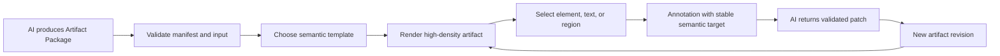

# Open Artifacts product brief

## Product thesis

Large models can generate more information than people can absorb as linear text. Open Artifacts
compiles structured model output into portable, high-density web artifacts that people can scan,
inspect, annotate, and send back to the model as precise change requests.

The product is not another chat UI, page builder, or AI website generator. It is the lifecycle above
renderers: package, template selection, controlled execution, semantic annotation, patch, and version.
See the [primary-source landscape](research/landscape.md) for the supporting analysis.

## First user and job

The first user is someone using an AI agent for research, analysis, planning, or technical decisions.
Their job is:

> Turn a large answer into something I can understand in one minute, interrogate at the exact point
> of disagreement, and revise without restating the surrounding context.

## Core loop

## Product boundary

An Artifact Package is the durable unit. At minimum it declares:

- package version, artifact identity, and revision;
- renderer kind, template identity, and template version;
- input schema and validated data;
- capabilities and trust level;
- generation provenance and edit policy.

The same lifecycle can later host two renderer channels:

1. A safe structured channel using trusted components and validated data.
2. A sandboxed code channel using HTML or a locked framework bundle.

The v0 prototype only implements the structured channel. That is intentional: it tests whether
semantic layout plus addressable feedback is valuable before adding arbitrary package execution.

## Prototype question

> Can one stable data package drive genuinely different high-density views while preserving the same
> semantic annotation target and producing feedback JSON an AI can act on?

The current prototype uses one package, three render structures, live JSON editing, ECharts as a real
third-party renderer dependency, and click-to-annotate feedback. Run it with `npm run dev`.

The current package shape is captured as a reviewable draft in
[`docs/spec/artifact-package.v0.1.schema.json`](spec/artifact-package.v0.1.schema.json).

## Success signals

- A reader can identify the main conclusion, evidence, risk, and next action within 60 seconds.
- Switching renderer structure does not change annotation target paths.
- A user can point at a visible claim and produce a complete feedback payload without describing its
  screen position in prose.
- Invalid JSON never replaces the last valid render.
- The same package can be rendered deterministically after reload.

## Explicit non-goals for v0

- Calling a model or designing prompt orchestration.
- Running arbitrary generated JavaScript or installing runtime dependencies.
- A hosted registry, accounts, collaboration, persistence, or billing.
- Claiming the draft package shape is a public standard before real usage validates it.

## Next validation after this prototype

1. Add text selection and free-area box selection alongside semantic element selection.
2. Return RFC 6902-compatible data patches and preview them before applying.
3. Compare a long-text answer with four semantic templates: comparison, timeline, evidence matrix,
   and decision matrix.
4. Measure find time, comparison accuracy, and number of revision turns.
