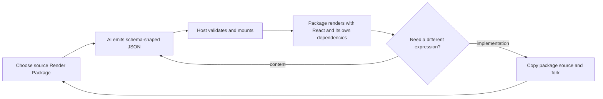

# Open Artifacts product brief

## Product thesis

Large models can generate more information than people can absorb as linear text. Open Artifacts lets
AI return a purpose-built, high-density React page without turning every response into an opaque
generated website.

The durable unit is a **source-published Render Package**. It owns the React implementation, input
schema, example, styles, assets, and npm dependencies. The AI normally emits only the package's
Render Input JSON. A developer can copy the package source locally and fork it without rebuilding the
page from screenshots or compiled output.

## Three distinct objects

| Object         | Owns                                                             | Does not own                        |
| -------------- | ---------------------------------------------------------------- | ----------------------------------- |
| Render Package | React source, layout, interaction, schema, example, dependencies | A particular AI response            |
| Render Input   | JSON content for one render                                      | React code or dependency choices    |
| Host           | Package discovery, input editing, mounting, error isolation      | Package-specific data meaning or UI |

Annotation, collaboration, persistence, and model orchestration may be host capabilities later. They
are not required Render Package props.

## Core loop

## First user and job

The first user is an AI builder or developer working with research, analysis, planning, or technical
decisions:

> Give the model a reliable visual language for a task, let it fill that language with JSON, and let
> me own and fork the React implementation when the template needs to evolve.

## Render Package v0 boundary

The format builds on npm instead of creating a parallel package system:

- `package.json` is the canonical identity, version, exports, files, and dependency manifest;
- `src/index.tsx` default-exports `Render({ data })`;
- `input.schema.json` describes the JSON the model should produce;
- `example.json` makes every package previewable immediately;
- `tsconfig.json` is standalone and published with the source;
- source is the package export and must be included in the published files;
- React is a peer dependency; implementation libraries belong to the package;
- package source must not import the host or a sibling render.

The v0 host discovers trusted local packages under `packages/render-*` and loads their public npm
exports. It is intentionally in-process and does not claim sandbox, permission, CSS, DOM, storage, or
network isolation.

## Current proof

The workbench loads two adapters through the same seam:

1. `decision-board` renders a dense dashboard and owns ECharts.
2. `evidence-trace` uses a different input schema and interactive plain React UI.

The host only sees a default component and example JSON. Contract tests verify source exports,
package-local schema/example resources, React peer dependency, and server rendering through the npm
package interface.

## Success signals

- Copying a package directory requires no host registry edit.
- A package can introduce a React ecosystem dependency without adding it to the host.
- The published npm file list includes editable TSX, CSS, schema, example, README, and standalone
  TypeScript config.
- One host mounts packages with different data models through `Render({ data })`.
- Invalid JSON does not replace the last syntactically valid render.
- A developer can find all implementation knowledge inside the copied package directory.

## Explicit non-goals for v0

- Annotation as a required render interface.
- Running unknown or untrusted packages safely.
- A Host SDK, theme context, action bus, capability negotiation, or remote RPC.
- Hosted registry, accounts, collaboration, persistence, or billing.
- Model calls, prompt orchestration, streaming patches, or eval claims.
- Supporting every bundler; v0 targets React source consumed by Vite.

## Next validation

1. Fork one reference package into a third package and measure the exact edits needed.
2. Validate example JSON against each package's JSON Schema in the host.
3. Add source maps or file navigation so a visible panel can jump to its package source.
4. Test source-package installation from an npm tarball, not only a workspace directory.
5. Only after two renders need the same host capability, design that optional seam.
