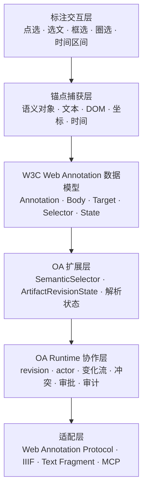
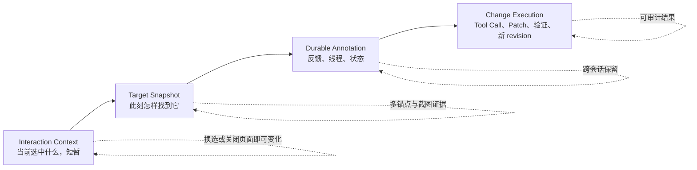
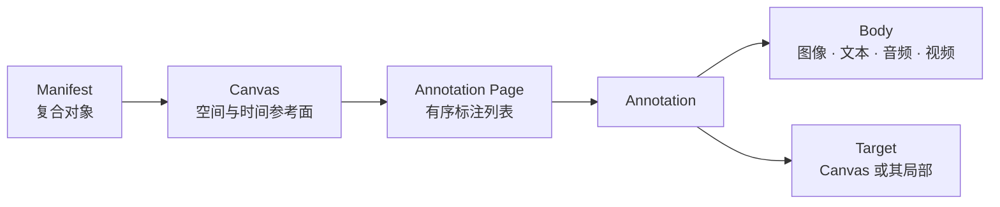
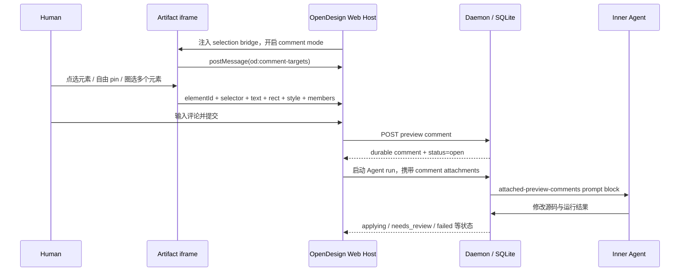

# Open Artifacts 通用标注协议：公开标准与协议分层调研

> 调研日期：2026-07-22
>
> 研究问题：如果 Open Artifacts 要支持文本选择、元素点选、矩形框选、自由圈选和音视频区间标注，哪些公开标准可以直接复用？这些标准覆盖到哪一层，哪些版本、同步和协作问题仍需 OA Runtime 自己定义？
>
> 资料口径：公开标准采用 W3C、IETF、WICG 与 IIIF 官方规范；市场实现采用产品官方文档与固定 commit 的官方源码。OpenDesign 结论来自本地 `projects/learning/open-design` checkout（v0.15.1，commit `6b90486c`）；该 checkout 当时落后 `origin/main` 5 个 commit，因此本文描述的是这个可复核源码快照，不声称代表最新远端。

## 1. 结论

Open Artifacts 不需要重新发明一套完整的标注数据模型。最合适的方案是：

1. 用 **W3C Web Annotation Data Model** 作为跨 Artifact、跨 Renderer 的核心交换模型；
2. 直接复用其 `Annotation`、`Body`、`Target`、`SpecificResource`、`Selector`、`State`、`motivation` 与 provenance 字段；
3. 文本使用 `TextQuoteSelector + TextPositionSelector` 双锚点，DOM 使用 CSS、XPath 或 `RangeSelector`，矩形和时间范围使用 `FragmentSelector + Media Fragments`，自由形状使用 `SvgSelector`；
4. 只有在 Artifact 确实存在稳定二维或时间坐标面时，才把 **IIIF Canvas** 作为可选适配层；不要让完整 IIIF Manifest/Canvas 层级成为所有 Artifact 的核心模型；
5. 把 **Text Fragment** 当作“打开浏览器并高亮”的分享链接适配器，不作为数据库中的权威锚点；
6. 把 **Web Annotation Protocol** 当作基础远端交换协议参考，不把它当作 OA 的实时协作与版本同步协议；
7. 由 OA 自己补齐 `SemanticSelector`、`ArtifactRevisionState`、锚点解析状态、revisioned change feed、冲突、审批和历史。

整体分层如下：



一句话概括标准与 OA 的边界：

> 现有标准已经很好地表达“这条反馈指向什么”，但没有完整解决“Artifact 变化后还能否指中、怎样迁移、怎样多人同步与审批”。后半部分应当由 Open Artifacts 的 Runtime Contract 承担。

### 1.1 两张界面截图实际上包含四种不同对象

用户框住页面区域并在浮层中输入评论，看起来像一个动作，协议上却应拆成四层：



- 输入框里的“文档 / 片段”胶囊更接近 **Interaction Context / Reference Attachment**：它告诉 Agent“这次对话指的是谁”，但不必自动形成长期批注。
- 蓝色框与评论浮层是 **Target Capture + Annotation Draft**：提交前只是当前选区和草稿；提交后才成为可持久化 Annotation。
- `Target Snapshot` 记录捕获时的语义 ID、源码、文本、DOM、几何、截图和 revision；这些是同一目标的多种证据，不是六条独立评论。
- Agent 真正修改 Artifact 时，应创建独立的执行记录，并把 `annotationId`、`baseRevision`、Tool Call、结果 revision 和验证证据关联起来；不能把“评论已 resolved”直接等同于“修改已验证”。

这个拆分也解释了为什么 OA 不应把 React 全局 State 或 Time Machine 直接当成标注协议：Agent 需要的是稳定目标、必要上下文和可调用动作，而不是所有 UI 内部状态。

## 2. 标准能力矩阵

| 能力             | 可复用标准                           | 标准已经定义                                             | 主要限制                                         | OA 建议                                      |
| ---------------- | ------------------------------------ | -------------------------------------------------------- | ------------------------------------------------ | -------------------------------------------- |
| 标注基本结构     | W3C Web Annotation Data Model        | `Annotation`、`body`、`target`、`motivation`、作者与时间 | 不规定 Artifact Runtime                          | 直接作为核心交换模型                         |
| 外部资源局部目标 | `SpecificResource`                   | `source + selector + state`                              | 不认识 OA 的对象 ID 和 revision                  | 保留结构，增加 OA 扩展                       |
| 文本引用         | `TextQuoteSelector`                  | `exact + prefix + suffix`                                | 重复文本可能产生多个匹配；可能复制受版权保护文本 | 与位置锚点并存，作为重定位主锚点             |
| 文本位置         | `TextPositionSelector`               | 规范化文本流中的 `start/end`                             | 内容变化后很脆弱                                 | 作为快速定位与校验锚点，不单独使用           |
| DOM 元素         | `CssSelector`                        | CSS 选择路径                                             | 仅适用于 DOM；结构变化后容易失效                 | 稳定业务 ID 优先，CSS 作为兼容锚点           |
| HTML/XML 节点    | `XPathSelector`                      | XPath 选择路径                                           | 仅适用于 DOM；解析器补节点会改变路径             | 仅用于需要精确结构路径的表示                 |
| 跨节点范围       | `RangeSelector`                      | `startSelector + endSelector`                            | 两个端点仍可能漂移                               | 用于跨 DOM 节点文本范围                      |
| 矩形区域         | `FragmentSelector + Media Fragments` | `xywh` 像素或百分比矩形                                  | 只表达 source media 坐标，不能表达语义对象       | 记录坐标空间与 revision 后使用               |
| 音视频区间       | `FragmentSelector + Media Fragments` | `t=start,end`，可与 `xywh` 组合                          | 不表达 timeline clip、track object 等业务语义    | 作为播放媒体锚点，与 `SemanticSelector` 并存 |
| 任意二维形状     | `SvgSelector`                        | 内嵌或外链 SVG shape                                     | 不定义 Renderer 坐标变换                         | 记录基准尺寸、坐标空间与变换版本             |
| 二进制范围       | `DataPositionSelector`               | byte stream 的 `start/end`                               | 数据变化后位置漂移                               | 只用于不可解析或专用二进制 Artifact          |
| 资源表示状态     | `TimeState`、`HttpRequestState`      | 时间、缓存副本、请求 Header                              | 没有 artifact revision、hash、renderer version   | 增加 `ArtifactRevisionState`                 |
| 多锚点与逐层定位 | 多个 `selector`、`refinedBy`         | 备选定位与“先选大范围，再选小范围”                       | 不定义 OA 的 resolver 优先级和置信度             | 定义确定性解析算法和状态                     |
| 二维/时间参考面  | IIIF Canvas                          | 统一空间和时间坐标面，Annotation Page/Collection         | 面向数字对象展示；完整模型较重                   | 只用于有稳定 Canvas 的 Artifact adapter      |
| 浏览器文本分享   | URL Fragment Text Directives         | `#:~:text=` 导航与高亮                                   | 不是 W3C 标准；不是持久标注模型                  | 从 TextQuote 生成分享 URL                    |
| 基础存储与 CRUD  | Web Annotation Protocol              | Container、POST、PUT、DELETE、ETag、分页                 | PATCH 未定义；无 change feed、离线和合并         | 作为互操作 API，不替代 OA Runtime            |

## 3. W3C Web Annotation Data Model

### 3.1 核心模型

[Web Annotation Data Model](https://www.w3.org/TR/annotation-model/) 是 2017 年发布的 W3C Recommendation。它的目标是让标注在不同硬件与软件平台之间共享、迁移和复用。

最小模型由三部分组成：

```json
{
  "@context": "http://www.w3.org/ns/anno.jsonld",
  "id": "https://example.com/annotations/123",
  "type": "Annotation",
  "motivation": "commenting",
  "body": {
    "type": "TextualBody",
    "value": "这里需要调整"
  },
  "target": "https://example.com/artifacts/42"
}
```

规范中的职责是：

- `Annotation`：一条可独立寻址的关联资源；
- `body`：评论、标签、建议、替换内容或外部资源；
- `target`：标注针对的一个或多个目标；
- `motivation`：标注为什么存在；
- `creator`、`created`、`modified`、`generator`、`generated`：基础生命周期与 provenance；
- `canonical`、`via`：同一标注被不同系统复制后，用于对齐权威身份与获取来源。

规范已经提供 `commenting`、`editing`、`highlighting`、`questioning`、`replying`、`tagging`、`assessing` 等 Motivation。OA 不必为普通评论、修改建议、提问和回复重新创造同义枚举。

官方来源：

- [Annotation、Body 与 Target](https://www.w3.org/TR/annotation-model/#annotations)
- [Motivation and Purpose](https://www.w3.org/TR/annotation-model/#motivation-and-purpose)
- [Lifecycle Information](https://www.w3.org/TR/annotation-model/#lifecycle-information)
- [Other Identities：canonical 与 via](https://www.w3.org/TR/annotation-model/#other-identities)

### 3.2 SpecificResource：局部目标的标准容器

当标注不是针对整个 Artifact，而是其中一段文字、一个区域或某个时间片段时，Target 应表示为 `SpecificResource`：

```json
{
  "type": "SpecificResource",
  "source": "https://example.com/artifacts/42",
  "state": {},
  "selector": {}
}
```

三个字段分别回答：

- `source`：目标属于哪一个资源；
- `state`：应该取得这个资源的哪个表示或历史状态；
- `selector`：在该表示中怎样找到目标片段。

State 必须先于 Selector 处理。也就是说，客户端应先恢复正确版本，再在其中定位区域或文本。

官方来源：

- [Specific Resources](https://www.w3.org/TR/annotation-model/#specific-resources)
- [States](https://www.w3.org/TR/annotation-model/#states)

## 4. Selector：怎样指向 Artifact 的局部内容

### 4.1 FragmentSelector

`FragmentSelector` 把既有媒体类型的 URI fragment 语义包装进 Web Annotation：

```json
{
  "type": "FragmentSelector",
  "conformsTo": "http://www.w3.org/TR/media-frags/",
  "value": "t=30,60"
}
```

`conformsTo` 指明 fragment 语法来自哪个规范。Web Annotation 官方列出的可复用 fragment 规范包括 HTML、PDF、纯文本、XML、CSV、Media Fragments、SVG 和 EPUB CFI。

官方来源：[Fragment Selector](https://www.w3.org/TR/annotation-model/#fragment-selector)

### 4.2 TextQuoteSelector

`TextQuoteSelector` 用被选文本及其前后文定位：

```json
{
  "type": "TextQuoteSelector",
  "exact": "WebMCP",
  "prefix": "AI on Chrome ",
  "suffix": " imperative API"
}
```

规范事实：

- `exact` 必须存在；
- `prefix` 和 `suffix` 用于消歧；
- 文本按 Unicode code point 的逻辑顺序处理；
- HTML/XML 标签应移除，字符实体应替换为对应字符后再记录；
- 如果完整处理 `prefix + exact + suffix` 后仍有多个匹配，规范要求把选择视为匹配全部结果；
- 大段复制受版权或访问限制的文本可能有风险。

官方来源：[Text Quote Selector](https://www.w3.org/TR/annotation-model/#text-quote-selector)

### 4.3 TextPositionSelector

`TextPositionSelector` 用规范化文本流中的字符位置定位：

```json
{
  "type": "TextPositionSelector",
  "start": 412,
  "end": 795
}
```

`start` 包含起始字符，`end` 不包含结束字符。位置必须基于与 `TextQuoteSelector` 相同的规范化文本计算。

规范明确指出：位置锚点对内容编辑和动态嵌入非常脆弱，因此推荐同时使用 State。对于 OA，它适合做快速定位和对 TextQuote 结果的校验，不适合独立成为唯一锚点。

官方来源：[Text Position Selector](https://www.w3.org/TR/annotation-model/#text-position-selector)

### 4.4 CSS、XPath 与 RangeSelector

DOM 类型 Artifact 可以复用：

- `CssSelector`：定位 DOM 元素；
- `XPathSelector`：定位 HTML/XML 节点或内容；
- `RangeSelector`：分别声明包含式起点和排除式终点，可用 CSS、XPath 等 Selector 表示端点。

CSS 与 XPath 只在资源表示符合 DOM 时有定义。它们对 DOM 重排、生成式 class name、插入包装节点和 SSR/CSR 差异都较敏感。OA 应优先捕获稳定的业务对象 ID 或 Renderer 提供的语义路径，再把 CSS/XPath 作为兼容和诊断锚点。

官方来源：

- [CSS Selector](https://www.w3.org/TR/annotation-model/#css-selector)
- [XPath Selector](https://www.w3.org/TR/annotation-model/#xpath-selector)
- [Range Selector](https://www.w3.org/TR/annotation-model/#range-selector)

### 4.5 SvgSelector

矩形不能覆盖手绘圈选、多边形或自由曲线时，可以使用 `SvgSelector`：

```json
{
  "type": "SvgSelector",
  "value": "<svg xmlns=\"http://www.w3.org/2000/svg\"><path d=\"...\" /></svg>"
}
```

规范定义了 SVG 内容的承载方式，但没有定义应用内部 viewport、zoom、pan、CSS transform、device pixel ratio 与 source coordinate 之间的变换。OA 必须额外记录该形状所属的坐标空间、基准尺寸和目标 revision。

官方来源：[SVG Selector](https://www.w3.org/TR/annotation-model/#svg-selector)

### 4.6 DataPositionSelector

`DataPositionSelector` 与文本位置类似，但 `start/end` 针对 byte stream。它适合磁盘镜像、二进制文件或没有更高层语义模型的 Artifact，但同样会在源数据改变后漂移。

官方来源：[Data Position Selector](https://www.w3.org/TR/annotation-model/#data-position-selector)

### 4.7 多个 Selector 与 refinedBy

标准区分两种组合方式：

```text
多个 selector
└── 同一 Segment 的备选定位方式，客户端选择自己能处理的一种

selector.refinedBy
└── 先执行外层 Selector，再在结果内部执行更精细的 Selector
```

例如先找到文章容器，再定位容器内的一段文字：

```json
{
  "type": "CssSelector",
  "value": "#article",
  "refinedBy": {
    "type": "TextQuoteSelector",
    "exact": "WebMCP",
    "prefix": "AI on Chrome ",
    "suffix": " imperative API"
  }
}
```

需要注意：多个 `refinedBy` 值也是得到同一选择结果的备选方案，并不表示多个条件做逻辑 AND。

官方来源：[Refinement of Selection](https://www.w3.org/TR/annotation-model/#refinement-of-selection)

## 5. Media Fragments：矩形与时间范围

[Media Fragments URI 1.0](https://www.w3.org/TR/media-frags/) 是 W3C Recommendation。基础版定义了时间和矩形空间片段：

```text
#t=10,20
#xywh=160,120,320,240
#xywh=percent:25,25,50,50
#t=10,20&xywh=160,120,320,240
```

规范事实：

- `t=10,20` 表示左闭右开的时间区间 `[10,20)`；
- `xywh` 的四个值依次是 `x、y、宽、高`；
- 空间坐标可以是 pixel 或 percent；
- 空间基础选择只支持矩形；
- 零宽度或零高度的区域无效；
- 时间与空间可以组合；
- URI fragment 表示对原资源的一部分聚焦，URI query 则可能得到新的资源表示。

它非常适合：

- 图片和视频中的矩形区域；
- 音频和视频中的播放时间段；
- 同时选中视频的一个时间段和画面区域。

它不表达：

- “按钮”“图层”“表格单元格”“React Component”；
- timeline 中的 `clip-42`；
- 3D scene 中的 entity；
- Artifact 内部领域对象与其跨版本身份。

官方来源：

- [Fragment Dimensions](https://www.w3.org/TR/media-frags/#fragment-dimensions)
- [Temporal Dimension](https://www.w3.org/TR/media-frags/#temporal-dimension)
- [Spatial Dimension](https://www.w3.org/TR/media-frags/#spatial-dimension)

## 6. State：版本锚点的标准雏形

### 6.1 TimeState

`TimeState` 记录资源在哪个时间点或时间区间适用于该标注，也可以用 `cached` 链接当时的副本：

```json
{
  "type": "TimeState",
  "sourceDate": "2026-07-22T06:30:00Z",
  "cached": "https://archive.example.com/artifacts/42/snapshot"
}
```

规范提到可通过 [RFC 7089 Memento](https://www.rfc-editor.org/rfc/rfc7089) 的 datetime negotiation 恢复历史表示。

官方来源：[Time State](https://www.w3.org/TR/annotation-model/#time-state)

### 6.2 HttpRequestState

`HttpRequestState` 记录取得特定 representation 时需要重放的 HTTP 请求 Header：

```json
{
  "type": "HttpRequestState",
  "value": "Accept: application/pdf"
}
```

它适用于同一个 URL 可返回 HTML、PDF 或不同语言版本的资源，但请求 Header 仍不能保证恢复所有环境相关表示，例如依赖 IP、Cookie 或动态后端状态的页面。

官方来源：[Request Header State](https://www.w3.org/TR/annotation-model/#request-header-state)

### 6.3 对 OA 的直接含义

上述 State 能表达“哪个时间、哪个 HTTP representation”，但没有标准字段表达：

- Artifact revision；
- immutable content digest；
- Package 版本；
- Renderer 版本；
- Public State schema 版本；
- 某个语义对象从 revision N 到 N+1 的身份延续。

因此 OA 应沿用 `state` 这个标准扩展点，但增加自己的 `ArtifactRevisionState`，而不是把 Annotation 的 HTTP ETag 或 `modified` 时间戳误当成 Artifact revision。

## 7. IIIF Annotation 与 Canvas

[IIIF Presentation API 3.0](https://iiif.io/api/presentation/3.0/) 直接复用 W3C Web Annotation。它的 `Canvas` 是一个表示对象特定视图的虚拟容器，同时提供空间与时间布局参考面。

IIIF 的核心结构可以概括为：



IIIF 通过同一 Annotation 机制完成两类事情：

- `painting`：把图像、文本、音视频等内容“绘制”到 Canvas；
- `supplementing`：给 Canvas 或其局部增加转录、字幕、翻译、说明等补充内容。

`Annotation Page` 保存有序标注列表，`Annotation Collection` 再把多个 Page 作为整体分组。IIIF 还维护官方 Selector Registry，补充了：

- `PointSelector`：空间或时间中的点；
- `ImageApiSelector`：IIIF Image API 的裁剪、尺寸、旋转和质量参数；
- `AudioContentSelector`；
- `VisualContentSelector`。

官方来源：

- [IIIF Canvas](https://iiif.io/api/presentation/3.0/#53-canvas)
- [IIIF Annotation Page](https://iiif.io/api/presentation/3.0/#55-annotation-page)
- [IIIF Annotation](https://iiif.io/api/presentation/3.0/#56-annotation)
- [IIIF Annotation Collection](https://iiif.io/api/presentation/3.0/#58-annotation-collection)
- [IIIF Registry of Selectors](https://iiif.io/api/registry/selectors/)

### 对 OA 的判断

IIIF Canvas 很适合以下 Artifact：

- 图片、画布和 PDF 页面；
- 音频、视频和带时间轴的可视媒体；
- 多页文档与数字馆藏；
- 需要把多个表示对齐到同一空间或时间参考面的内容。

但完整 IIIF 模型不适合直接成为 OA 所有 Artifact 的核心：

- Web App、代码 AST、表格、3D scene、数据库记录和领域 timeline 不天然是 Manifest/Canvas；
- `painting` 是展示语义，不是通用 Artifact 业务状态语义；
- IIIF 对资源 URI、层级和展示行为有自己的约束；
- IIIF 官方还明确记录了它与 Web Annotation `label` 表示方式的不兼容点。

因此推荐把 IIIF 作为“有稳定空间/时间参考面”的 Artifact adapter，而不是强制所有 Package 采用 IIIF Presentation hierarchy。

## 8. URL Text Fragment

[URL Fragment Text Directives](https://wicg.github.io/scroll-to-text-fragment/) 定义浏览器文本片段 URL：

```text
https://example.com/page#:~:text=[prefix-,]start[,end][,-suffix]
```

它与 `TextQuoteSelector` 都使用目标文本和前后文消歧，但职责不同：

| Web Annotation TextQuote    | URL Text Fragment                 |
| --------------------------- | --------------------------------- |
| 可存储、交换的标注 Target   | URL 导航指令                      |
| 可与 Body、作者、State 组合 | 只负责定位、高亮和滚动            |
| 面向标注系统                | 面向浏览器用户代理                |
| W3C Recommendation 的一部分 | WICG Draft Community Group Report |

规范明确声明 Text Fragment 不是 W3C Standard，也不在 W3C Standards Track。浏览器还会把 fragment directive 从页面脚本可见的 URL API 中剥离，以避免与页面逻辑冲突。

OA 应把它作为输出适配器：从 `TextQuoteSelector` 生成便于分享的浏览器 URL；权威存储仍使用 Web Annotation Target。

## 9. Web Annotation Protocol：存储和同步能力边界

[Web Annotation Protocol](https://www.w3.org/TR/annotation-protocol/) 是 W3C Recommendation，基于 HTTP、Linked Data Platform 与 Activity Streams Collection。

它定义了：

- Annotation Container 的发现与描述；
- `GET / HEAD / OPTIONS`；
- `POST` 创建 Annotation；
- `PUT` 全量替换 Annotation；
- `DELETE` 删除 Annotation；
- Annotation Collection 与 Annotation Page 的有序分页；
- Annotation 与 Container 的 `ETag`；
- `If-Match` 乐观并发；
- `application/ld+json;profile="http://www.w3.org/ns/anno.jsonld"` 媒体类型。

需要特别区分：

- PUT 与 DELETE 是服务器 SHOULD 支持，不是所有实现必须支持；
- 服务器 MAY 支持 PATCH，但该规范明确不定义 PATCH 语义；
- `ETag + If-Match` 保护的是 Annotation 或 Container representation，不是 Target Artifact 的 revision；
- Activity Streams Collection Page 是有序分页，不是增量变化流；
- 规范列出 401/403 错误，但没有规定认证与授权机制；
- 规范没有离线同步、CRDT、操作日志、订阅、resume cursor 或三方合并。

官方来源：

- [Annotation Containers](https://www.w3.org/TR/annotation-protocol/#annotation-containers)
- [Create a New Annotation](https://www.w3.org/TR/annotation-protocol/#create-a-new-annotation)
- [Update an Existing Annotation](https://www.w3.org/TR/annotation-protocol/#update-an-existing-annotation)
- [Delete an Existing Annotation](https://www.w3.org/TR/annotation-protocol/#delete-an-existing-annotation)

## 10. 公开标准仍然留下的缺口

以下结论是根据上述规范的明确范围推导出的 OA 设计缺口，不是标准原文声明：

| 缺口              | 标准现状                                                        | OA 需要补充                                                         |
| ----------------- | --------------------------------------------------------------- | ------------------------------------------------------------------- |
| Artifact revision | `TimeState` 记录时间或缓存副本；HTTP ETag 保护 Annotation       | `ArtifactRevisionState`：revision、digest、Package 与 Renderer 版本 |
| 领域语义目标      | Selector 主要覆盖文本、DOM、字节、二维与时间媒体                | `SemanticSelector`：对象 ID、类型、逻辑路径、字段或时间线对象       |
| 坐标转换          | Media Fragments 只定义 source media 坐标；IIIF 定义 Canvas 坐标 | Renderer viewport、zoom、pan、transform、device scale 映射契约      |
| 锚点漂移          | TextPosition、CSS、XPath 都可能失效；TextQuote 可能歧义         | `resolved / ambiguous / orphaned` 状态、置信度与重定位证据          |
| 跨版本迁移        | 没有把 Selector 从 revision N 映射到 N+1 的协议                 | re-anchor / migrate API、来源 revision 与迁移 provenance            |
| 增量同步          | Annotation Protocol 只有当前 representation 与分页              | revisioned change feed、subscription、resume cursor                 |
| 并发冲突          | ETag 只能拒绝 stale PUT                                         | `baseRevision`、结构化冲突、领域级 merge 与 proposal                |
| 离线协作          | 未定义                                                          | oplog、操作重放，必要时采用 CRDT/OT                                 |
| 历史与撤销        | `modified` 只是时间戳，PUT 覆盖当前状态                         | immutable revision、undo/redo、审计历史                             |
| 工作流            | Motivation 有 commenting、editing、replying                     | open、resolved、rejected、proposal、approval 生命周期               |
| 权限              | 只提及 401/403                                                  | actor、ACL/capability、visibility 与审计策略                        |
| 查询              | Collection 只定义分页                                           | 按 artifact、revision、selector、creator、status 查询               |
| 讨论串            | 可用 `replying` 并以另一条 Annotation 为 Target                 | thread 身份、排序、折叠、已读和 resolve 状态                        |

## 11. Open Artifacts 推荐协议分层

### 11.1 第一层：标准 Annotation Envelope

OA 对外交换格式保留 W3C 字段：

```text
Annotation
├── id
├── type = Annotation
├── motivation
├── body
├── target
│   └── SpecificResource
│       ├── source
│       ├── state
│       └── selector
├── creator / created / modified
└── canonical / via
```

内部 TypeScript 和数据库不必真的实现 RDF 图数据库，但序列化格式应能稳定映射到 Web Annotation JSON-LD。

### 11.2 第二层：OA 原生语义锚点

Renderer 或 Artifact Package 应优先提供稳定语义对象，而不是只暴露 DOM：

```json
{
  "type": "oa:SemanticSelector",
  "objectType": "timeline.clip",
  "objectId": "clip-42",
  "path": "/tracks/video-main/clips/clip-42"
}
```

字段名仍需通过后续 ADR 固化。核心要求是：

- `objectId` 在同一 Artifact lineage 内稳定；
- `objectType` 让客户端知道该目标的领域含义；
- `path` 是可读和可诊断的补充，不应替代稳定 ID；
- 语义 Selector 可以与 TextQuote、坐标和 DOM Selector 作为同一目标的 alternatives 一起保存。

### 11.3 第三层：ArtifactRevisionState

建议沿用 Web Annotation `state` 扩展点：

```json
{
  "type": "oa:ArtifactRevisionState",
  "artifactId": "artifact-42",
  "revision": 17,
  "contentDigest": "sha256:...",
  "packageVersion": "1.3.0",
  "rendererVersion": "2.1.0"
}
```

这组字段必须区分：

- Annotation 自身版本；
- Target Artifact 的权威 revision；
- Artifact 内容 digest；
- 负责解释 Selector 与坐标的 Renderer 版本。

### 11.4 第四层：锚点解析协议

建议把解析过程定义为可观察结果，而不是隐藏在 UI 中：

```text
resolve(annotation.target, artifactRevision)
├── resolved    唯一命中，返回规范化 Target
├── ambiguous   多个候选，返回候选与置信度
├── orphaned    没有可接受命中，保留原始锚点
└── unsupported 当前 Renderer 不支持该 Selector
```

建议的解析优先级：

1. `SemanticSelector`；
2. Package 提供的源码或 Schema Path 锚点；
3. 同一 revision 下可直接验证的 DOM、文本位置或媒体坐标；
4. `TextQuoteSelector` 的 exact/prefix/suffix 重定位；
5. CSS/XPath/Range fallback；
6. 几何区域与截图只作为最后的上下文证据，不自动等价为业务对象。

这是 OA 的推荐策略，不是 W3C 规定的通用优先级。

### 11.5 第五层：Runtime 协作与生命周期

OA Runtime 继续负责：

- Snapshot、revision 与 `baseRevision`；
- idempotency；
- actor、presence 与 audit；
- revisioned change feed；
- proposal、approval、resolve 与 reject；
- 冲突检测和领域级合并；
- undo/redo 与历史；
- 页面关闭后的 durable session。

Web Annotation Protocol 可作为额外 HTTP 兼容面，但不能替代这些 Runtime 能力。

### 11.6 第六层：标准适配器

| Adapter                 | 输入                                   | 输出或作用                                             |
| ----------------------- | -------------------------------------- | ------------------------------------------------------ |
| Text Fragment           | `TextQuoteSelector`                    | 可分享的浏览器高亮 URL                                 |
| IIIF                    | Canvas 类型 Artifact 与 W3C Annotation | IIIF Presentation Manifest、Annotation Page/Collection |
| Web Annotation Protocol | OA Annotation projection               | 标准 Container CRUD 与分页                             |
| MCP / WebMCP            | Annotation、Context 与领域 Tool        | Agent 读取、提问、resolve、执行修改建议                |

## 12. 推荐的最小交换示例

下面示例同时保留 OA 语义对象、Artifact revision、文本和 DOM 兼容锚点：

```json
{
  "@context": [
    "http://www.w3.org/ns/anno.jsonld",
    "https://openartifacts.dev/ns/annotation.jsonld"
  ],
  "id": "https://example.com/annotations/anno-123",
  "type": "Annotation",
  "motivation": "editing",
  "creator": {
    "id": "https://example.com/users/onee",
    "type": "Person",
    "name": "onee"
  },
  "created": "2026-07-22T06:30:00Z",
  "body": {
    "type": "TextualBody",
    "value": "这个标题需要更具体"
  },
  "target": {
    "type": "SpecificResource",
    "source": "https://example.com/artifacts/artifact-42",
    "state": {
      "type": "oa:ArtifactRevisionState",
      "artifactId": "artifact-42",
      "revision": 17,
      "contentDigest": "sha256:...",
      "rendererVersion": "2.1.0"
    },
    "selector": [
      {
        "type": "oa:SemanticSelector",
        "objectType": "document.heading",
        "objectId": "heading-summary"
      },
      {
        "type": "TextQuoteSelector",
        "exact": "当前市场结论",
        "prefix": "调研摘要：",
        "suffix": "仍需验证"
      },
      {
        "type": "TextPositionSelector",
        "start": 412,
        "end": 418
      },
      {
        "type": "CssSelector",
        "value": "[data-artifact-id='heading-summary']"
      }
    ]
  }
}
```

这个示例刻意不定义最终 OA JSON-LD namespace、字段稳定性和 resolver 算法；这些属于后续 ADR，而不是本轮公开标准事实。

## 13. 市场产品实现方式

### 13.1 总览

| 实现                              | 捕获与锚点                                                    | 交给 Agent 的方式                         | 持久协作                                      | 可复用程度                             | 对 OA 最有价值的部分                          |
| --------------------------------- | ------------------------------------------------------------- | ----------------------------------------- | --------------------------------------------- | -------------------------------------- | --------------------------------------------- |
| Agentation / AFS 1.1              | CSS path、坐标、bounds、文本、React tree、样式                | HTTP + stdio MCP + SSE                    | 线程、pending/acknowledged/resolved/dismissed | **最接近开放格式**，但不是标准组织规范 | lifecycle、event envelope、watch MCP          |
| stagewise                         | DOM、XPath、CDP live node、源码、样式、frame、截图            | `.swdomelement` + 图片附件进入 Agent chat | 不是批注系统                                  | 丰富的私有 context packet              | 捕获时上下文与截图 fallback                   |
| React Grab                        | React component/source、HTML、selector hints                  | Clipboard MIME + 本机 pull/watch          | 无                                            | 轻量的一次性引用格式                   | source anchor 与低接入成本                    |
| Figma Comments / Make             | node/frame-relative 或绝对 region、版本截图                   | REST/Webhook；Make 内部 Agent             | 成熟的 thread/resolve/version                 | Figma 领域专用                         | 明确坐标空间、版本归属、capture-time snapshot |
| Hypothesis                        | Range、TextPosition、TextQuote 多锚点                         | API + iframe/sidebar client               | 线程、权限、orphan 展示                       | 成熟的网页文本标注实现                 | fuzzy re-anchor 与 unanchored 生命周期        |
| tldraw Make Real / Agent Template | Shape selection、bounds、viewport、截图                       | 多模态 Prompt / structured shape context  | 不是通用批注协议                              | Canvas 专用                            | 结构化对象与视觉证据并存                      |
| OpenDesign                        | `data-od-id`、DOM selector、rect、文本、style、圈选成员、截图 | 内部 Prompt Attachment                    | 本地 SQLite + 状态字段                        | 产品私有协议                           | 最接近目标体验，详见下一节                    |

市场没有出现一个同时满足以下条件的现成标准：

```text
通用 Artifact target
+ 跨 revision 重锚
+ 人与 Agent 双向 thread / lifecycle
+ 语义 Tool 执行与验证
+ MCP / CLI / Browser 多 Adapter
```

因此 OA 可以兼容现有格式，但不能简单选择其中一个照搬。

### 13.2 Agentation：最接近“Agent 标注格式”的现有方案

[Agentation AFS 1.1](https://www.agentation.com/schema) 把自己定义为 portable structured UI feedback format。必填字段包括 `id`、`comment`、`elementPath`、`timestamp`、`x/y` 和 `element`；推荐 `url/boundingBox`；可选字段包括 React component tree、class、computed style、accessibility、附近文字、selected text、intent、severity、kind、status 和 thread。

它还定义事件 envelope：

```ts
type AgentationEvent = {
  type:
    | 'annotation.created'
    | 'annotation.updated'
    | 'annotation.deleted'
    | 'session.created'
    | 'session.updated'
    | 'session.closed'
    | 'thread.message'
    | 'action.requested';
  timestamp: string;
  sessionId: string;
  sequence: number;
  payload: unknown;
};
```

`sequence` 支持检测漏事件和 replay。[Agentation MCP](https://www.agentation.com/mcp) 同时运行浏览器 HTTP server 与 Agent stdio MCP，共享同一存储，并提供 9 个工具：session list/get、pending list/watch、acknowledge、resolve、dismiss 和 reply。它是目前最接近“人在网页指出问题，Agent 渐进获取并回应”的公开实现。

但 AFS 仍偏向 localhost React UI 修复：

- canonical target 主要是 CSS path、URL 和 viewport/document 坐标；
- 没有 Artifact revision、稳定领域对象 ID、renderer transform 或 screenshot reference；
- `selectedText` 没有标准化 offset、prefix/suffix，重复文本会歧义；
- Agentation 源码使用 [PolyForm Shield 1.0.0](https://github.com/benjitaylor/agentation/blob/main/LICENSE)，不是 MIT/Apache。官方称 AFS 为 open format，不应由此推导实现代码可自由再分发。

OA 最适合借用其 lifecycle、thread、event envelope 与 MCP watch 模式，再替换 Target 模型。

### 13.3 stagewise 与 React Grab：Context Packet，而不是 Annotation

[stagewise](https://docs.stagewise.io/) 的 `.swdomelement` 附件是本轮发现最丰富的捕获快照。固定 commit 的[源码类型](https://github.com/stagewise-io/stagewise/blob/f57a9f91f2fa4ee287d63f302bd2988de2eac266/apps/browser/src/shared/selected-elements/swdomelement.ts#L10-L107)包含 URL、tag、XPath、属性、自有属性、文本、React/Vue 信息、bounding rect、截图、computed styles、pseudo elements、hover/active/focus、父子/兄弟、iframe、源码 path/line/content。live session 还可用 CDP `backendNodeId`，但该 ID 不进入持久附件，导航或重渲染后也不能作为长期身份。

[React Grab](https://github.com/aidenybai/react-grab/blob/760d080b6160453b042ac2921f795ef735cb4789/packages/grab/README.md) 更轻：选择元素后把 HTML、React component stack 和 `file:line:column` 写入 Clipboard。它还提供 `application/x-react-grab` 自定义 MIME 和本机 pull/watch。源码存在时定位非常精准，但缺少持久 ID、thread、revision、截图与冲突模型。

二者都证明 OA 的 `TargetSnapshot` 应允许 source anchor；它们并没有定义 durable Annotation。

### 13.4 Figma：最成熟的持久评论与坐标空间

Figma REST Comment 的 `client_meta` 是 `Vector | FrameOffset | Region | FrameOffsetRegion`。Frame-relative 类型明确携带 `node_id + node_offset`，Region 类型携带宽高和 anchor corner；Comment 自身有 id、file、parent、user、创建/解决时间和 reactions。[Comment 类型](https://developers.figma.com/docs/rest-api/comments-types/)、[坐标类型](https://developers.figma.com/docs/rest-api/comments-property-types/)、[REST endpoints](https://developers.figma.com/docs/rest-api/comments-endpoints/)。

Figma Make 的官方帮助说明，点击 live app 元素评论时会保存该元素当前状态的截图；每次代码变化形成新 version，评论按 Current version / Other versions 分组，且只能在最新版本新增评论。[Figma Make Comments](https://help.figma.com/hc/en-us/articles/38701587731735-Add-comments-in-Figma-Make)

值得借鉴的是 `durable ID + thread + resolve + 明确坐标空间 + capture-time snapshot + version`。但 Figma REST 与 Plugin live selection 是两套 API，Figma Make 也未公开 element/source anchor，因此它不是通用 Agent Target 协议。

### 13.5 Hypothesis：多锚点与 orphan 是成熟先例

Hypothesis 会同时保存 Range、TextPosition 与 TextQuote 三类 Selector，并依次尝试结构定位、全局文本位置、带上下文的 fuzzy match 和只依赖 quote 的 fuzzy match。[Fuzzy Anchoring](https://web.hypothes.is/blog/fuzzy-anchoring/) 这证明“一个目标保存多个互补锚点”比押注单一 CSS/XPath 更可靠。

当页面变化后无法重附，Hypothesis 不删除评论，而是把它显示为 unanchored，并保留原始引用文本。[Unanchored Annotations](https://web.hypothes.is/help/what-are-unanchored-annotations/) OA 的 `orphaned` 状态、原始 Target 证据和人工 re-anchor 流程可以直接借鉴这一产品语义。

### 13.6 tldraw：截图是证据，不是 Target

[tldraw Make Real](https://github.com/tldraw/make-real-starter) 把选区渲染成 JPEG 交给模型，并用 Prompt 约定红色笔画/箭头是指令而非 UI。它的优势是任意视觉内容都能表达，缺点是模型要靠 vision 推断对象，没有精确、可查询、可 resolve 的 Target。

[tldraw Agent Template](https://github.com/tldraw/agent-template) 更进一步，同时给 Agent 当前 selection、viewport、bounds、截图、简化 shape、外围 cluster 和最近动作。这支持 OA 的关键取舍：**截图永远是捕获时证据，稳定 Shape/Entity ID 才是首选 Target；两者应同时存在。**

## 14. OpenDesign 实现方式

### 14.1 结论：完整产品闭环，但仍是私有协议

OpenDesign 没有采用 W3C Web Annotation 或 AFS。它的实现链是：



因此它已经验证了你截图里的用户体验，但它的公共边界不是 annotation protocol：iframe 消息、HTTP 数据、数据库结构和 Agent Prompt 是四套内部形状。

### 14.2 目标捕获：稳定 `data-od-id` 优先，DOM 与视觉信息补充

OpenDesign 的官方 system prompt 要求有意义的 DOM 元素带唯一 `data-od-id`。导入的 HTML 若没有标识，Runtime 会为部分语义元素自动生成 path-based ID。[自动标注源码](https://github.com/nexu-io/open-design/blob/6b90486c97967633bfcfb0cd4d3c9b3314bf0caf/apps/web/src/runtime/srcdoc.ts#L1136-L1173)

iframe 内的 selection bridge：

1. 优先把 `data-od-id` / `data-screen-label` 编成 selector；
2. 无稳定 ID 时，退化为 `body > tag:nth-of-type(n)` DOM path；
3. 捕获 `elementId`、selector、tag/class label、截断文本、`getBoundingClientRect()`、opening-tag HTML hint 和 computed style；
4. 广播所有 live targets，滚动、resize 或 DOM 结构变化后更新几何；
5. 支持 free pin，也支持记录 pointer stroke，再把圈中的多个 live target 聚合成 pod。

对应源码：[selection bridge 与 target 构造](https://github.com/nexu-io/open-design/blob/6b90486c97967633bfcfb0cd4d3c9b3314bf0caf/apps/web/src/runtime/srcdoc.ts#L1534-L2004)、[点选、pin 与 pod](https://github.com/nexu-io/open-design/blob/6b90486c97967633bfcfb0cd4d3c9b3314bf0caf/apps/web/src/runtime/srcdoc.ts#L2207-L2335)。Host 还会校验消息是否来自自己的 preview iframe，再归一化 target 和圈选成员。

这套设计的正确部分是“Artifact-owned stable ID 为主锚，selector、rect、文本和截图为 repair/context hint”。不足是 path-generated ID 与 nth-of-type 仍会因结构变化漂移，也没有显式 Artifact revision。

### 14.3 持久数据：评论与选区快照绑定

[`PreviewComment`](https://github.com/nexu-io/open-design/blob/6b90486c97967633bfcfb0cd4d3c9b3314bf0caf/packages/contracts/src/api/comments.ts#L3-L114) 保存：

```text
PreviewComment
├── projectId / conversationId / filePath
├── elementId / selector / label
├── text / htmlHint / computed style
├── position {x,y,width,height}
├── selectionKind: element | pod
├── podMembers[] / slideIndex
├── note / image attachments
├── status
└── createdAt / updatedAt
```

状态枚举是 `open | attached | applying | needs_review | resolved | failed`。Daemon 通过 GET/POST/PATCH/DELETE 提供内部 HTTP CRUD，[路由源码](https://github.com/nexu-io/open-design/blob/6b90486c97967633bfcfb0cd4d3c9b3314bf0caf/apps/daemon/src/routes/project/comments.ts#L17-L90)；SQLite 唯一键是 `project + conversation + file + element + slide`。PATCH 只校验状态白名单，没有声明合法 transition graph；当前主流程能确认 `applying / needs_review / failed / open` 的转换，但不能仅凭枚举声称所有状态都已形成完整状态机。

### 14.4 Agent 看到的是 Prompt Attachment，不是可查询资源

执行时，OpenDesign 会把持久评论投影成更丰富的 chat attachment。它另支持 `visual` 类型、screenshot、`markKind` 和 intent。Daemon 将 element、pod、visual 三类输入归一化，再串成 `<attached-preview-comments>` 文本块，包含 selector、position、current text、HTML hint、style、screenshot、pod members 与图片，并以 hard scope 指示 Agent 只修改所指区域。[Prompt 构造源码](https://github.com/nexu-io/open-design/blob/6b90486c97967633bfcfb0cd4d3c9b3314bf0caf/apps/daemon/src/runtimes/chat-prompt-inputs.ts#L477-L621)

这很实用，但它本质上是一次性 Prompt serialization：Agent 无法在运行中渐进调用 `annotation.list/get/watch/reply/resolve`，也无法获得独立的 target-resolution 结果。

### 14.5 关键缺口：OpenDesign MCP 尚未暴露评论

本地源码快照的 [`TOOL_DEFS`](https://github.com/nexu-io/open-design/blob/6b90486c97967633bfcfb0cd4d3c9b3314bf0caf/apps/daemon/src/mcp.ts#L153-L497) 一共 18 个工具，覆盖 project、artifact/file、skill/plugin、run 和 agent discovery；没有 comment/annotation 的 list、create、reply、resolve 或 watch。代码里的 MCP `annotations` 是 tool safety hint，与用户批注无关。

因此当前 OpenDesign 是：

```text
内部 UI 标注闭环            ✅
内部 HTTP / SQLite 持久化   ✅
标注作为 Agent Prompt 上下文 ✅
公开通用 Annotation Schema  ❌
外部 Agent 可调用的 MCP 面   ❌
Artifact revision / re-anchor ❌
```

这正是 OA 可以超越“复刻体验”的地方：把 OpenDesign 已验证的 UI interaction 提升为 Package/Runtime 可声明、MCP/CLI 可访问、跨 revision 可重锚的公共能力。

### 14.6 对 OA 的直接拆分建议

```text
Artifact Package（可选能力，不强制所有 v0 Package）
├── defineInteractionContext()   selection / focus / playhead
├── defineAddressableEntities()  稳定领域对象与 target resolver
└── Render                       负责人的 UI

OA Runtime
├── Annotation Store             body / thread / status / actor
├── Target Resolver              resolved / ambiguous / orphaned
├── Revision + Event Log         baseRevision / audit / watch
└── Change Execution             annotation -> tool -> result -> verification

Adapters
├── iframe / postMessage         当前页面交互
├── HTTP / SSE                   UI 与外部集成
├── MCP                          Agent 渐进发现和调用
└── CLI                          脚本与无 MCP 环境
```

第一版无需把 Annotation 变成 `react-render/v0` 的必需接口。它应是 Runtime 拥有的可选能力：Package 若声明稳定实体和 resolver，就获得高质量语义标注；未声明时仍可退化到 Web Annotation 的文本、DOM、坐标与截图 Selector。

### 14.7 建议的 Agent API 面

Transport 可以变化，但语义操作应稳定：

```text
annotations.list     按 session / artifact / status 查询
annotations.get      读取 body、thread、target 与 resolution
annotations.create   人或 Agent 创建批注
annotations.reply    线程内澄清与更新
annotations.resolve  记录解决结论；不自动等于修改验证通过
annotations.delete   权限控制下删除
annotations.watch    cursor + sequence 增量等待
targets.resolve      针对指定 revision 重解析多锚点
targets.reanchor     显式迁移并保留 provenance
```

Agent 执行 Artifact Tool 时只传 `annotationId` 不够，还应携带 `baseRevision` 与可选 `observedContextVersion`。执行结果应关联 `toolCallId`、new revision、变更摘要和视觉/结构验证证据。

## 15. 后续决策点

本轮标准调研之后，仍需通过 ADR 明确：

1. OA 是否对外完整输出 JSON-LD，还是内部使用简化 JSON、导出时映射；
2. `SemanticSelector` 与 `ArtifactRevisionState` 的正式 namespace 和字段；
3. 多 Selector 的解析优先级、置信度和失败状态；
4. 坐标空间、基准尺寸与 Renderer transform 的标准字段；
5. Annotation revision 与 Artifact revision 的并发关系；
6. reply、resolve、proposal、approval 的生命周期模型；
7. Web Annotation Protocol、MCP 与 WebMCP 各自暴露哪些 projection 和 action。

## 16. 主要资料清单

### 16.1 公开标准

- [W3C Web Annotation Data Model](https://www.w3.org/TR/annotation-model/)
- [W3C Web Annotation Protocol](https://www.w3.org/TR/annotation-protocol/)
- [W3C Web Annotation Vocabulary](https://www.w3.org/TR/annotation-vocab/)
- [W3C Selectors and States](https://www.w3.org/TR/selectors-states/)
- [W3C Media Fragments URI 1.0](https://www.w3.org/TR/media-frags/)
- [IETF RFC 7089：Memento](https://www.rfc-editor.org/rfc/rfc7089)
- [IIIF Presentation API 3.0](https://iiif.io/api/presentation/3.0/)
- [IIIF Registry of Selectors](https://iiif.io/api/registry/selectors/)
- [WICG URL Fragment Text Directives](https://wicg.github.io/scroll-to-text-fragment/)

### 16.2 市场实现与源码

- [Agentation AFS 1.1](https://www.agentation.com/schema)
- [Agentation MCP](https://www.agentation.com/mcp)
- [stagewise selected element schema](https://github.com/stagewise-io/stagewise/blob/f57a9f91f2fa4ee287d63f302bd2988de2eac266/apps/browser/src/shared/selected-elements/swdomelement.ts#L10-L107)
- [React Grab](https://github.com/aidenybai/react-grab/blob/760d080b6160453b042ac2921f795ef735cb4789/packages/grab/README.md)
- [Figma Comments](https://developers.figma.com/docs/rest-api/comments-types/)
- [Hypothesis Fuzzy Anchoring](https://web.hypothes.is/blog/fuzzy-anchoring/)
- [tldraw Agent Template](https://github.com/tldraw/agent-template)
- [OpenDesign comment contract](https://github.com/nexu-io/open-design/blob/6b90486c97967633bfcfb0cd4d3c9b3314bf0caf/packages/contracts/src/api/comments.ts)
- [OpenDesign selection bridge](https://github.com/nexu-io/open-design/blob/6b90486c97967633bfcfb0cd4d3c9b3314bf0caf/apps/web/src/runtime/srcdoc.ts)
- [OpenDesign MCP tool registry](https://github.com/nexu-io/open-design/blob/6b90486c97967633bfcfb0cd4d3c9b3314bf0caf/apps/daemon/src/mcp.ts)
