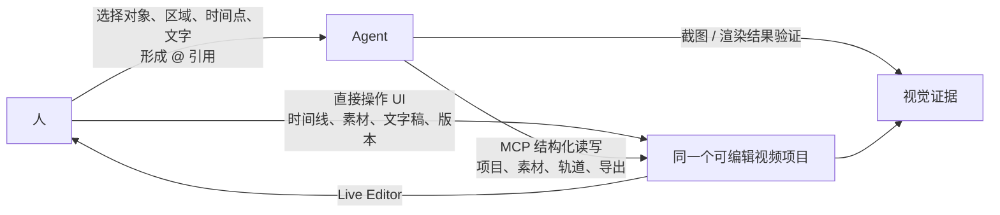
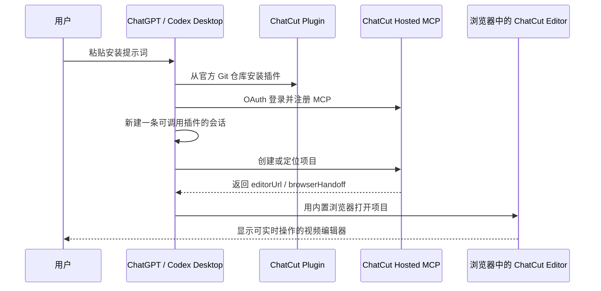
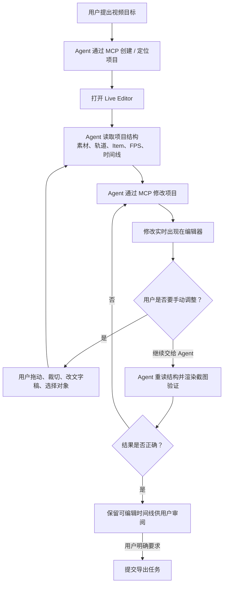
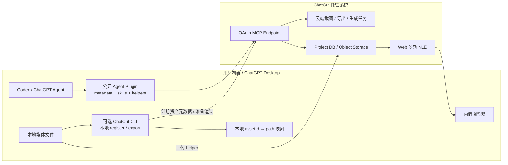

# ChatCut Agent Plugin 调研

> 调研日期：2026-07-14  
> 范围：只使用 ChatCut 官网、官方 GitHub 仓库、仓库内 README / 配置 / Skill / 代码，以及官方产品文档。本文区分“公开的 Agent 插件源码”和“未公开的 ChatCut 编辑器 / 后端实现”，不把营销页面推断成源码事实。

## 结论

ChatCut 已经在视频编辑这个垂直领域实现了 Open Artifacts 所设想的关键交互闭环：**人和 Agent 面对同一个可编辑产物；人通过视频编辑器直接操作时间线，Agent 通过结构化工具读取和修改项目，并把实时编辑器作为共同的预览与验收界面。**

但它不是 Open Artifacts 的直接同类实现：ChatCut 是一个**主产品源码未公开、托管、视频专用的 SaaS 编辑器**，公开仓库只是连接 Codex / ChatGPT 与 ChatCut 托管 MCP 服务的插件分发包；Open Artifacts 想做的是**通用、源码优先、本地可运行且可 fork 的 Artifact Package Runtime**。

最值得 Open Artifacts 学习的不是视频能力，而是这套双通道协作方式：



## 1. 官方源码在哪里

- 官网安装指引明确指定公共 Marketplace 仓库为 [`ChatCut-Inc/agent-plugin`](https://github.com/ChatCut-Inc/agent-plugin)，安装时使用 `main` ref；仓库 README 也给出同一地址。[官网安装指引](https://chatcut.io/chatgpt-plugin) · [仓库 README](https://github.com/ChatCut-Inc/agent-plugin#repository)
- 仓库内容是一个 Codex Agent Plugin，当前包括插件元数据、托管 MCP 配置、视频工作流 Skills、品牌素材和本地媒体上传辅助脚本；README 没有声称这里包含 ChatCut 编辑器或后端源码。[目录结构](https://github.com/ChatCut-Inc/agent-plugin) · [README](https://github.com/ChatCut-Inc/agent-plugin/blob/main/README.md#what-is-included)
- 插件通过 OAuth 连接托管端点 `https://api.chatcut.io/api/external-mcp/mcp`，不是在本地启动 ChatCut 后端。[`.mcp.json`](https://github.com/ChatCut-Inc/agent-plugin/blob/main/chatcut/.mcp.json) · [README Authentication](https://github.com/ChatCut-Inc/agent-plugin/blob/main/README.md#authentication)

虽然官网 URL 和标题使用 “ChatGPT Plugin”，但当前公开实现不是 2023 年那种 `ai-plugin.json` / REST Action 插件：安装命令使用 Codex Plugin Marketplace，清单位于 `.codex-plugin/plugin.json`，能力通过 MCP 暴露，并依赖 Codex 内置浏览器完成编辑器 handoff。[官网安装指引](https://chatcut.io/chatgpt-plugin) · [`plugin.json`](https://github.com/ChatCut-Inc/agent-plugin/blob/main/chatcut/.codex-plugin/plugin.json) · [`.mcp.json`](https://github.com/ChatCut-Inc/agent-plugin/blob/main/chatcut/.mcp.json)

因此，“ChatCut 开源了”需要精确表述为：

> **ChatCut 开源了 Agent 集成层和工作流说明；从官方公开仓库可见内容看，Web 视频编辑器、项目数据库、媒体存储、渲染服务和 MCP 服务端实现没有随这个仓库公开。**

## 2. 当前状态

截至 2026-07-14，可以把状态判断为“产品可用，Agent 插件仍处于 beta / rollout 阶段”：

- 官网已有可登录的 Web 编辑器、文档、免费方案和付费方案，并将 ChatCut 定义为“web-based AI video editing agent”；它支持完整时间线、字幕、Motion Graphics、生成式视频 / 图片 / 音乐等。[产品定义](https://chatcut.io/docs/what-is-chatcut) · [价格页](https://chatcut.io/pricing)
- 插件落地页同时给出完整安装流程和应用场景，但 FAQ 仍称该页面是在“preview”插件体验与配置路径。因此不能仅凭落地页断言其已经全面 GA。[插件页面](https://chatcut.io/chatgpt-plugin)
- 官方仓库的默认分支为 `beta`，安装指引使用 `main`；插件元数据版本是 `0.2.18`，仓库没有 GitHub Release 或 tag。[仓库](https://github.com/ChatCut-Inc/agent-plugin) · [`plugin.json`](https://github.com/ChatCut-Inc/agent-plugin/blob/main/chatcut/.codex-plugin/plugin.json) · [最近一次 `main` 提交](https://github.com/ChatCut-Inc/agent-plugin/commit/a3a639cd9e422f477976065e3f1c4e901e01feeb)

## 3. 产品工作流

### 3.1 安装和进入项目



官网安装文件要求桌面版 ChatGPT / Codex：安装 Marketplace 插件、对 ChatCut MCP 完成 OAuth，然后新建一条会话，并用内置浏览器打开用户的第一个编辑项目。[官方安装指引](https://chatcut.io/chatgpt-plugin)

这里的浏览器不是唯一控制面。Agent 的主要执行接口是 MCP；浏览器承担把共同产物显示给用户、让用户随时接管编辑，以及必要的可见结果检查。

### 3.2 人与 Agent 如何共同编辑



公开 Skill 给出了几个关键约束：

1. **同一项目是共享事实源。** Agent 改动通过 ChatCut 的 DB / 对象存储路径写入，应该真实出现在编辑器；用户也可能在浏览器里手动改动，所以 Agent 在继续操作前必须重新读取最新项目状态。[Plugin Basics](https://github.com/ChatCut-Inc/agent-plugin/blob/main/chatcut/skills/chatcut-plugin-basics/SKILL.md)
2. **结构化读写优先。** Agent 读取项目、素材、轨道、时间线 Item 及帧级位置，再通过 MCP 工具修改它们，而不是仅靠截图猜测数值。[Plugin Basics](https://github.com/ChatCut-Inc/agent-plugin/blob/main/chatcut/skills/chatcut-plugin-basics/SKILL.md#data-model)
3. **视觉验证是第二条证据链。** `read_project` 验证结构，`render_cloud_screenshot` 验证精确帧上合成后的视觉结果；工具返回成功本身不等于结果正确。[Verification Skill](https://github.com/ChatCut-Inc/agent-plugin/blob/main/chatcut/skills/verification/SKILL.md)
4. **默认交付可编辑时间线，不是扁平 MP4。** 除非用户要求最终导出，否则 Agent 应把 Live Editor 留给用户审阅和继续调整。[Plugin Basics](https://github.com/ChatCut-Inc/agent-plugin/blob/main/chatcut/skills/chatcut-plugin-basics/SKILL.md#do-only-what-was-asked)

### 3.3 人如何把 UI 上下文交给 Agent

ChatCut 编辑器的选择模式允许人选择：

- 时间线 Item 或素材；
- 预览画布中的一个区域；
- 时间线上的一个时间点；
- Transcript 中的一段文字。

这些选择会以 `@ mention` 加入 AI 输入框，为 Agent 提供准确目标。[UI & Features](https://github.com/ChatCut-Inc/agent-plugin/blob/main/chatcut/skills/product-help/references/ui-and-features.md#ai-panel)

这和 Open Artifacts 设想的“人在产物上圈选或批注，然后 Agent 获得结构化上下文”很接近，但目前公开资料只证明了**选择引用**，没有证明存在通用的持久批注、批注解决状态，或 `fetch changes/comments` 这一类事件协议。

编辑器顶部有协作者在线头像，但公开资料没有证明存在“Agent 正在看哪个对象 / 区域”的 gaze 或 presence 浮层。[UI & Features — Top Bar](https://github.com/ChatCut-Inc/agent-plugin/blob/main/chatcut/skills/product-help/references/ui-and-features.md#top-bar)

### 3.4 动态表单

插件还通过 MCP Apps 的 `ask_followup_questions` 在对话中展示结构化表单，支持单选、多选、文本、视觉风格卡片、声音试听和场景卡片。[Widget Forms Skill](https://github.com/ChatCut-Inc/agent-plugin/blob/main/chatcut/skills/widget-forms/SKILL.md)

这是“Agent 不必把所有交互压成纯文本”的另一种实现，但表单仍发生在对话宿主中；真正的视频产物交互则发生在 ChatCut Editor。

## 4. 可从公开资料确认的技术架构



公开材料支持以下判断：

- **宿主层：** Codex / ChatGPT 插件由 `plugin.json`、MCP 配置和一组 Skills 组成；插件本身不包含主编辑器 UI。[`plugin.json`](https://github.com/ChatCut-Inc/agent-plugin/blob/main/chatcut/.codex-plugin/plugin.json) · [README](https://github.com/ChatCut-Inc/agent-plugin/blob/main/README.md)
- **Agent API 层：** 所有项目操作通过一个托管、OAuth 保护的 MCP endpoint 暴露。[`.mcp.json`](https://github.com/ChatCut-Inc/agent-plugin/blob/main/chatcut/.mcp.json)
- **数据模型：** Project 拥有共享素材库和多个 Timeline；Timeline 拥有 Canvas、视频 / 音频 Tracks 和 Items；Asset 与 Timeline Item 分离，使同一素材可多次引用，素材内容和实例位置也可分别修改。[Plugin Basics — Data Model](https://github.com/ChatCut-Inc/agent-plugin/blob/main/chatcut/skills/chatcut-plugin-basics/SKILL.md#data-model)
- **媒体路径：** 默认辅助脚本把本地媒体导入 ChatCut；视频会被规范到 30fps。另有 `chatcut register` / `chatcut export` 的本地资产和本地渲染路径，让素材字节留在本机，但项目结构仍由 ChatCut 会话和服务协调。[Asset Import Skill](https://github.com/ChatCut-Inc/agent-plugin/blob/main/chatcut/skills/asset-import/SKILL.md) · [Export Skill](https://github.com/ChatCut-Inc/agent-plugin/blob/main/chatcut/skills/export/SKILL.md)
- **编辑器：** Web 端是多轨非线性编辑器，包含 AI 面板、预览画布、素材 / Transcript 面板、Timeline、版本和导出。[UI & Features](https://github.com/ChatCut-Inc/agent-plugin/blob/main/chatcut/skills/product-help/references/ui-and-features.md#editor-layout)
- **同步模型：** 官方 Skill 说 Agent 写入后应在编辑器可见，也明确要求在用户可能手工编辑后重读状态；但公开仓库没有服务端同步代码，因此无法从源码确认其底层是 WebSocket、轮询、CRDT、OT 还是其他协议。[Plugin Basics](https://github.com/ChatCut-Inc/agent-plugin/blob/main/chatcut/skills/chatcut-plugin-basics/SKILL.md)

官网官方博客把 ChatCut 描述为“dual-mode AI assistance + transcript-synchronized timeline”的研究方向，但官网、官方文档和公开仓库没有链接到一篇可核验的 ChatCut 正式论文或技术白皮书；因此本文把它当产品设计说明，而不当同行评审证据。[官方研究文章](https://chatcut.io/blog/chatcut-llm-transcript-driven-documentary-editing)

## 5. 和 Open Artifacts 的关系

### 相似之处

| 共同思想                    | ChatCut 的实现                                                  |
| --------------------------- | --------------------------------------------------------------- |
| 人与 Agent 围绕同一产物协作 | 同一个 ChatCut Project / Timeline 同时供人操作和 Agent 修改     |
| 复杂任务应该出现领域 UI     | 视频任务进入完整 NLE，而不是只返回文字或最终文件                |
| Agent 需要结构化数据通道    | MCP 读取和修改项目、时间线、素材、导出任务                      |
| Agent 还需要视觉通道        | Live Editor、源素材帧、`render_cloud_screenshot`                |
| 人可以精确指向产物局部      | Item、素材、画布区域、时间点、Transcript 片段会形成 `@ mention` |
| 产物应保持可编辑            | 默认审阅对象是时间线，只有明确要求才导出扁平文件                |

所以 ChatCut 是对 Open Artifacts 核心假设的强验证：**当 Agent 处理复杂媒介时，共享的领域编辑器比聊天消息或单向生成结果更自然。**

### 关键差异

| 维度           | ChatCut                              | Open Artifacts 设想                              |
| -------------- | ------------------------------------ | ------------------------------------------------ |
| 领域           | 视频编辑专用                         | 任意交互式 Artifact                              |
| Runtime        | 托管 ChatCut SaaS + MCP              | 本地 `oa` CLI + Server                           |
| UI 来源        | ChatCut 自有、源码未公开的编辑器     | 可下载的 Artifact Package                        |
| 分发单位       | Agent Plugin + 托管服务              | 源码发布的 Render / Artifact Package             |
| 可 fork 对象   | 可复制项目、时间线和编辑流程         | 可 fork UI / 逻辑 package 源码                   |
| Agent 操作面   | ChatCut 专用 MCP tools               | 通用 Session / state / changes / annotations API |
| 数据与执行位置 | 云端为主，部分媒体可本地注册 / 导出  | 目标是 local-first，可按需扩展远端能力           |
| 开放性         | 开放集成层，不开放编辑器与服务端实现 | 核心格式、Runtime 与 Package 生态都应开放        |

## 6. 对 Open Artifacts 可复用的设计

### 6.1 把“人类界面”和“Agent API”视为同一 Artifact 的两种投影

OA Package 不应只导出 React Component，还应导出或声明一套 Agent 可读取的领域状态与命令：

```text
Human: 浏览器 UI → 操作 Session
Agent: oa state / changes / apply → 操作同一个 Session
Both: 共享 revision、selection、presence、annotations
```

ChatCut 的教训是：Browser Use 适合观察整体和空间关系，结构化 API 适合精确读写；两者互补，不应强迫 Agent 用视觉点击完成所有操作。

### 6.2 明确三种证据，不把“命令成功”当“产物正确”

可以借鉴 ChatCut 的验证顺序：

1. **结构证据：** `oa state` 确认数据和 revision；
2. **视觉证据：** Browser Use 或 `oa screenshot` 确认最终呈现；
3. **用户证据：** 人在共享 UI 中审阅、修改或批准。

### 6.3 默认交付可编辑 Session

和 ChatCut 默认交付时间线一样，OA 的主要结果应该是可继续修改的 Artifact Session；PNG、PDF、MP4 等是显式导出，不是默认终点。

### 6.4 让 UI 选择直接产生结构化引用

ChatCut 的 `@ mention` 覆盖素材、Item、时间点、区域和 Transcript。OA 可抽象为：

```json
{
  "target": {
    "kind": "timeline-range",
    "artifactId": "...",
    "start": 12.4,
    "end": 16.8
  }
}
```

这比只传坐标或截图更稳定，也可直接成为 annotation、change 或 Agent command 的 target。

### 6.5 防止 Agent 使用陈旧状态

ChatCut 明确要求用户可能手动修改后重新读取项目。OA 应让每次读写带 revision，并提供乐观并发控制：

```text
oa state             → revision 18
oa apply --base 18   → revision 19
```

当人类已经改到 revision 20 时，Agent 基于 18 的写入应该冲突，而不是静默覆盖。

## 7. 不应照搬的部分与风险

1. **不要把通用协议藏在产品专用 MCP 工具里。** ChatCut 的工具语义与视频领域深度绑定；OA 需要稳定的 Session / state / event / target 基础协议，再由 Package 扩展领域命令。
2. **不要把 Browser Use 当数据同步机制。** ChatCut 也使用结构化项目读取；OA 的 Browser Use 应服务于视觉理解、空间操作和验收，而不是代替 `oa state`。
3. **需要明确权限和副作用。** ChatCut 的插件声明 `Read` / `Write`，生成任务还有确认卡。OA 下载并执行源码 Package 时风险更高，应定义包来源、依赖安装、文件 / 网络权限、沙箱、写操作确认和审计记录。[`plugin.json`](https://github.com/ChatCut-Inc/agent-plugin/blob/main/chatcut/.codex-plugin/plugin.json) · [UI & Features — Generation confirmation](https://github.com/ChatCut-Inc/agent-plugin/blob/main/chatcut/skills/product-help/references/ui-and-features.md#ai-panel)
4. **本地与云端资产语义要显式。** ChatCut 区分本地注册资产和云端可读资产，云渲染无法读取纯本地文件。OA 也需要明确 package、session 数据和大文件各自的位置及可移植性。[Asset Import Skill](https://github.com/ChatCut-Inc/agent-plugin/blob/main/chatcut/skills/asset-import/SKILL.md#local-only-import-no-s3-upload)
5. **共享 Session 需要真正的并发协议。** ChatCut 公开资料只描述“重读最新状态”，没有暴露底层同步实现。OA 若要支持人和多个 Agent 同时操作，需要自己定义 revision、冲突、撤销、事件游标和 presence 生命周期。
6. **不要混淆“开源插件”和“可 fork 产品”。** ChatCut 用户可以编辑项目，但不能从公开插件仓库 fork 出完整视频编辑器。OA 的差异化恰恰是 Package 源码可读、可运行、可 fork。

## 8. 许可证判断

- 插件元数据声明 `GPL-3.0-only`。[`plugin.json`](https://github.com/ChatCut-Inc/agent-plugin/blob/main/chatcut/.codex-plugin/plugin.json)
- 但仓库根目录没有 `LICENSE` 文件，GitHub 仓库也没有识别出许可证；仓库内出现的许可证文件是随附 FFmpeg 二进制及其构建分发说明，并不等同于给整个仓库补上一份完整顶层许可证。[仓库文件树](https://github.com/ChatCut-Inc/agent-plugin) · [FFmpeg GPLv3 文本](https://github.com/ChatCut-Inc/agent-plugin/blob/main/chatcut/skills/asset-import/scripts/ffmpeg/FFMPEG-GPLv3.txt)

因此：

> 可以学习其公开架构和工作流；若要复制、修改或分发代码，应先向 ChatCut 确认顶层授权范围，并按 GPL-3.0-only 评估衍生作品义务。不要因为仓库公开就假设代码可以无条件复用。

## 9. 对 Open Artifacts 定位的修正

ChatCut 出现后，Open Artifacts 不宜再把自己描述成“第一个让 Agent 打开领域 UI 的产品”。更准确的位置是：

> **ChatCut 证明了垂直领域的共享 Artifact 工作方式；Open Artifacts 要把这种能力从一个闭源视频产品，抽象成开放、通用、local-first、源码可 fork 的 Package 与 Session 协议。**

一句话差异：

> **ChatCut 是一个 Agent 能操作的视频编辑器；Open Artifacts 要成为任何 Agent 与人共同操作任意领域编辑器的开放运行时。**

## 一手来源索引

- [ChatCut ChatGPT / Codex Plugin 页面与安装指引](https://chatcut.io/chatgpt-plugin)
- [ChatCut 官方产品定义](https://chatcut.io/docs/what-is-chatcut)
- [ChatCut 官方编辑理念：LLMs for Transcript-Driven Editing](https://chatcut.io/blog/chatcut-llm-transcript-driven-documentary-editing)
- [官方 GitHub：ChatCut-Inc/agent-plugin](https://github.com/ChatCut-Inc/agent-plugin)
- [Plugin Basics Skill](https://github.com/ChatCut-Inc/agent-plugin/blob/main/chatcut/skills/chatcut-plugin-basics/SKILL.md)
- [Verification Skill](https://github.com/ChatCut-Inc/agent-plugin/blob/main/chatcut/skills/verification/SKILL.md)
- [Widget Forms Skill](https://github.com/ChatCut-Inc/agent-plugin/blob/main/chatcut/skills/widget-forms/SKILL.md)
- [UI & Features](https://github.com/ChatCut-Inc/agent-plugin/blob/main/chatcut/skills/product-help/references/ui-and-features.md)
- [Asset Import Skill](https://github.com/ChatCut-Inc/agent-plugin/blob/main/chatcut/skills/asset-import/SKILL.md)
- [Export Skill](https://github.com/ChatCut-Inc/agent-plugin/blob/main/chatcut/skills/export/SKILL.md)
