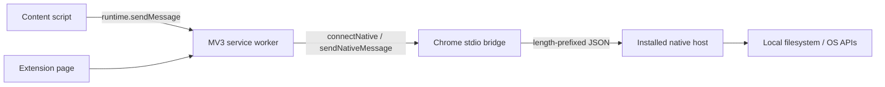

# Chrome Extension（Manifest V3）访问本地内容的三条路径（2026-07-31）

> 调研截止：2026-07-31（Asia/Shanghai）  
> 证据范围：Chrome / Chromium 官方文档为主；MDN 只用于补充 Web API 的接口约束。本文讨论 Chrome Extension MV3 中运行的浏览器代码，不讨论已淘汰的 Chrome Apps `chrome.fileSystem` API。

## 结论先行

| 需求                                                   | 正确入口                                         | 是否需要逐次用户选择                                         | 能力边界                                                                |
| ------------------------------------------------------ | ------------------------------------------------ | ------------------------------------------------------------ | ----------------------------------------------------------------------- |
| 读取扩展安装包内的静态资源                             | `chrome.runtime.getURL()` + `fetch()`            | 否                                                           | 只能访问扩展包内的相对路径；`getURL()` 只构造 URL，不授予网页访问权     |
| 读取用户选择的文件或目录                               | `showOpenFilePicker()` / `showDirectoryPicker()` | 首次选择需要；之后可复用持久化 handle，但要重新检查/请求权限 | 权限绑定到用户选中的 handle，不等于任意路径权限                         |
| 后台读取已知 `file://` 路径                            | extension page / service worker `fetch(fileUrl)` | 不需每次 picker；但安装后用户必须开启“允许访问文件网址”      | 需要 `file:///*` host permission 和用户开关；仍受 Chrome 与 OS 权限限制 |
| 稳定访问任意本机文件、遍历目录、监听变化或调用本机能力 | Native Messaging host                            | 浏览器内不需要 picker；但必须另行安装并注册原生 host         | 真正文件 I/O 在本机进程中完成；扩展只收发 JSON 消息                     |

`chrome.downloads` 不属于“读本机文件”的方案。它用于发起、搜索和管理 Chrome 的下载记录/下载任务，即使 `DownloadItem.filename` 暴露绝对路径，也没有“按路径读取文件内容”的 API。

## 1. 扩展包内静态资源

### 1.1 扩展自身页面或 service worker

每个扩展有独立的 `chrome-extension://<extension-id>/` origin。Chrome 官方说明，扩展 service worker 或前台 extension page 不需要额外权限即可 `fetch()` 自己安装目录中的资源；`runtime.getURL(path)` 将安装目录内的相对路径转换成完整 URL。

```js
// popup.js、side-panel.js、options.js 或 service-worker.js
const url = chrome.runtime.getURL('assets/default-project.json');
const response = await fetch(url);
if (!response.ok) throw new Error(`HTTP ${response.status}`);
const project = await response.json();
```

这里不需要 `host_permissions`，也不需要把资源放进 `web_accessible_resources`。同一 extension origin 中也可直接写：

```js
const response = await fetch('/assets/default-project.json');
```

来源：[chrome.runtime.getURL()](https://developer.chrome.com/docs/extensions/reference/api/runtime/#method-getURL)、[Cross-origin network requests：Extension origin](https://developer.chrome.com/docs/extensions/develop/concepts/network-requests#extension-origin)。

### 1.2 Content script 与宿主网页不是 extension page

Content script 默认运行在 `ISOLATED` world：它能共享宿主页面的 DOM，但页面 JavaScript、content script、其他扩展的 JavaScript 全局变量彼此不可见。Content script 只能直接调用一小组 extension API，其中包括 `runtime.getURL()` 和消息 API；需要其他 extension API 时应向 service worker / extension page 发消息。

如果 content script 要把扩展资源交给网页 DOM，或用 `fetch()` 读取扩展文件，Chrome 要求先在 MV3 manifest 的 `web_accessible_resources` 中暴露该文件：

```json
{
  "manifest_version": 3,
  "name": "Local asset example",
  "version": "1.0.0",
  "content_scripts": [
    {
      "matches": ["https://example.com/*"],
      "js": ["content.js"]
    }
  ],
  "web_accessible_resources": [
    {
      "resources": ["assets/logo.png", "assets/default-project.json"],
      "matches": ["https://example.com/*"],
      "use_dynamic_url": true
    }
  ]
}
```

```js
// content.js
const logo = document.createElement('img');
logo.src = chrome.runtime.getURL('assets/logo.png');
document.body.append(logo);

const defaults = await fetch(chrome.runtime.getURL('assets/default-project.json')).then((r) =>
  r.json(),
);
```

边界必须分清：

- `runtime.getURL()` 只把相对路径变成 `chrome-extension://…` URL；它本身不使资源对页面可读。
- `web_accessible_resources[].matches` / `extension_ids` 才决定哪些网页 origin 或扩展能访问哪些文件。匹配的是 origin，match pattern 的 path 必须是 `/*`。
- 被暴露的资源会带合适的 CORS header，可被匹配页面 `fetch()`；未列出的资源，从 web origin 导航过去也会被 Chrome 阻止。
- `use_dynamic_url: true` 使用每个浏览器 session 重建的动态 ID，减少稳定扩展 URL 被跨站追踪的风险。
- Chrome 的 manifest 文档注明“content scripts themselves do not need to be allowed”，指 content-script 文件本身无需列入 WAR；但 content script 要访问的其他扩展资产仍应按 content-script 文档列入 WAR。
- WAR 会把资源同时暴露给该站点的一方和第三方页面脚本。不要把秘密、令牌或仅供扩展内部使用的数据放进 WAR。

来源：[Content scripts：isolated world、能力与 extension files](https://developer.chrome.com/docs/extensions/develop/concepts/content-scripts)、[Web Accessible Resources manifest](https://developer.chrome.com/docs/extensions/reference/manifest/web-accessible-resources)、[runtime API 的注入图片示例](https://developer.chrome.com/docs/extensions/reference/api/runtime/#add-image-to-web-page)。

如果宿主页面 JavaScript 需要和 content script 通信，隔离世界之间应使用共享 DOM / `window.postMessage()`，并严格校验 `event.source`、消息结构与来源；若网页要直接向扩展发消息，还需 `externally_connectable`。页面并不会因为知道 extension URL 就获得 `chrome.*` API 或 content script 的变量。

来源：[Content scripts：Communication with the embedding page](https://developer.chrome.com/docs/extensions/develop/concepts/content-scripts#host-page-communication)、[Message passing：Send messages from web pages](https://developer.chrome.com/docs/extensions/develop/concepts/messaging#external-webpage)。

## 2. 用户主动选择本地文件或目录

File System Access API 是首选的浏览器内最小权限方案。picker 必须从有 `window` 的安全上下文调用，并由用户手势触发；MV3 service worker 没有 DOM / `window`，所以典型做法是在 popup、side panel、options page 或 extension tab 的按钮事件中选择，再把结果或 handle 交给需要的 extension context。

### 2.1 读取单个文件

```js
openButton.addEventListener('click', async () => {
  const [handle] = await window.showOpenFilePicker({
    multiple: false,
    types: [
      {
        description: 'JSON',
        accept: { 'application/json': ['.json'] },
      },
    ],
  });

  const file = await handle.getFile();
  const text = await file.text();
  console.log(file.name, text);
});
```

读取权限由用户在 picker 中选择文件时授予，不需要 Chrome extension manifest permission。用户取消时会抛出异常；代码应正常处理。

### 2.2 读取目录

```js
directoryButton.addEventListener('click', async () => {
  const dir = await window.showDirectoryPicker({ mode: 'read' });

  for await (const [name, entry] of dir.entries()) {
    if (entry.kind !== 'file') continue;
    const file = await entry.getFile();
    console.log(name, await file.text());
  }
});
```

`showDirectoryPicker()` 返回 `FileSystemDirectoryHandle`，权限作用域是用户明确选中的目录。浏览器可能禁止选择敏感系统目录；这不是获取根目录任意访问权的绕行方式。

来源：[Chrome File System Access API：open/read/directory/security](https://developer.chrome.com/docs/capabilities/web-apis/file-system-access)、[Chrome：Reading and writing files and directories](https://developer.chrome.com/docs/capabilities/browser-fs-access)。

### 2.3 Handle 持久化不等于权限永久有效

File / directory handle 是 structured-clone 可序列化对象，可存入 IndexedDB，也可在同一 top-level origin 的上下文之间 `postMessage()`。不要存到 `chrome.storage`：后者要求 JSON 可序列化值，不能保留原生 handle 类型。

```js
// 省略 IndexedDB 的 open/transaction 样板
await idbPut('workspace', directoryHandle);

const handle = await idbGet('workspace');
const options = { mode: 'read' };
let state = await handle.queryPermission(options);

if (state !== 'granted') {
  // requestPermission 也应放在用户手势里调用。
  state = await handle.requestPermission(options);
}
if (state !== 'granted') throw new Error('File access not granted');
```

持久化的是“对哪个 entry 的引用”，不是绕过权限的通行证。重新打开 extension page 或浏览器后，应先 `queryPermission()`；如为 `prompt`，在用户手势中调用 `requestPermission()`。用户可以撤销访问，文件也可能被移动或删除。Chrome 官方当前说明，已授予的访问至少在同 origin 的所有 tab 关闭前可继续使用，之后再次使用可能重新提示。

来源：[Chrome：Storing file or directory handles in IndexedDB 与 Permission persistence](https://developer.chrome.com/docs/capabilities/web-apis/file-system-access#store-file-directory-handles)、[MDN FileSystemHandle.queryPermission()](https://developer.mozilla.org/docs/Web/API/FileSystemHandle/queryPermission)、[MDN FileSystemHandle.requestPermission()](https://developer.mozilla.org/docs/Web/API/FileSystemHandle/requestPermission)。

## 3. 无 picker 访问固定路径或任意本机文件

这里有两个层级，不能混为一谈。

### 3.1 Chrome 的 `file:` URL 访问：可读已知路径，但需要一次显式总开关

Chrome 官方的扩展更新记录明确：从 Chrome 99 起，MV2 / MV3 extension service worker 可用 Fetch API 请求 `file:` scheme URL。要这样做：

1. manifest 声明相应的 file scheme host permission；固定文件也无法用 match pattern 精确到 path，因为 host permission 的 path 部分不作为细粒度文件授权边界，通常只能声明 `file:///*`。
2. 用户必须在 `chrome://extensions` 的该扩展详情页手动开启 **Allow access to file URLs / 允许访问文件网址**。
3. 运行时可用 `chrome.extension.isAllowedFileSchemeAccess()` 检查开关。

```json
{
  "manifest_version": 3,
  "name": "Known local path reader",
  "version": "1.0.0",
  "host_permissions": ["file:///*"],
  "background": { "service_worker": "service-worker.js" }
}
```

```js
// service-worker.js
async function readKnownFile(fileUrl) {
  const allowed = await chrome.extension.isAllowedFileSchemeAccess();
  if (!allowed) {
    throw new Error("Enable 'Allow access to file URLs' for this extension");
  }

  // 调用方应传入用 URL / encodeURI 正确编码过的 file URL。
  const url = new URL(fileUrl);
  if (url.protocol !== 'file:') throw new TypeError('Expected file: URL');

  const response = await fetch(url.href);
  if (!response.ok) throw new Error(`Cannot read ${url.href}`);
  return response.text();
}
```

这条路“每次读取无 picker”，但不是静默获得本机文件权限：安装 manifest 后仍由用户控制全局 file-URL 开关，且 `file:///*` 权限很宽。它也不是一个完整的文件系统 API：官方只承诺对 file-scheme URL 的 Fetch 请求；目录枚举、文件监听、原子写入、Unix 权限提升、macOS TCC 绕过等都不由它提供。Content script 的 fetch 仍代表宿主 web origin，不会继承 extension service worker / page 的跨 origin fetch 能力；应通过消息让 service worker 读取，并只允许经过验证的路径/操作。

来源：[Chrome extensions What's new：Chrome 99 service worker support for file schemes](https://developer.chrome.com/docs/extensions/whats-new#chrome-99-file-scheme)、[Declare permissions：Allow access to file URLs](https://developer.chrome.com/docs/extensions/develop/concepts/declare-permissions#allow-access)、[`isAllowedFileSchemeAccess()`](https://developer.chrome.com/docs/extensions/reference/api/extension#method-isAllowedFileSchemeAccess)、[Cross-origin requests：content script 与 extension origin 边界](https://developer.chrome.com/docs/extensions/develop/concepts/network-requests)。

### 3.2 Native Messaging：把任意文件能力放进单独安装的本机进程

当需求是稳定访问任意绝对路径、递归目录、监听变化、处理大文件，或复用本机凭据/沙箱权限时，Chrome 官方提供的扩展—本机桥是 Native Messaging：



扩展 manifest：

```json
{
  "manifest_version": 3,
  "name": "Native local reader",
  "version": "1.0.0",
  "permissions": ["nativeMessaging"],
  "background": { "service_worker": "service-worker.js" }
}
```

本机 host manifest（这是独立于 extension manifest 的第二个文件）：

```json
{
  "name": "com.example.local_reader",
  "description": "Reads explicitly allowed local paths",
  "path": "/Applications/Example.app/Contents/MacOS/local-reader-host",
  "type": "stdio",
  "allowed_origins": ["chrome-extension://abcdefghijklmnopabcdefghijklmnop/"]
}
```

```js
// service-worker.js；connectNative 适合复用一个长连接
const port = chrome.runtime.connectNative('com.example.local_reader');
port.onMessage.addListener((message) => console.log(message));
port.onDisconnect.addListener(() => console.error(chrome.runtime.lastError));
port.postMessage({ op: 'read', path: '/absolute/path/project.json' });
```

关键限制：

- `runtime.connectNative()` / `sendNativeMessage()` 需要 extension manifest 的 `nativeMessaging` permission。
- 这两个方法不能从 content script 直接调用；content script 先给 service worker 或 extension page 发消息。
- 原生 host 必须由安装器另行放置可执行文件和 host manifest。macOS/Linux 的 `path` 必须是绝对路径；host manifest 的 `allowed_origins` 必须列出完整 extension origin，不能用 wildcard。
- macOS 的用户级 Google Chrome host manifest 默认在 `~/Library/Application Support/Google/Chrome/NativeMessagingHosts/`，系统级在 `/Library/Google/Chrome/NativeMessagingHosts/`；Chrome for Testing 与 Chromium 的目录不同，应按官方表格安装。
- Chrome 启动 host 子进程，通过 stdin/stdout 传输 UTF-8、32-bit native-endian 长度前缀的 JSON；host 的 stdout 只能输出协议消息，诊断日志写 stderr。
- `connectNative()` 在 port 存续期间保持进程；`sendNativeMessage()` 每个调用启动一个新进程，只采用 host 的第一条回复。
- host 最终能读什么仍取决于运行用户、文件权限、macOS 隐私/TCC、应用沙箱等 OS 约束。扩展端必须把网页/content-script 输入视为不可信，host 侧应做 allowlist、路径规范化、操作授权和结果大小限制，不能实现裸 `read-any-path` 代理。

来源：[Chrome Native messaging](https://developer.chrome.com/docs/extensions/develop/concepts/native-messaging)、[chrome.runtime native messaging permission](https://developer.chrome.com/docs/extensions/reference/api/runtime/#permissions)。

## 4. 为什么 `chrome.downloads` 不是本地文件读取 API

`chrome.downloads` 的官方用途是“发起、监控、操作、搜索下载”。它需要 `"downloads"` permission：

```json
{
  "permissions": ["downloads"]
}
```

```js
const id = await chrome.downloads.download({
  url: chrome.runtime.getURL('exports/project.json'),
  filename: 'open-artifacts/project.json',
  saveAs: true,
});
```

它可以返回下载项元数据、显示下载文件、在用户手势后打开已完成下载，或删除下载文件；但 API 没有 `readFile(path)`，也不能凭 `DownloadItem.filename` 读取文件字节。因此：

- 导出 extension 生成的 Blob / URL 到磁盘：可以用 downloads。
- 查询某个文件是否作为 Chrome download 出现过：可以搜索 download history。
- 按任意本机路径读取内容：不可以；改用 File System Access handle、经授权的 `file:` fetch，或 Native Messaging。

来源：[chrome.downloads API](https://developer.chrome.com/docs/extensions/reference/api/downloads)。

## 5. 推荐决策

1. **只读内置模板/图标/schema**：放进 extension package，由 extension context 直接 `fetch(chrome.runtime.getURL(...))`；只有需要交给宿主网页时才最小化声明 WAR。
2. **用户拥有的 Artifact Package / workspace**：在 extension page 中用 `showDirectoryPicker()`，把 directory handle 存 IndexedDB；每次恢复都 `queryPermission()`，需要时由用户手势重新授权。
3. **已知固定路径、用户愿意授予全局 file URL 能力的本地 PoC**：可用 `file:///*` + “允许访问文件网址” + service worker fetch。由于权限过宽，不建议把它包装成无感默认能力。
4. **产品级 daemon / 任意路径 / watch / 大文件流**：安装受控的 Native Messaging host；扩展只做 UI 与消息适配，host 负责 OS 文件 I/O 和策略。不要用 `chrome.downloads` 冒充读取通道。

## 官方资料索引

- [Chrome Extensions：runtime API](https://developer.chrome.com/docs/extensions/reference/api/runtime/)
- [Chrome Extensions：Web Accessible Resources](https://developer.chrome.com/docs/extensions/reference/manifest/web-accessible-resources)
- [Chrome Extensions：Content scripts](https://developer.chrome.com/docs/extensions/develop/concepts/content-scripts)
- [Chrome Extensions：Cross-origin network requests](https://developer.chrome.com/docs/extensions/develop/concepts/network-requests)
- [Chrome Extensions：Declare permissions](https://developer.chrome.com/docs/extensions/develop/concepts/declare-permissions)
- [Chrome Extensions：Native messaging](https://developer.chrome.com/docs/extensions/develop/concepts/native-messaging)
- [Chrome Extensions：downloads API](https://developer.chrome.com/docs/extensions/reference/api/downloads)
- [Chrome：File System Access API](https://developer.chrome.com/docs/capabilities/web-apis/file-system-access)
- [Chrome：Reading and writing files and directories](https://developer.chrome.com/docs/capabilities/browser-fs-access)
