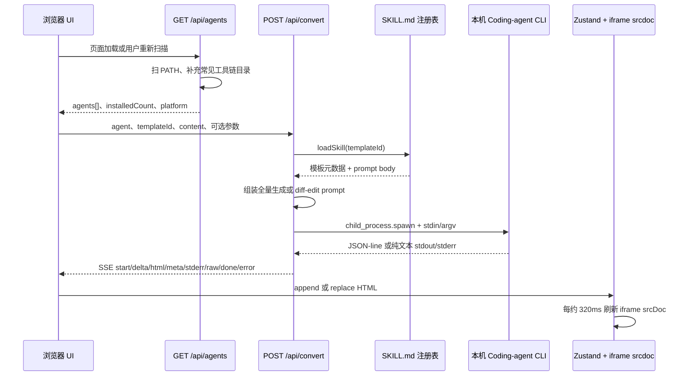

# HTML Anything 核心功能与两个 API 研究

> 调研日期：2026-07-23  
> 仓库：[`nexu-io/html-anything`](https://github.com/nexu-io/html-anything)  
> 核对快照：[`d0efb1eaa3b65c731709981718cd5a0a0d4e8f71`](https://github.com/nexu-io/html-anything/tree/d0efb1eaa3b65c731709981718cd5a0a0d4e8f71)  
> 证据范围：官方 README / 官方项目页 / 源码 / package manifest / tests / CI。本文不用第三方解读；“事实”与“推断”分开标注。

## 一句话结论

**事实：** HTML Anything 是一个本地优先的 Agent 驱动 HTML 编辑器。浏览器负责输入、格式预处理、模板选择、流式预览与导出；Next.js Node 服务端负责发现本机 coding-agent CLI、把用户内容和 `SKILL.md` 拼成 prompt、启动 CLI，并把 stdout 转成 SSE；浏览器再把 SSE 中的 HTML 增量写入 Zustand 状态并刷新 `iframe.srcdoc`。官方还提供微信、X / 小红书、知乎、HTML、PNG 等导出路径。[README：产品定位与能力](https://github.com/nexu-io/html-anything/blob/d0efb1eaa3b65c731709981718cd5a0a0d4e8f71/README.md#L96-L119) [README：架构](https://github.com/nexu-io/html-anything/blob/d0efb1eaa3b65c731709981718cd5a0a0d4e8f71/README.md#L371-L412)

**关键边界：** 这里没有托管模型 API 或统一推理后端；真正执行生成的是 **Next API 进程所在机器** 上已安装、通常也已登录的 CLI。`POST /api/convert` 本质上是一个带高权限 agent 参数的本地进程启动器，而不是一个适合直接暴露到公网的普通“文本转 HTML”接口。[进程启动实现](https://github.com/nexu-io/html-anything/blob/d0efb1eaa3b65c731709981718cd5a0a0d4e8f71/next/src/lib/agents/invoke.ts#L81-L198) [官方安全说明](https://github.com/nexu-io/html-anything/blob/d0efb1eaa3b65c731709981718cd5a0a0d4e8f71/README.md#L452-L462)

## 核心执行链路



以上链路分别由 [`page.tsx`](https://github.com/nexu-io/html-anything/blob/d0efb1eaa3b65c731709981718cd5a0a0d4e8f71/next/src/app/page.tsx#L33-L59)、[`use-convert.ts`](https://github.com/nexu-io/html-anything/blob/d0efb1eaa3b65c731709981718cd5a0a0d4e8f71/next/src/lib/use-convert.ts#L33-L169)、[`convert/route.ts`](https://github.com/nexu-io/html-anything/blob/d0efb1eaa3b65c731709981718cd5a0a0d4e8f71/next/src/app/api/convert/route.ts#L64-L164)、[`invoke.ts`](https://github.com/nexu-io/html-anything/blob/d0efb1eaa3b65c731709981718cd5a0a0d4e8f71/next/src/lib/agents/invoke.ts#L81-L318) 和 [`preview-pane.tsx`](https://github.com/nexu-io/html-anything/blob/d0efb1eaa3b65c731709981718cd5a0a0d4e8f71/next/src/components/preview-pane.tsx#L129-L165) 共同实现。

## `GET /api/agents`

### 输入

| 项目         | 准确行为                                                                                        |
| ------------ | ----------------------------------------------------------------------------------------------- |
| 方法与路径   | `GET /api/agents`                                                                               |
| query / body | 路由不读取 query、body 或 headers 中的业务参数。                                                |
| 缓存语义     | 路由声明 `dynamic = "force-dynamic"`；前端调用额外传 `cache: "no-store"`。                      |
| 前置安全门   | 所有 `/api/*` 先经过 Host allowlist；默认只允许 `127.0.0.1`、`localhost`、`[::1]`（忽略端口）。 |

来源：[`agents/route.ts`](https://github.com/nexu-io/html-anything/blob/d0efb1eaa3b65c731709981718cd5a0a0d4e8f71/next/src/app/api/agents/route.ts#L1-L21)；[`middleware.ts`](https://github.com/nexu-io/html-anything/blob/d0efb1eaa3b65c731709981718cd5a0a0d4e8f71/next/src/middleware.ts#L14-L44)。

### 成功输出

HTTP 200 JSON：

```ts
{
  agents: Array<{
    id: string;
    label: string;
    vendor: string;
    available: boolean;
    path?: string;
    resolvedBin?: string;
    protocol: 'stdin' | 'argv' | 'argv-message' | 'acp' | 'pi-rpc';
    models: Array<{ id: string; label: string }>;
    unsupported?: true;
  }>;
  installedCount: number;
  platform: NodeJS.Platform;
}
```

- `agents` **包含全部已知 agent，而非只包含已安装项**；`available` 表示是否找到 binary。[返回类型与检测映射](https://github.com/nexu-io/html-anything/blob/d0efb1eaa3b65c731709981718cd5a0a0d4e8f71/next/src/lib/agents/detect.ts#L434-L475)
- `path` 是探测到的本地可执行文件路径；fallback binary 命中时，`resolvedBin` 记录实际 binary 名。[检测映射](https://github.com/nexu-io/html-anything/blob/d0efb1eaa3b65c731709981718cd5a0a0d4e8f71/next/src/lib/agents/detect.ts#L451-L475)
- `models` 是项目维护的候选列表；首项通常为 `default`，含义是“不传 `--model`，交给 CLI 配置决定”，并不是运行时向 provider 查询出来的模型列表。[模型定义说明](https://github.com/nexu-io/html-anything/blob/d0efb1eaa3b65c731709981718cd5a0a0d4e8f71/next/src/lib/agents/detect.ts#L21-L40)
- `installedCount` 只统计 `available`，**不会排除** `unsupported`。因此它是“binary 被发现数”，不是“可转换 agent 数”。前端另行禁止选择 `unsupported` agent 进入转换。[路由计数](https://github.com/nexu-io/html-anything/blob/d0efb1eaa3b65c731709981718cd5a0a0d4e8f71/next/src/app/api/agents/route.ts#L7-L14) [欢迎页禁用逻辑](https://github.com/nexu-io/html-anything/blob/d0efb1eaa3b65c731709981718cd5a0a0d4e8f71/next/src/components/welcome-modal.tsx#L124-L139)

失败时为 HTTP 500 JSON：

```json
{ "error": "<异常消息或 detection failed>" }
```

Host 不允许时，路由执行前返回 HTTP 403 JSON，其中 `error` 为 `"Host not allowed"`。[中间件响应](https://github.com/nexu-io/html-anything/blob/d0efb1eaa3b65c731709981718cd5a0a0d4e8f71/next/src/middleware.ts#L14-L28)

### 实现路径

1. `GET()` 调用 `detectAgents()`。
2. `detectAgents()` 遍历静态 `AGENTS` 注册表。
3. 每个 agent 先检查其专属环境变量覆盖路径，再依次检查主 binary 与 fallback binary。
4. `resolveOnPath()` 扫描 `PATH`，并补充 `~/.local/bin`、Bun、Volta、asdf、pnpm、Cargo、npm-global、Homebrew 等目录；Windows 还补充 Scoop / AppData npm 路径。
5. 检测只做文件存在性检查，不执行 `--version`、登录态或健康检查。

来源：[`detectAgents`](https://github.com/nexu-io/html-anything/blob/d0efb1eaa3b65c731709981718cd5a0a0d4e8f71/next/src/lib/agents/detect.ts#L451-L475)、[`userToolchainDirs` / `resolveOnPath`](https://github.com/nexu-io/html-anything/blob/d0efb1eaa3b65c731709981718cd5a0a0d4e8f71/next/src/lib/agents/detect.ts#L322-L365)。

### 前端如何消费

- 首页 hydration 后调用一次，把 `data.agents` 写入 Zustand，供工具栏把持久化的 `selectedAgent` 解析成显示标签；失败被静默忽略。[`page.tsx`](https://github.com/nexu-io/html-anything/blob/d0efb1eaa3b65c731709981718cd5a0a0d4e8f71/next/src/app/page.tsx#L33-L59)
- Welcome 页面和 Settings 页面也调用同一路由，用 `available` 分成“已安装 / 未安装”，默认选择第一个已安装项，展示每个 agent 的 model picker 与 custom binary path；`unsupported` 会阻止进入或转换。[`welcome-modal.tsx`](https://github.com/nexu-io/html-anything/blob/d0efb1eaa3b65c731709981718cd5a0a0d4e8f71/next/src/components/welcome-modal.tsx#L92-L139) [`settings-modal.tsx`](https://github.com/nexu-io/html-anything/blob/d0efb1eaa3b65c731709981718cd5a0a0d4e8f71/next/src/components/settings-modal.tsx#L153-L194)
- 客户端只声明了 `AgentInfo` 的子集，没有声明 `resolvedBin`；JSON 中该字段仍存在，只是当前 UI 类型和消费路径不用它。[客户端 `AgentInfo`](https://github.com/nexu-io/html-anything/blob/d0efb1eaa3b65c731709981718cd5a0a0d4e8f71/next/src/lib/store.ts#L8-L22)

### 能力边界

- `available: true` 只证明路径存在，不证明文件可执行、协议兼容、账号已登录、模型可用或网络正常。
- 源码快照中 `AGENTS` 注册表实际有 **20 个定义**，其中 ACP / `pi-rpc` 项是“可检测但不可调用”；README 展示“9 个 agent”，官方页面仍展示“8 个 agent”。所以官网数字是产品宣传口径或旧快照，不能当作当前注册表的精确 API 合约。[完整注册表](https://github.com/nexu-io/html-anything/blob/d0efb1eaa3b65c731709981718cd5a0a0d4e8f71/next/src/lib/agents/detect.ts#L43-L320) [README 口径](https://github.com/nexu-io/html-anything/blob/d0efb1eaa3b65c731709981718cd5a0a0d4e8f71/README.md#L1-L12) [官方页旧口径](https://open-design.ai/html-anything/#eight-coding-agents-auto-detected)
- `path` 把本机工具安装位置返回给浏览器；在默认本地单用户模型下影响有限，但它仍是本机环境信息。

## `POST /api/convert`

### 准确输入

请求头通常为 `Content-Type: application/json`；Body 类型和运行时行为如下：

| 字段                       | 必需 | 运行时行为                                                                                                      |
| -------------------------- | ---: | --------------------------------------------------------------------------------------------------------------- |
| `agent: string`            |   是 | 必须 truthy；之后在静态 agent 注册表中查找。未知值不会得到 4xx，而是在已建立的 SSE 流中收到 `error` 事件。      |
| `templateId: string`       |   是 | 必须 truthy，且 `loadSkill(templateId)` 必须找到 bundled 或 marketplace skill；否则 HTTP 400。                  |
| `content: string`          |   是 | 必须 truthy；作为用户内容进入 prompt。没有类型、长度或内容安全校验。                                            |
| `format?: string`          |   否 | 默认 `"text"`；只进入 prompt 的“输入格式”说明。                                                                 |
| `model?: string`           |   否 | 传给对应 adapter，通常转换成 `--model <值>`；前端把 `"default"` 转成不传该字段。                                |
| `cwd?: string`             |   否 | 作为 child process 工作目录；缺省为 API 进程的 `process.cwd()`。当前主前端不发送它，但直接 API 调用者可以发送。 |
| `binOverride?: string`     |   否 | 优先于环境变量与 PATH 扫描。注释称绝对路径，但实现也接受可由 PATH 解析的相对 binary 名。                        |
| `editFromHtml?: string`    |   否 | 与 `editFromContent` **同时 truthy** 时进入 diff-edit。                                                         |
| `editFromContent?: string` |   否 | 与 `editFromHtml` 共同提供上一版基线；缺任一项就回到全量生成。                                                  |

来源：[`Body` 与参数校验](https://github.com/nexu-io/html-anything/blob/d0efb1eaa3b65c731709981718cd5a0a0d4e8f71/next/src/app/api/convert/route.ts#L9-L90)、[`resolveBinForAgent`](https://github.com/nexu-io/html-anything/blob/d0efb1eaa3b65c731709981718cd5a0a0d4e8f71/next/src/lib/agents/invoke.ts#L25-L64)、[前端 payload 组装](https://github.com/nexu-io/html-anything/blob/d0efb1eaa3b65c731709981718cd5a0a0d4e8f71/next/src/lib/use-convert.ts#L47-L104)。

同步校验错误都是 `text/plain`：

| 状态 | 响应正文                                              |
| ---: | ----------------------------------------------------- |
|  400 | `invalid JSON body`                                   |
|  400 | `missing required fields: agent, templateId, content` |
|  400 | `unknown template: <templateId>`                      |
|  403 | 中间件 JSON：`{"error":"Host not allowed", ...}`      |

### Prompt 如何生成

- 全量生成：读取 skill 的 `SKILL.md` body，将其与共享设计约束、`format`、`content` 拼接。共享约束要求单文件 HTML、禁止文件工具、允许 Tailwind / Google Fonts / jsDelivr CDN、使用真实数据等。[`assemblePrompt`](https://github.com/nexu-io/html-anything/blob/d0efb1eaa3b65c731709981718cd5a0a0d4e8f71/next/src/lib/templates/shared.ts#L6-L57) [skill 加载](https://github.com/nexu-io/html-anything/blob/d0efb1eaa3b65c731709981718cd5a0a0d4e8f71/next/src/lib/templates/loader.ts#L222-L229)
- diff-edit：把模板名、旧内容、新内容、旧 HTML 全部放入专用 prompt，要求保留原设计并只修改内容差异。[`buildEditPrompt`](https://github.com/nexu-io/html-anything/blob/d0efb1eaa3b65c731709981718cd5a0a0d4e8f71/next/src/app/api/convert/route.ts#L30-L61)

### 成功响应与 SSE 合约

通过同步校验后，HTTP 响应为：

```http
HTTP/1.1 200
Content-Type: text/event-stream; charset=utf-8
Cache-Control: no-cache, no-transform
Connection: keep-alive
X-Accel-Buffering: no
```

每条 SSE 为：

```text
event: <type>
data: <JSON>

```

`data` 通常保留同名 `type` 字段。完整事件联合类型：

| SSE event | `data` 形状                              | 意义                                                                                       |
| --------- | ---------------------------------------- | ------------------------------------------------------------------------------------------ |
| `start`   | `{type:"start", bin, argv, promptBytes}` | 实际 binary、完整 argv、prompt UTF-8 字节数。                                              |
| `delta`   | `{type:"delta", text}`                   | 应追加到当前 HTML 的文本增量。某些 adapter 实际是一次性返回。                              |
| `html`    | `{type:"html", text}`                    | parser 从 agent 的 HTML 文件写入 tool call 中救回的完整 HTML；客户端应**替换**而不是追加。 |
| `meta`    | `{type:"meta", key, value}`              | model、session、cwd、usage、duration、cost、result、rate limit 等；不同 adapter 覆盖不同。 |
| `stderr`  | `{type:"stderr", text}`                  | child stderr，供日志显示。                                                                 |
| `raw`     | `{type:"raw", text}`                     | 不能识别的 stdout 行，最多保留该行前 240 字符。                                            |
| `done`    | `{type:"done", code}`                    | 子进程 close；`code` 可为 `null`。                                                         |
| `error`   | `{type:"error", message}` 或 `{message}` | 找不到 agent、协议不支持、spawn / parser / stream 错误。                                   |

来源：[`InvokeEvent`](https://github.com/nexu-io/html-anything/blob/d0efb1eaa3b65c731709981718cd5a0a0d4e8f71/next/src/lib/agents/invoke.ts#L66-L79)、[SSE 转发与 headers](https://github.com/nexu-io/html-anything/blob/d0efb1eaa3b65c731709981718cd5a0a0d4e8f71/next/src/app/api/convert/route.ts#L117-L164)。

### 实现路径

1. 解析 JSON，只对三个 required 字段做 truthy 检查。
2. 从磁盘加载 skill；选择全量 prompt 或 diff-edit prompt。
3. `invokeAgent()` 查静态注册表，按 `binOverride` → agent 专属 env var → PATH/fallback 顺序解析 binary。
4. adapter 构造 CLI argv。多个 agent 使用高权限 / 跳过确认参数，例如 Claude `bypassPermissions`、Codex `workspace-write` 且开启网络、Cursor `--force --trust`、Gemini / Qwen `--yolo`、Copilot `--allow-all-tools`、OpenCode `--dangerously-skip-permissions`。[argv 构造](https://github.com/nexu-io/html-anything/blob/d0efb1eaa3b65c731709981718cd5a0a0d4e8f71/next/src/lib/agents/argv.ts#L20-L148)
5. Node `child_process.spawn()` 在 `cwd` 下启动 agent。大多数 agent 从 stdin 收 prompt；DeepSeek / CodeWhale 放 positional argv；OpenClaw 放 `--message`。[spawn 与输入协议](https://github.com/nexu-io/html-anything/blob/d0efb1eaa3b65c731709981718cd5a0a0d4e8f71/next/src/lib/agents/invoke.ts#L99-L198)
6. stdout 按 adapter 解析成 delta / html / meta / raw；stderr 直接转发。OpenClaw 是关闭后解析整份 JSON，不是实时 NDJSON。[流解析](https://github.com/nexu-io/html-anything/blob/d0efb1eaa3b65c731709981718cd5a0a0d4e8f71/next/src/lib/agents/invoke.ts#L200-L307)
7. 浏览器断开或主动取消时，AbortSignal 最终向 child 发送 `SIGTERM`。[取消实现](https://github.com/nexu-io/html-anything/blob/d0efb1eaa3b65c731709981718cd5a0a0d4e8f71/next/src/lib/agents/invoke.ts#L309-L318)

### 前端如何消费

1. Convert 按钮读取当前 task 的 agent、template、content、format、model；无 agent、空内容、正在运行或协议不支持时禁用。[`convert-chip.tsx`](https://github.com/nexu-io/html-anything/blob/d0efb1eaa3b65c731709981718cd5a0a0d4e8f71/next/src/components/convert-chip.tsx#L13-L48)
2. `useConvert()` 在浏览器端：
   - 把 `asset:<id>` 替换回 image data URL；
   - 自动识别输入格式并为表格类数据附加摘要；
   - 若存在旧 content / HTML 且内容变化，则发送 diff-edit 字段；
   - 发送 `fetch("/api/convert")` 并手工解析 SSE（不是 `EventSource`，因为这里是 POST）。
     [payload 与请求](https://github.com/nexu-io/html-anything/blob/d0efb1eaa3b65c731709981718cd5a0a0d4e8f71/next/src/lib/use-convert.ts#L47-L112) [SSE parser](https://github.com/nexu-io/html-anything/blob/d0efb1eaa3b65c731709981718cd5a0a0d4e8f71/next/src/lib/use-convert.ts#L112-L150)
3. `delta` 追加 HTML，`html` 替换 HTML，`meta` 更新统计，其余事件写日志。[`handleEvent`](https://github.com/nexu-io/html-anything/blob/d0efb1eaa3b65c731709981718cd5a0a0d4e8f71/next/src/lib/use-convert.ts#L172-L279)
4. Preview 从 task state 读 HTML；流式期间约每 320ms 更新一次 `srcDoc`，最后一次状态变化立即提交；iframe 使用 `sandbox="allow-scripts allow-same-origin"`。[预览更新](https://github.com/nexu-io/html-anything/blob/d0efb1eaa3b65c731709981718cd5a0a0d4e8f71/next/src/components/preview-pane.tsx#L129-L165) [iframe](https://github.com/nexu-io/html-anything/blob/d0efb1eaa3b65c731709981718cd5a0a0d4e8f71/next/src/components/preview-pane.tsx#L286-L300)
5. 输出清理仅负责抽取 fenced HTML、`<!DOCTYPE html>` / `<html>` 文档，或把纯文本转义后包进 scaffold；这里没有 HTML schema 校验，也没有在预览路径调用 DOMPurify。[`extract-html.ts`](https://github.com/nexu-io/html-anything/blob/d0efb1eaa3b65c731709981718cd5a0a0d4e8f71/next/src/lib/extract-html.ts#L1-L62)

### 能力边界与实现风险

#### 已确认事实

- **不能保证输出一定是完整 HTML。** prompt 要求 HTML，但 server 不验证 agent 的最终文本；前端只是尽力抽取或包一层 fallback scaffold。
- **不是所有“检测到”的 agent 都可调用。** `acp` 与 `pi-rpc` 会抛 `UnsupportedAgentProtocolError`；UI 会禁用它们，但直接 API 调用仍会得到 SSE `error`。[不支持协议](https://github.com/nexu-io/html-anything/blob/d0efb1eaa3b65c731709981718cd5a0a0d4e8f71/next/src/lib/agents/argv.ts#L129-L140)
- **不是所有 adapter 都真正流式。** Aider 配置 `--no-stream`，OpenClaw 等到进程结束后解析单份 JSON；“SSE streaming”是统一传输外壳，不代表每个 CLI 都有 token 级 delta。
- **没有应用级 timeout、请求体大小、并发数或 rate-limit。** 正常 child 只在客户端 abort 时终止；仅 OpenClaw 的 `agents list` 探测有 5 秒 timeout。[OpenClaw 探测 timeout](https://github.com/nexu-io/html-anything/blob/d0efb1eaa3b65c731709981718cd5a0a0d4e8f71/next/src/lib/agents/detect.ts#L367-L408)
- **运行期错误通常仍是 HTTP 200。** agent 未知、binary 缺失、协议不支持、child stderr / 非零退出都发生在 SSE 建立以后，以事件表示，不转换成 HTTP 4xx / 5xx。
- **前端的最终状态判定较宽松。** 它收到 `error` 事件时只写错误日志；只要 SSE 正常结束，随后仍无条件把 task 标为 `"done"` 并提交 diff-edit baseline。换言之，客户端的 “done” 不等同于“agent exit code 0 且得到有效 HTML”。[`use-convert.ts`](https://github.com/nexu-io/html-anything/blob/d0efb1eaa3b65c731709981718cd5a0a0d4e8f71/next/src/lib/use-convert.ts#L145-L164) [`error` 事件处理](https://github.com/nexu-io/html-anything/blob/d0efb1eaa3b65c731709981718cd5a0a0d4e8f71/next/src/lib/use-convert.ts#L262-L277)
- **“本地”指 API server 所在机器。** `child_process.spawn` 在 Next route 进程里执行；这两个 API 没有“远端 Web shell 回连用户笔记本 agent”的协议。

#### 源码推断

- 官方写“可部署 Vercel，agent 留在 laptop”，但当前 `POST /api/convert` 只会在 Next server 所在主机 spawn binary。**推断：** 如果把完整 Next 应用直接部署到 Vercel，这条转换路径不会自动使用用户笔记本的 CLI；除非另有未体现在这两个 API 中的本地代理 / 反向隧道设计，否则远端 shell 与本地转换不能同时由当前路径实现。[README 部署说法](https://github.com/nexu-io/html-anything/blob/d0efb1eaa3b65c731709981718cd5a0a0d4e8f71/README.md#L404-L412) [实际 spawn 位置](https://github.com/nexu-io/html-anything/blob/d0efb1eaa3b65c731709981718cd5a0a0d4e8f71/next/src/lib/agents/invoke.ts#L160-L175)
- 源码技能目录在该提交有 81 个一级目录，README / 官方页写 75。**推断：** 宣传数字尚未跟随注册表更新；接入方应调用模板 API / 读注册表，不应硬编码 75。

## 安全模型

### API 面

**事实：**

- 项目明确把 API 定位为“单机、单操作者、本地侧”。所有 `/api/*` 以 Host allowlist 防 DNS rebinding；默认允许 loopback，支持 `HTML_ANYTHING_ALLOWED_HOSTS` 扩展，也可用 `HTML_ANYTHING_ALLOW_ANY_HOST=1` 完全关闭门禁。[安全说明](https://github.com/nexu-io/html-anything/blob/d0efb1eaa3b65c731709981718cd5a0a0d4e8f71/next/src/lib/security/host-validation.ts#L1-L30) [env 读取](https://github.com/nexu-io/html-anything/blob/d0efb1eaa3b65c731709981718cd5a0a0d4e8f71/next/src/lib/security/host-validation.ts#L116-L125)
- 路由没有登录、API token、Origin 检查或 per-request CSRF token。Host allowlist 是这里的主要 API 边界。
- `POST /api/convert` 接受调用者提供的 `cwd` 和 `binOverride`，并给多种 agent 高权限 / 跳过确认参数。官方源码注释直接把成功的恶意 POST 描述为“通过 agent 在用户机器上的 unauthenticated RCE”。[威胁模型](https://github.com/nexu-io/html-anything/blob/d0efb1eaa3b65c731709981718cd5a0a0d4e8f71/next/src/lib/security/host-validation.ts#L4-L18)
- Host gate 有单测和 Playwright E2E，覆盖 loopback 接受、攻击 Host 拒绝、`/api/convert` RCE 向量、subdomain trick 与空 Host。[单测](https://github.com/nexu-io/html-anything/blob/d0efb1eaa3b65c731709981718cd5a0a0d4e8f71/next/src/lib/security/host-validation.test.ts#L52-L145) [E2E](https://github.com/nexu-io/html-anything/blob/d0efb1eaa3b65c731709981718cd5a0a0d4e8f71/e2e/ui/host-validation.spec.ts#L31-L130)

**推断 / 建议：**

- 不应仅通过 `HTML_ANYTHING_ALLOW_ANY_HOST=1` 把 API 暴露公网。反向代理至少还需要身份认证、来源 / CSRF 防护、请求体与并发限制，并限制或移除外部 `cwd` / `binOverride`。
- “prompt 写着禁止 Bash / Write”不是安全边界：agent CLI 被授予的权限高于自然语言约束，模型也可能不服从。

### 预览面

**事实：**

- 生成内容能运行 inline script，并可通过 prompt 指示加载 Tailwind、Google Fonts、jsDelivr 等外部资源；预览 iframe 同时启用 `allow-scripts` 和 `allow-same-origin`。[共享 prompt](https://github.com/nexu-io/html-anything/blob/d0efb1eaa3b65c731709981718cd5a0a0d4e8f71/next/src/lib/templates/shared.ts#L16-L23) [iframe](https://github.com/nexu-io/html-anything/blob/d0efb1eaa3b65c731709981718cd5a0a0d4e8f71/next/src/components/preview-pane.tsx#L292-L300)
- Preview 的 `extractHtml` / `previewHtml` 不做 DOMPurify 清洗。

**推断：**

- README 声称 cookies / localStorage 与 host 隔离，但代码同时授予 scripts 与 same-origin，且没有预览路径的 sanitizer。仅凭当前仓库证据，不能把该 iframe 当作“可以安全执行任意不可信 HTML”的强隔离沙箱；应做浏览器级安全验证，并考虑不同 origin 的预览服务、更严格 sandbox 或 CSP。
- 用户输入、内联图片与旧 HTML 会进入 agent prompt。虽然浏览器端解析先在本机完成，但所选 CLI 是否把 prompt 发送给云模型取决于该 CLI / provider；“zero API key”不等于“数据永不离开本机”。

## 运行依赖

| 层级          | 已确认依赖 / 条件                                                                                                                                                                                                                                                             |
| ------------- | ----------------------------------------------------------------------------------------------------------------------------------------------------------------------------------------------------------------------------------------------------------------------------- |
| 工作区        | pnpm workspace；根 manifest 固定 `packageManager: pnpm@10.33.2`。[根 `package.json`](https://github.com/nexu-io/html-anything/blob/d0efb1eaa3b65c731709981718cd5a0a0d4e8f71/package.json#L1-L9)                                                                               |
| 服务端        | Next.js `16.2.6`、Node runtime、`child_process.spawn`、本地文件系统与 PATH；路由显式 `runtime = "nodejs"`，不能按纯 Edge function 理解。[Next manifest](https://github.com/nexu-io/html-anything/blob/d0efb1eaa3b65c731709981718cd5a0a0d4e8f71/next/package.json#L14-L45)     |
| Node 版本证据 | manifest 未声明 `engines`；CI 使用 Node 24。因此能确认的是“官方 CI 在 Node 24 验证”，不能据此断言最低 Node 版本。[CI](https://github.com/nexu-io/html-anything/blob/d0efb1eaa3b65c731709981718cd5a0a0d4e8f71/.github/workflows/ci.yml#L17-L51)                                |
| Agent         | 至少一个支持的 CLI binary；通常需要该 CLI 自己的登录态、provider 权限和网络。HTML Anything 不要求再录入一份 API key，但也不负责替代 CLI 登录。[README Quickstart](https://github.com/nexu-io/html-anything/blob/d0efb1eaa3b65c731709981718cd5a0a0d4e8f71/README.md#L361-L371) |
| 浏览器        | Fetch streaming / `ReadableStream`、iframe `srcdoc`；导出能力另依赖 Clipboard / screenshot 等浏览器 API。                                                                                                                                                                     |
| 生成页面网络  | 模板 prompt 默认要求 CDN Tailwind、Google Fonts，必要脚本走 jsDelivr；离线时生成流程可能继续，但预览样式 / 字体 / 脚本可能不完整。                                                                                                                                            |

## 测试与 CI 能证明什么

**事实：**

- CI 顺序执行 workspace guard、Next / E2E typecheck、Next unit tests、build、Playwright Chromium E2E。[`ci.yml`](https://github.com/nexu-io/html-anything/blob/d0efb1eaa3b65c731709981718cd5a0a0d4e8f71/.github/workflows/ci.yml#L29-L51)
- Host allowlist 有 unit + E2E 覆盖；agent stdout parser 的公开单测明确覆盖 OpenCode 与 IBM Bob 的部分 payload / usage 解析。[parser tests](https://github.com/nexu-io/html-anything/blob/d0efb1eaa3b65c731709981718cd5a0a0d4e8f71/next/src/lib/agents/__tests__/argv.test.ts#L1-L220)
- 在本次所读 `next` / `e2e` 测试文件中，未发现对 `GET /api/agents` 完整 JSON schema、`POST /api/convert` required fields、各 SSE event 合约、非零 exit code、abort、并发或真实 CLI spawn 的端到端合约测试。Host E2E 对 `/api/agents` 只检查“不被 403”，对 `/api/convert` 重点验证伪造 Host 必须 403。

**边界：** 因此可以说“安全 Host gate、构建和部分 parser 受 CI 保护”，不能说“两个 API 的完整协议与所有 20 个 agent adapter 都有自动化兼容保证”。

## 关键源码文件清单

- [`README.md`](https://github.com/nexu-io/html-anything/blob/d0efb1eaa3b65c731709981718cd5a0a0d4e8f71/README.md)
- [`package.json`](https://github.com/nexu-io/html-anything/blob/d0efb1eaa3b65c731709981718cd5a0a0d4e8f71/package.json)
- [`next/package.json`](https://github.com/nexu-io/html-anything/blob/d0efb1eaa3b65c731709981718cd5a0a0d4e8f71/next/package.json)
- [`next/src/app/api/agents/route.ts`](https://github.com/nexu-io/html-anything/blob/d0efb1eaa3b65c731709981718cd5a0a0d4e8f71/next/src/app/api/agents/route.ts)
- [`next/src/app/api/convert/route.ts`](https://github.com/nexu-io/html-anything/blob/d0efb1eaa3b65c731709981718cd5a0a0d4e8f71/next/src/app/api/convert/route.ts)
- [`next/src/lib/agents/detect.ts`](https://github.com/nexu-io/html-anything/blob/d0efb1eaa3b65c731709981718cd5a0a0d4e8f71/next/src/lib/agents/detect.ts)
- [`next/src/lib/agents/argv.ts`](https://github.com/nexu-io/html-anything/blob/d0efb1eaa3b65c731709981718cd5a0a0d4e8f71/next/src/lib/agents/argv.ts)
- [`next/src/lib/agents/invoke.ts`](https://github.com/nexu-io/html-anything/blob/d0efb1eaa3b65c731709981718cd5a0a0d4e8f71/next/src/lib/agents/invoke.ts)
- [`next/src/lib/templates/loader.ts`](https://github.com/nexu-io/html-anything/blob/d0efb1eaa3b65c731709981718cd5a0a0d4e8f71/next/src/lib/templates/loader.ts)
- [`next/src/lib/templates/shared.ts`](https://github.com/nexu-io/html-anything/blob/d0efb1eaa3b65c731709981718cd5a0a0d4e8f71/next/src/lib/templates/shared.ts)
- [`next/src/lib/use-convert.ts`](https://github.com/nexu-io/html-anything/blob/d0efb1eaa3b65c731709981718cd5a0a0d4e8f71/next/src/lib/use-convert.ts)
- [`next/src/app/page.tsx`](https://github.com/nexu-io/html-anything/blob/d0efb1eaa3b65c731709981718cd5a0a0d4e8f71/next/src/app/page.tsx)
- [`next/src/components/welcome-modal.tsx`](https://github.com/nexu-io/html-anything/blob/d0efb1eaa3b65c731709981718cd5a0a0d4e8f71/next/src/components/welcome-modal.tsx)
- [`next/src/components/settings-modal.tsx`](https://github.com/nexu-io/html-anything/blob/d0efb1eaa3b65c731709981718cd5a0a0d4e8f71/next/src/components/settings-modal.tsx)
- [`next/src/components/convert-chip.tsx`](https://github.com/nexu-io/html-anything/blob/d0efb1eaa3b65c731709981718cd5a0a0d4e8f71/next/src/components/convert-chip.tsx)
- [`next/src/components/preview-pane.tsx`](https://github.com/nexu-io/html-anything/blob/d0efb1eaa3b65c731709981718cd5a0a0d4e8f71/next/src/components/preview-pane.tsx)
- [`next/src/lib/extract-html.ts`](https://github.com/nexu-io/html-anything/blob/d0efb1eaa3b65c731709981718cd5a0a0d4e8f71/next/src/lib/extract-html.ts)
- [`next/src/middleware.ts`](https://github.com/nexu-io/html-anything/blob/d0efb1eaa3b65c731709981718cd5a0a0d4e8f71/next/src/middleware.ts)
- [`next/src/lib/security/host-validation.ts`](https://github.com/nexu-io/html-anything/blob/d0efb1eaa3b65c731709981718cd5a0a0d4e8f71/next/src/lib/security/host-validation.ts)
- [`next/src/lib/security/host-validation.test.ts`](https://github.com/nexu-io/html-anything/blob/d0efb1eaa3b65c731709981718cd5a0a0d4e8f71/next/src/lib/security/host-validation.test.ts)
- [`next/src/lib/agents/__tests__/argv.test.ts`](https://github.com/nexu-io/html-anything/blob/d0efb1eaa3b65c731709981718cd5a0a0d4e8f71/next/src/lib/agents/__tests__/argv.test.ts)
- [`e2e/ui/host-validation.spec.ts`](https://github.com/nexu-io/html-anything/blob/d0efb1eaa3b65c731709981718cd5a0a0d4e8f71/e2e/ui/host-validation.spec.ts)
- [`.github/workflows/ci.yml`](https://github.com/nexu-io/html-anything/blob/d0efb1eaa3b65c731709981718cd5a0a0d4e8f71/.github/workflows/ci.yml)
- [官方项目页](https://open-design.ai/html-anything/)
