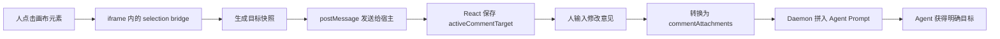

# Open Design 是怎么把画布上的一次点击，交给 Agent 的

事情是这样的。

最近我们一直在折腾 Open Artifacts。

这个项目想解决的问题其实挺朴素的。以后人和 Agent 一起干活，不应该永远挤在一个纯文本对话框里。你让 Agent 剪视频，眼前就应该出现一个视频编辑器。你让 Agent 分析数据，眼前就应该出现一个数据面板。人可以在上面点、拖、改，Agent 也能理解人刚刚做了什么。

想法听着特别自然。

怎么说呢，越是自然的交互，底下往往越藏着一堆不自然的工程问题。

但真的往下做，马上就会撞上一块很硬的石头。

假设我在一个设计画布里点中了一张卡片，然后在旁边写了一句，把这里的留白再收紧一点。

Agent 凭什么知道，我说的「这里」，到底是哪里？

它看到的是卡片，还是卡片里的文字？它能不能知道这个元素在哪个文件里？页面刷新以后，它还能不能找到同一个东西？如果 Agent 正在修改页面，而我又点了另一个元素，这两个动作会不会互相打架？

我一开始也顺着一个很自然的方向想过。

是不是应该把 React State 全部暴露出来？

甚至做一个类似 Time Machine 的东西，把页面里所有状态的变化历史都记下来。这样 Agent 不就什么都知道了吗？

理论上，听着很完整。

然后我让 Codex 跟着本地工程，把 Open Design 的源码走了一遍。

翻完以后，我发现它走的路，比我想象中简单很多，也聪明很多。

先交代一下核验范围。这次看到的是本地提交 `6b90486c97967633bfcfb0cd4d3c9b3314bf0caf`，当时本地 `main` 比 `origin/main` 落后 5 个提交。所以这篇文章讲的是一个固定源码快照，不代表远端最新实现。

它根本没有去读画布里的 React State。

更没有一个全知全能的 Time Machine。

它只做了一件事。

我跟你说，翻到这里的时候，我是真的有点意外。

把人的一次点击，翻译成一张 Agent 能读懂的快递单。

就这么简单。

Open Design 的画布并不是直接长在对话框里的。真正的设计页面，被放进了一个 sandbox iframe。你可以把它想象成一间隔着玻璃的工作室。

工作室里面，是正在运行的 Artifact。它可能是 React 写的，也可能只是普通 HTML，甚至还可能带着自己的动画、状态和交互。

工作室外面，是 Open Design 自己的界面。评论框、对话框、任务队列、Agent Runtime，都在外面。

外面的人看得见里面，但不能随便伸手进去翻箱倒柜。

所以 Open Design 往 iframe 里塞了一小段桥接代码，源码里叫 `selection bridge`。它不关心页面内部用了 Zustand、Redux 还是一堆 `useState`。它只监听鼠标经过了谁，又点中了谁。

一旦用户点击，桥接代码就开始做翻译。

整条链路大概是这样。

真正有意思的，是那张目标快照里装了什么。

它不是一张截图。

也不是整个页面的 JSON。

里面放的是一小组非常克制的信息，包括 `elementId`、`selector`、元素标签、当前文字、屏幕坐标、宽高、HTML 开头、有限的计算样式，有些场景还会带上幻灯片页码和鼠标落点。

你想想看，这些信息刚好够回答 Agent 最关心的几个问题。

你点的是谁。

它现在长什么样。

它大概在源码的什么位置。

你希望它怎么改。

不是更多。

是刚刚好。

这块源码主要在 [srcdoc.ts](/Users/onee/Code/onee-workspace/projects/learning/open-design/apps/web/src/runtime/srcdoc.ts)。里面有个 `targetFrom()`，专门负责把 DOM 元素压缩成这张快递单。可见文字最多取 160 个字符，HTML 提示最多取 180 个字符，样式也只挑颜色、字号、行高、间距、圆角这些真正可能帮助修改的字段。

其实吧，它做的不是收集，而是删减。

我是真的觉得，这个克制特别重要。

很多系统一说让 Agent 理解页面，第一反应就是把所有东西都扔给它。整个 DOM 树、完整 State、所有事件历史，最好再塞十张截图。好像上下文越多，Agent 就越聪明。

但上下文不是仓库，Agent 也不是来盘点库存的。

真正有价值的信息，往往只是此刻谁被选中了，以及这次选择准备干什么。

当然，新的问题又来了。

一个元素要怎么拥有稳定的名字？

Open Design 在这里做了四层兜底。

最稳的一层，是 Artifact 自己提供 `data-od-id` 或者 `data-screen-label`。就像开发者主动给元素挂了一块门牌，告诉外界这个是 `hero-title`，那个是 `pricing-card`。以后页面样式怎么变，只要门牌还在，外界就能找到它。

如果 Artifact 没有主动提供，Open Design 会在生成 `srcDoc` 时运行 `annotateMissingOdIds()`，给 section、标题、按钮、链接，还有一部分有意义的结构节点自动补上 `data-od-id`。

这就像物业发现有些房间没门牌，先按照楼层和路径给它补一个临时编号。

还找不到，就退到 DOM selector。它会生成类似 `body > main > h1` 这样的路径，必要时还会带上 `nth-of-type`。

这条路能用，但有点脆。

前面插入一个同类节点，门牌可能就串门了。。。

再不行，用户点在一块没有合适元素的空白区域，Open Design 就创建一个 `pin`，直接记住点击位置。它不是在说我点中了某个语义元素，而是在说我指的就是屏幕上的这一小块。

从语义 ID，到自动 ID，到 DOM 路径，再到坐标。

一层比一层不稳定，但一层比一层更不容易让用户点了以后什么都没有发生。

这其实是很典型的产品取舍。

如果只接受完美的语义 ID，协议会很优雅，体验会很残废。大量从外部导入的网页根本没有 `data-od-id`，用户点半天没反应，估计当场就把产品关了。

如果什么都只记坐标，体验倒是顺滑，页面稍微一重排，批注就飘到了十万八千里。

所以 Open Design 没有选一个所谓最正确的答案，而是做了一条稳定性逐级下降的逃生通道。

反正我觉得，对一个真的要给人用的产品来说，这种不完美的兜底，比纸面上漂亮的协议重要多了。

这个思路挺实用。

点选完成以后，iframe 通过 `postMessage` 把目标快照发给外层页面。外层的 [FileViewer.tsx](/Users/onee/Code/onee-workspace/projects/learning/open-design/apps/web/src/components/FileViewer.tsx) 收到消息，并不会立刻相信它。

它先看 `event.source`。

只有消息真的来自当前预览 iframe，才会继续处理。然后它会清洗坐标，检查宽高是不是有效，再把数据整理成 `PreviewCommentSnapshot`。

合法的数据会进入两个 React State。

`liveCommentTargets` 记着当前页面里能被标注的目标，`activeCommentTarget` 记着用户刚刚点中的那个目标。

看到这里，我突然意识到一件事。

Open Design 不是不要 State。

它只是不要 Artifact 内部那份不可控的 State。

Artifact 里面到底有多少业务状态，Open Design 不关心。它只在自己的宿主层，维护一份非常薄的交互状态。

谁能被选。

谁正在被选。

够了。

而且这份快照也不是拍完就死了。页面滚动、窗口缩放、DOM 结构变化时，iframe 会重新报告目标位置。已经选中的元素如果文字或属性发生变化，也会单独刷新。

所以那张贴在元素旁边的评论框，能尽量跟着元素一起移动。

注意，是尽量。

它依然没有解决所有问题。如果 Agent 把整个 DOM 结构改掉了，原来的 selector 可能失效。Open Design 当前也没有给这次选择绑定 Artifact Revision，更没有看到一套完整的冲突解决协议。

这块不能硬吹。

说实话，我们要做 Open Artifacts，这反而是最值得盯住的缺口。一次选择如果准备跨越几分钟、几小时，甚至跨越一轮 Agent 修改继续存在，它就不能只知道我当时点中了谁，还应该知道我是基于哪个版本点中的。

不然用户指着旧世界说这里，Agent 却跑到新世界里找答案。

鸡同鸭讲。

回到点选之后的流程。

当 `activeCommentTarget` 出现，Open Design 会在目标旁边渲染一个 `BoardComposerPopover`。用户可以写修改意见，也可以加图片。

这时候有两条路。

如果用户想马上让 Agent 动手，`sendBoardBatch()` 会直接把目标快照转换成 `ChatCommentAttachment`。用户写的那句话会成为本轮请求，目标信息则作为结构化上下文一起进入任务队列。

如果用户只是想先留个批注，也可以点保存。评论会通过 `/comments` 接口写进 SQLite 的 `preview_comments`。等到以后真的准备处理，再把这条评论附加到对话框里。

这部分可以继续从 Daemon 的 [comments.ts](/Users/onee/Code/onee-workspace/projects/learning/open-design/apps/daemon/src/routes/project/comments.ts) 和 [db.ts](/Users/onee/Code/onee-workspace/projects/learning/open-design/apps/daemon/src/db.ts) 往下追。

一个是现在就改。

一个是先记下来，晚点再改。

这两件事在界面上很像，在数据层却被分开了。我觉得这个区分非常对。批注是一份可以持续存在的协作记录，执行则是一次有明确时机的动作。不能因为人写了一句话，就默认 Agent 马上开工。

我有时候觉得，很多 Agent 产品让人不安，问题就出在这里。人的表达和机器的执行贴得太紧，中间没有一个让人停下来确认的空间。

相关的转换逻辑可以从 [comments.ts](/Users/onee/Code/onee-workspace/projects/learning/open-design/apps/web/src/comments.ts) 和 [ProjectView.tsx](/Users/onee/Code/onee-workspace/projects/learning/open-design/apps/web/src/components/ProjectView.tsx) 一路看下去。

到了这里，那次最初的点击，已经从一个浏览器事件，变成了 `commentAttachments`。

然后它会跟着请求进入 `/api/runs`。

Daemon 仍然不会直接相信前端送来的东西。[chat-prompt-inputs.ts](/Users/onee/Code/onee-workspace/projects/learning/open-design/apps/daemon/src/runtimes/chat-prompt-inputs.ts) 里的 `normalizeCommentAttachments()` 会再清洗一遍。

没有 `filePath`，丢掉。

没有 `elementId`，丢掉。

普通元素没有 selector，也丢掉。

文字太长就截断，样式重新归一化，多个批注按照 order 排好。

清洗完以后，Daemon 会生成一段 `<attached-preview-comments>`，[server.ts](/Users/onee/Code/onee-workspace/projects/learning/open-design/apps/daemon/src/server.ts) 再把它放进最终的 User Prompt。里面不只有目标信息，还有一段很强的范围要求，告诉 Agent 只修改被 selector、位置或者 pod 成员指向的元素，不要顺手改父布局、全局 CSS、Design Token 和其他无关区域。

这一下，那句「把这里的留白再收紧一点」，终于拥有了完整语境。

这里是哪一个文件。

这里是哪一个元素。

这里现在是什么文字。

这里在页面上的什么位置。

这里大概长什么样。

然后才是，人希望怎么改。

你会发现，Agent 最终拿到的依然是文字。

但已经不是孤零零的一句话。

人的一个空间动作，被翻译成了结构化语言。

这个变化很小，但我觉得特别迷人。

人类花了几十年时间，把计算机从命令行变成图形界面。以前我们得记住一串命令，后来只要指着屏幕上的东西点一下、拖一下，电脑就知道我们想操作谁。

现在 Agent 出现以后，问题又绕回来了。

人还是习惯用手指。

Agent 还是更擅长读语言。

所以新一代人机界面需要做的，并不是逼人重新学会描述每一个对象。它应该站在中间，把人的指、点、圈、拖，翻译成 Agent 能消费的语义地址。

Open Design 的这套实现，还不是一个公开协议。它的 `postMessage` 消息名、`data-od-id`、`commentAttachments` 和 Prompt 标签，都是自己的内部约定。iframe 侧发送消息时使用的是通配目标，宿主主要依靠 `event.source` 判断来源，也不能直接拿去当成一个跨域通用安全协议。

Prompt 里的 Hard Scope 也不是文件系统 ACL。

它是一句很强的指令，但不是一堵 Agent 无法穿过的墙。

评论持久化也只活在 project 和 conversation 里。同一个元素的新评论会覆盖旧记录，它不是完整的审计日志。selector 在页面大改以后怎么重新锚定，多个操作者同时修改时怎么冲突，当前实现里也还没有一套让我觉得特别完整的答案。

说实话，我们还差得远。

但这次翻源码，确实让我把一个问题想清楚了一点。

Agent 和人共享同一份产物，不需要先把整个世界都复制给 Agent。

我们更需要的是一层稳定的翻译。

它知道人此刻在看什么，选中了什么，留下了什么意见。它能把短暂的交互上下文，变成可以传递的目标快照。需要长期保留时，再把快照变成批注。真的准备执行时，再把批注变成一次带版本、权限和确认边界的操作。

交互上下文。

目标快照。

持久批注。

变更执行。

它们看起来都发生在同一个小气泡里，却不应该是同一个东西。

这可能也是 Open Artifacts 接下来最需要守住的边界。

不是给 Agent 一块更大的屏幕。

也不是给它塞更多 State。

而是当人伸手指向某个东西时，Agent 能自然地说一句。

我知道你指的是谁。

以上，既然看到这里了，如果觉得不错，随手点个赞、在看、转发三连吧，如果想第一时间收到推送，也可以给我个星标⭐～

谢谢你看我的文章，我们，下次再见。

> / 作者，Onee.御姐
>
> / 有任何想和我直接交流的，请微信联系，CallMeOnee
