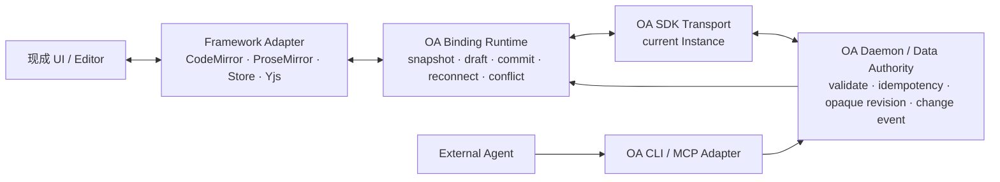
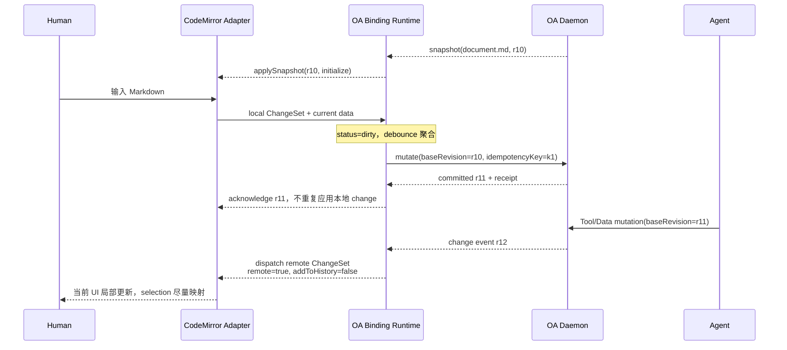

# OA SDK Framework Data Adapter：复用现有 Store 与 Markdown 编辑器的可落地性调研

> 调研日期：2026-07-26
>
> 状态：供架构 Review 的决策草案，不代表当前仓库已经实现
>
> 研究问题：OA SDK 能否直接对接现有状态框架或编辑器公开的数据接口，使 Artifact Package 复用 CodeMirror、ProseMirror、Tiptap、Monaco、Redux、Zustand、XState、Yjs 等既有生态，而不重写一套编辑器与 Store？
>
> 资料口径：只采用本仓库当前代码与文档，以及 React、Redux、Zustand、XState、CodeMirror、ProseMirror、Tiptap、Monaco、Yjs 的官方文档或官方源码。

## 一句话结论

**可以复用，而且应当这样做；但 OA 不应假装成所有框架的“存储后端”，而应先实现连接 OA Data Authority 的 `Binding Runtime`，再用很薄的 `Framework Adapter` 对接各框架公开的 Snapshot、Subscription 与 Transaction Interface。**

这个方向在技术上可落地，尤其适合现成 Markdown 源码编辑器；但当前仓库还没有 OA SDK、Data Authority、持久 revision 或 change feed，所以结论是：

> **架构方向可直接采纳；当前代码不能即插即用。先补最薄 Binding Runtime，再验证两个 Adapter，之后才适合冻结公共 API。**

## 先区分三个容易混淆的问题

“把框架的数据存储 API 对接 OA”可能指三件不同的事：

1. **让 React 等 UI 消费 OA Data。** 这是 View Binding，`getSnapshot + subscribe` 已足够。
2. **让现成编辑器把本地编辑提交到 OA，同时接收 Agent 的外部编辑。** 这是双向 Transaction Binding，需要 origin、undo、冲突与 draft 语义。
3. **让 Redux、Yjs、localStorage 等成为 Instance Data 的权威存储。** 这是 Authority Delegation，
   会改变 v0 managed Data 只经 OA Daemon 形成 committed revision 的架构，不应被 Adapter 默默引入。

本调研建议只接受前两项。第三项如果未来需要，应作为独立 Data Binding / Provider Contract 设计，而不是隐藏在编辑器 Adapter 中。

## 当前 OA 契约与当前实现不是同一状态

### 文档中的目标契约

当前 `CONTEXT.md` 与架构页已经约定：

- Instance Data 是 Artifact Instance 的持久工作内容，不等于 UI State；
- Runtime 注入的 OA SDK 自动限定当前 Instance；
- SDK Data Binding 提供读取、提交修改以及在权威 revision 变化后收敛到新 Data；
- OA Daemon 统一负责 Contract 校验、幂等、opaque Data revision、receipt 与 change event；当前
  `architecture.html` 选择用 Git commit 实现首版 managed `data/` 的 revision；
- event stream、polling、signals、React Context 或具体状态库仍是实现选择，而不是公共合同。

参见仓库当前的 [`CONTEXT.md`](../../CONTEXT.md)、[`architecture.html`](../architecture.html) 与 [`product.html`](../product.html)。

旧调研 [`state-observation.md`](./state-observation.md) 关于 `getSnapshot / subscribe`、显式事务和不抓取 React Fiber 的技术结论仍然成立；但其中的 “Public State / Session” 术语已被当前 `CONTEXT.md` 收敛为 “Instance Data / Instance”，本文采用新术语。

### 代码中的当前实现

当前代码尚未实现上述目标契约：

| 当前代码证据                                                                                         | 现在实际发生的事                                                                                          | 对 Adapter 的影响                                                                                |
| ---------------------------------------------------------------------------------------------------- | --------------------------------------------------------------------------------------------------------- | ------------------------------------------------------------------------------------------------ |
| [`apps/cli/src/runtime/index.ts`](../../apps/cli/src/runtime/index.ts)                               | Vite 虚拟入口生成一次 `const data = artifactInput`，随后 `createRoot(...).render(<Render data={data} />)` | 没有注入 OA SDK，也没有运行期读写或 change subscription                                          |
| [`apps/cli/src/cli/run.ts`](../../apps/cli/src/cli/run.ts)                                           | 每次 `run` 创建 `~/.open-artifacts/sessions/<sessionId>`，写入 `runtime.json`、`record.json` 等运行记录   | 目前的 Session 目录不是文档所描述的 durable Instance Data 目录                                   |
| [`apps/cli/src/cli/session.ts`](../../apps/cli/src/cli/session.ts)                                   | `stop` 成功后递归删除 Session 目录                                                                        | 尚未满足 Active → Stopped 后保留 Data 与身份的生命周期约束                                       |
| [`apps/web/src/App.tsx`](../../apps/web/src/App.tsx)                                                 | `revision` 是 React 本地数字，用作 `RenderErrorBoundary` 的 `key` 强制重新挂载                            | 这不是 Daemon 分配的持久 revision，也没有并发或审计含义                                          |
| [`packages/artifact-video-editor/src/index.tsx`](../../packages/artifact-video-editor/src/index.tsx) | 播放头、选择、Draft Brief、已应用 Brief、项目状态等都在组件 `useState` 中                                 | 当前没有可被 Framework Adapter 订阅的 Artifact-owned Store，且持久 Data 与 UI State 尚未完全分层 |

因此，不能先发布 `@open-artifacts/adapter-codemirror` 再期待它工作。Adapter 的上游必须先存在一个可用的 Binding Runtime。

## 问题边界：Data、Draft 与 UI State

框架 Adapter 不能把编辑器能读到的一切都提交为 Instance Data。

| 层                     | Markdown 示例                                            | Video Editor 示例                                | 所有者                                     | OA 默认行为                                               |
| ---------------------- | -------------------------------------------------------- | ------------------------------------------------ | ------------------------------------------ | --------------------------------------------------------- |
| **Instance Data**      | `document.md` 的已提交文本、文档元数据                   | 工程 JSON、字幕、已应用 Brief、轨道与 clip       | OA Data Authority，或显式外部 Data Binding | 校验、持久化、分配 revision、产生 change event            |
| **Local Draft**        | 输入后尚未 debounce/save 的 transaction、IME composition | 拖拽中的位置、未应用 Brief                       | Package / Binding Runtime 的本地 overlay   | 暂存；提交后才成为 Data；遇到外部 revision 时不得静默覆盖 |
| **Ephemeral UI State** | cursor、selection、scroll、fold、autocomplete 面板       | hover、播放头、缩放、打开的 Dialog、当前选中素材 | 编辑器或 UI 自己                           | 默认不提交，不进入 Data revision                          |

一个状态是否共享，不由它“是不是 React state”决定，而由产品语义决定。当前 Selection
默认留在编辑器内部；Human 提交 Annotation 时，Package 再把当时的 Selection 转换成 Target
Descriptor 与 Snapshot 保存。只有需要实时多人光标时，Selection 才进入独立的
presence/awareness 能力。Yjs 也把持久共享类型与 Awareness Protocol 分开，后者专门表达在线状态、
光标等短生命周期信息。[Yjs Awareness](https://docs.yjs.dev/api/about-awareness)

## 关键判断：对接 Public Interface，而不是模拟任意存储 API

现有生态并不存在一个统一的“数据存储 API”：

- React 只有消费外部 Store 的 `subscribe / getSnapshot` 接口；
- Redux、Zustand、XState 暴露 Store 或 Actor 接口；
- CodeMirror、ProseMirror、Tiptap 以 Transaction 为核心；
- Monaco 以 Text Model 与 edit operation 为核心；
- Yjs 以 CRDT update、transaction origin 与 state vector 为核心；
- `localStorage` 只有字符串键值和跨文档事件。

因此 OA 应提供一个稳定的 Framework Adapter seam，由每个 Adapter 翻译其框架的原生操作。OA 公共接口不应直接暴露 `redux.dispatch`、`zustand.setState`、`EditorView.dispatch` 或 `Y.applyUpdate`，否则 Package Contract 会绑定具体生态，Daemon 也无法维持统一的 revision、actor、idempotency 与 audit 语义。

本文中的公开 `revision` 始终指 **opaque OA Data revision**。首版 PoC 只覆盖 OA 管理的
`data/`，可在内部把 Git commit 映射成这个 revision。外部 Data Binding 若要支持写入，必须另行定义
版本读取、compare-and-swap、原子提交和失败恢复；在该 Contract 出现前，不能把外部文件版本或 CRDT
clock 直接当成 OA revision。

## 现成框架可接入 Interface 证据矩阵

“可接入”不等于“无需语义补丁”。下表区分官方公共接口、可以复用的能力和 OA 仍需补齐的部分。

| 生态                        | 官方公共 Interface 证据                                                                                                                                                                                                                                                                                                                                                  | 可直接复用                                                   | OA Adapter 必须补齐                                                                                               | 候选 Adapter 形态        |
| --------------------------- | ------------------------------------------------------------------------------------------------------------------------------------------------------------------------------------------------------------------------------------------------------------------------------------------------------------------------------------------------------------------------ | ------------------------------------------------------------ | ----------------------------------------------------------------------------------------------------------------- | ------------------------ |
| **React**                   | `useSyncExternalStore(subscribe, getSnapshot)`；React 要求 snapshot 在 Store 未变化时保持引用稳定。[官方文档](https://react.dev/reference/react/useSyncExternalStore)                                                                                                                                                                                                    | 从 OA BindingSnapshot 驱动 React render                      | 写入、origin、undo、冲突都不属于这个 Hook                                                                         | **View**                 |
| **Redux**                   | Store 提供 `getState()`、`subscribe()`、`dispatch(action)`；subscriber 在 reducer 完成后触发，但不接收 action。[Store API](https://redux.js.org/api/store/)                                                                                                                                                                                                              | 当前投影、订阅、显式 Action                                  | 用 middleware/action meta 传 origin；只绑定纯 Data slice；持久化、rebase 与 OA revision 不在 core 中              | **Store**                |
| **Zustand**                 | Vanilla `createStore` 返回 `setState`、`getState`、`getInitialState`、`subscribe`。[官方文档](https://zustand.docs.pmnd.rs/reference/apis/create-store)                                                                                                                                                                                                                  | 很薄的 Snapshot/Subscription Adapter                         | core 没有 transaction origin、undo、rebase；整体 replace 可能删除 state 中的 action 函数，只能绑定纯数据 slice    | **Store**                |
| **XState**                  | Actor 支持 `getSnapshot()`、`subscribe()`、`send(event)`；持久快照另有 `getPersistedSnapshot()`。[Actors](https://stately.ai/docs/actors)；[Persistence](https://stately.ai/docs/persistence)                                                                                                                                                                            | 用领域 Event 表达本地修改；订阅 emitted snapshot             | Actor snapshot 不等于 OA committed snapshot；恢复有逻辑版本与副作用兼容风险                                       | **Semantic Store**       |
| **CodeMirror 6 core**       | `EditorState` 是 immutable state；更新经 `EditorView.dispatch(Transaction)`；`ViewUpdate` 暴露 transactions；Transaction 有 `userEvent`、`addToHistory`、`remote` Annotation。[Reference](https://codemirror.net/docs/ref/)                                                                                                                                              | 文本 ChangeSet、selection mapping、origin 标记、本地 history | 把 OA revision/actor/idempotency 放在 OA envelope；core 不提供 authority 或 rebase                                | **Transaction**          |
| **CodeMirror collab**       | `sendableUpdates / receiveUpdates` 跟踪 authority version 与未确认本地 changes；官方示例明确 authority 与 transport 仍需宿主实现。[API](https://codemirror.net/docs/ref/#collab.receiveUpdates)；[示例](https://codemirror.net/examples/collab/)                                                                                                                         | 本地未确认 transaction、远端 update、OT rebase               | 建立 OA opaque revision 与 collab version 的映射；决定保留多久的 change history                                   | **Transaction + Rebase** |
| **ProseMirror core**        | `EditorState + Transaction + Step`；`dispatchTransaction` 可接入更大的应用数据流；history 观察 transaction 并保存 inverse。[Guide](https://prosemirror.net/docs/guide/)；[Reference](https://prosemirror.net/docs/ref/)                                                                                                                                                  | 富文本 Transaction、Step、selection mapping、history         | transaction meta 不应被当作持久审计；OA envelope 仍需保存 actor/idempotency/revision                              | **Transaction**          |
| **ProseMirror collab**      | 可选 collab 模块提供 `sendableSteps / receiveTransaction` 与 version/rebase。[Reference](https://prosemirror.net/docs/ref/#collab)                                                                                                                                                                                                                                       | 未确认本地 Step、远端 Step 与 rebase                         | Schema 必须一致；建立 OA revision 与 collab version 的映射                                                        | **Transaction + Rebase** |
| **Tiptap**                  | 基于 ProseMirror；公开 `update`、`transaction` 事件，`setContent(..., {emitUpdate})` 可替换全文。[Events](https://tiptap.dev/docs/editor/api/events)；[setContent](https://tiptap.dev/docs/editor/api/commands/content/set-content)                                                                                                                                      | 复用 Tiptap UI、Extension 与底层 PM Transaction              | 不应默认以 `setContent` 做每次远端同步；需读取底层 transaction/meta；JSON/Markdown codec 要验证                   | **Transaction**          |
| **Tiptap Markdown**         | 官方 Markdown Extension 支持 parse/serialize，但截至调研日仍标为 Beta，明确有 comments 丢失与 table cell 限制，并建议做 round-trip 测试。[Markdown](https://tiptap.dev/docs/editor/markdown)；[Basic Usage](https://tiptap.dev/docs/editor/markdown/getting-started/basic-usage)                                                                                         | 富文本方式编辑一部分 Markdown                                | 不能承诺任意 source-first Markdown 无损；扩展语法、空白与格式必须做 corpus round-trip gate                        | **Codec，条件兼容**      |
| **Monaco**                  | `ITextModel` 有内容读取与 `onDidChangeContent`；`executeEdits(source, edits)` / `pushEditOperations` 将 edit 放入 undo stack。[ITextModel](https://microsoft.github.io/monaco-editor/typedoc/interfaces/editor_editor_api.editor.ITextModel.html)；[ICodeEditor](https://microsoft.github.io/monaco-editor/typedoc/interfaces/editor_editor_api.editor.ICodeEditor.html) | 文本 edit operation、cursor state、undo stack                | content change event 没有通用 OA origin envelope；需 wrapper 跟踪 source/echo；无官方通用 authority/provider seam | **Edit Operation**       |
| **Yjs core**                | 所有共享类型修改发生在 transaction；`doc.on('update')` 带 origin；`applyUpdate` 可传 origin；update 是 commutative、associative、idempotent；state vector 可计算 diff。[Y.Doc](https://docs.yjs.dev/api/y.doc)；[Document Updates](https://docs.yjs.dev/api/document-updates)                                                                                            | 并发 update、增量同步、断线 diff、origin 抑制 echo           | selection mapping、awareness 与 undo 需要具体 editor binding / Awareness / UndoManager；Provider 不能绕过 Daemon  | **CRDT Update**          |
| **`localStorage` 风格组件** | `Storage` 只提供字符串键值操作；规范在广播变更时会排除发起写入的 `Storage` 对象，也不提供跨 agent cluster 的锁。[HTML Standard: Web storage](https://html.spec.whatwg.org/multipage/webstorage.html)                                                                                                                                                                     | 初始化与简单缓存                                             | 没有 transaction、origin、base revision、原子提交、同页 notification 或可靠冲突语义                               | **Snapshot fallback**    |

### 对矩阵的两个重要解释

第一，**Transaction-native 编辑器比只有 `get/set value` 的组件更适合 OA**。Transaction 可以携带精确 change、映射 selection、控制是否进入 undo，并区分 remote update。全文 `setValue/setContent` 应只用于初始化、灾难恢复或 Adapter 降级。

第二，**origin 只解决 echo suppression，不解决 authority**。例如 Yjs Provider 可以用 transaction origin 防止把刚收到的 update 再发回去，但它不能因此自行分配 OA revision、actor 或 audit。只有 Daemon 接受后，本地 Draft 才成为 committed Instance Data。

最后一列是本文根据公开 Interface 提出的 **Adapter 候选形态**，不是框架官方等级，也不是已经通过
OA contract tests 的兼容性认证。实际能力必须由 Adapter manifest 与 PoC 测试得出。

## 推荐接缝：Binding Runtime + Framework Adapter



两层接缝各自负责：

| 层                                     | 负责                                                                                                                 | 不负责                                                        |
| -------------------------------------- | -------------------------------------------------------------------------------------------------------------------- | ------------------------------------------------------------- |
| **Binding Runtime（OA 官方）**         | 当前权威 snapshot、revision、Draft Overlay、提交排队、幂等 retry、冲突状态、change feed / polling、断线重连、receipt | 理解 CodeMirror Transaction、Redux Action 或 ProseMirror Step |
| **Framework Adapter（OA 官方或生态）** | 读取框架中的 Data 投影、监听本地 transaction、把 committed update 应用回框架、origin/echo、selection/history 适配    | 分配 OA revision、实现持久化后端、绕过 Daemon 决定提交成功    |
| **Framework / Editor**                 | 编辑体验、selection、composition、局部 transaction、插件与本地 undo                                                  | 成为 OA Instance Data 的隐式第二权威                          |

这个接缝允许 OA 官方先维护少数高质量 Adapter，生态再增加其他 Adapter；Package 作者也可以写很小的产品专用 Adapter，而不必改 Runtime。

## 最小 Interface 草案

最小接口不能只有 `get / set`。至少需要区分初始化 Snapshot、增量 Transaction、本地 change 与 committed remote update。

```ts
type Unsubscribe = () => void;

interface AdapterCapabilities {
  mode: 'snapshot' | 'transaction' | 'crdt-update';
  mapsEditorSelection: boolean;
  controlsUndo: boolean;
  exposesOrigin: boolean;
  canRebase: boolean;
}

interface LocalChange<TNativeChange> {
  nativeChange?: TNativeChange;
  groupId?: string;
}

interface CommittedUpdate<TData, TMutation> {
  data: TData;
  revision: string;
  mutation?: TMutation;
  actor?: string;
}

interface FrameworkDataAdapter<TData, TMutation, TNativeChange = never> {
  readonly capabilities: AdapterCapabilities;

  readSnapshot(): TData;

  subscribeLocalChanges(listener: (change: LocalChange<TNativeChange>) => void): Unsubscribe;

  encodeMutation(input: {
    change: LocalChange<TNativeChange>;
    snapshot: TData;
    baseRevision: string;
  }): TMutation;

  applyCommitted(
    update: CommittedUpdate<TData, TMutation>,
    options: {
      origin: symbol;
      history: 'exclude' | 'include';
    },
  ): void;

  applySnapshot(
    snapshot: CommittedUpdate<TData, never>,
    options: {
      origin: symbol;
      reason: 'initialize' | 'recover' | 'fallback';
    },
  ): void;
}
```

### 必须写入 Interface Contract 的行为

1. `subscribeLocalChanges` **只能报告本地意图**；由 `applyCommitted/applySnapshot` 引发的变化不能再次作为本地 change 上报。Store Adapter 可以只发“已变化”信号，Binding Runtime 随后调用
   `readSnapshot()`；Transaction Adapter 则应附带 framework-native change。
2. `encodeMutation` 把 framework-native change 与当前 snapshot 转成当前 Data Binding 定义的
   framework-neutral OA mutation。CodeMirror `ChangeSet`、ProseMirror `Transaction` 等类型不得
   直接泄漏成 Daemon 的通用协议。
3. `applyCommitted` 接收 OA mutation 与 committed data，由具体 Adapter 转成
   framework-native transaction/edit operation；只有缺失可安全转换的增量时才调用
   `applySnapshot`。
4. Adapter 不得把 selection、scroll、插件缓存或 action 函数混入 `TData`。
5. `applySnapshot` 遇到未提交 Draft 时不能直接覆盖，必须由 Binding Runtime 先选择 rebase、conflict 或 explicit discard。
6. Adapter capability 必须可检测；Binding Runtime 不能假设所有 Adapter 都支持 rebase 或 history control。
7. OA 公共合同只暴露上述语义；框架特有的 `dispatch/setState/applyUpdate` 保留在具体 Adapter 内部。
8. `mapsEditorSelection` 只表示编辑器在应用 change 时能否维持自己的短生命周期 selection；它不负责
   生成或解析 Annotation Target。`Selection → Target Descriptor → Target Resolution` 仍是 Package /
   Inspector 的独立接缝。

### Binding Runtime 的概念接口

```ts
interface BindingSnapshot<T> {
  committed: {
    data: T;
    revision: string;
  };
  draft?: {
    data: T;
    baseRevision: string;
    pendingIdempotencyKey?: string;
    persistence: 'memory' | 'durable';
  };
  status: 'loading' | 'synced' | 'dirty' | 'saving' | 'conflict' | 'offline';
  conflict?: {
    currentRevision: string;
  };
}

type MutationResult<T> =
  | {
      status: 'committed';
      receiptId: string;
      idempotencyKey: string;
      revision: string;
      data: T;
    }
  | {
      status: 'conflict';
      code: 'REVISION_CONFLICT';
      current: {
        revision: string;
        data: T;
      };
    }
  | {
      status: 'rejected';
      code: string;
      message: string;
    };

type ReconcileResult<TData, TMutation> =
  | {
      kind: 'unchanged';
      revision: string;
    }
  | {
      kind: 'changes';
      revision: string;
      changes: Array<{
        baseRevision: string;
        revision: string;
        change: TMutation;
      }>;
    }
  | {
      kind: 'snapshot';
      data: TData;
      revision: string;
      reason: 'initial' | 'history-compacted' | 'fallback';
    };

interface DataBinding<TData, TMutation> {
  getSnapshot(): BindingSnapshot<TData>;
  subscribe(listener: () => void): Unsubscribe;
  mutate(mutation: {
    baseRevision: string;
    idempotencyKey: string;
    change: TMutation;
  }): Promise<MutationResult<TData>>;
  reconcile(input: { sinceRevision?: string }): Promise<ReconcileResult<TData, TMutation>>;
}
```

这里的 `FrameworkDataAdapter` 面向编辑器；`DataBinding` 面向 OA Data Authority。
二者共享同一个 framework-neutral `TMutation`；`TNativeChange` 只存在于 Adapter 内。
`connect(binding, adapter)` 调用 `encodeMutation()` 出站，并把 `reconcile()` 返回的 OA mutation
交给 `applyCommitted()` 入站，同时维护 Draft Overlay、pending receipt 和状态机。PoC 默认只保证
Runtime 存活期间的 memory Draft；刷新页面或重启 Runtime 后恢复 Draft 不在 v0 承诺中。若 Review
要求跨刷新恢复，就必须把 Draft Journal 作为 Binding Runtime 的持久化能力加入首版，而不能靠框架
自己的 `persist` 偷偷补上。

## Markdown 编辑器端到端示例

### 推荐首选：CodeMirror 6 编辑 Markdown 源文件

对于 source-first Markdown，CodeMirror 6 比富文本 parse → JSON → serialize 路径更适合作为首个 PoC：

- 它直接编辑 Markdown 字符串，不需要格式往返转换；
- document change 是 `ChangeSet/Transaction`，而不是只能拿到新全文；
- `Transaction.remote` 可以标记外部 Actor 的 change；
- `Transaction.addToHistory` 可以控制 remote commit 是否进入本地 undo；
- `@codemirror/collab` 证明其模型可以承载 authority version、未确认本地 change 与 rebase，但 OA v0 不必立刻采用完整 collab package。

CodeMirror 官方说明，常规更新都应通过 `EditorView.dispatch`，直接操作 content DOM 会被编辑器纠正；这正是一个稳定 Adapter seam。[CodeMirror Reference](https://codemirror.net/docs/ref/)

### Package 侧期望用法

下面是目标 API 形态，不是当前已经存在的代码：

```ts
const binding = oa.data.bindText('document.md');

const editor = new EditorView({
  parent: document.querySelector('#editor')!,
  state: EditorState.create({
    doc: '',
    extensions: [markdown(), oaCodeMirrorTransactions()],
  }),
});

const disconnect = oa.adapters.codeMirror({
  binding,
  view: editor,
  commit: {
    mode: 'debounce',
    delayMs: 500,
  },
});
```

### 完整链路



### 发生并发时

如果 Human 在 `r11` 上还有未提交 Draft，Agent 已提交 `r12`：

- **v0 Snapshot Adapter：** 保留 Human Draft，进入 `conflict`；显示 Reload remote / Keep mine as new commit / Manual merge，不静默覆盖。
- **Transaction Adapter：** 如果 Daemon 能提供 `r11 → r12` 的 change，尝试把本地 ChangeSet rebase 到 `r12`；rebase 成功后以 `baseRevision=r12` 提交。
- **CRDT Adapter：** Yjs 可以合并并发 update，但 Daemon 仍需接受合并结果并生成 OA revision；CRDT clock 不能直接取代 OA revision。

### 为什么不默认用 Tiptap 做首个 Markdown PoC

Tiptap 很适合富文本 Artifact，且能直接复用成熟 UI；但它原生操作的是结构化 ProseMirror document
model，JSON 只是可选的序列化表示。Package 可以选择 ProseMirror JSON 或 Markdown 作为 Instance
Data 的表示，OA 不替它决定。官方 Markdown Extension 目前仍是 Beta，comments 尚不支持，某些 table
结构受限，并明确建议做 parse → serialize round-trip 测试。[Tiptap Markdown](https://tiptap.dev/docs/editor/markdown)

所以：

- **Markdown 源码保持字节/语法语义：** 优先 CodeMirror；
- **Package 选择结构化富文本 document/JSON 为权威 Data：** 优先 ProseMirror/Tiptap；
- **声称 Tiptap 无损编辑任意 Markdown：** 当前证据不足，不应进入 OA 承诺。

## OA revision、幂等、冲突、undo、echo-loop 与重连

### 1. Revision boundary：不要每个按键一次 durable commit

编辑器 transaction 的粒度通常比产品 revision 更细。若 v0 managed `data/` 每次 keypress 都产生
Git commit：

- commit 历史噪声巨大；
- IME composition 与批量 paste 可能被拆成无意义中间态；
- 网络失败会让编辑体验依赖每次按键的 round trip；
- undo group 与 Git commit group 不一致。

推荐：

- 本地 transaction 先进入 Draft Overlay；
- 以 debounce、显式 Save、blur 或领域动作结束作为 logical commit boundary；
- 一个 logical commit 产生一个稳定 `idempotencyKey` 和一个 opaque OA Data revision；
- Adapter 可以保留细粒度 transaction 用于 selection mapping，Daemon 不必逐键产生 durable
  revision；
- v0 managed `data/` 用 Git commit 实现 revision；外部 Data Binding 不在这个 PoC 的可写范围内。

### 2. 幂等：同一 logical commit 的 retry 必须复用 key

`idempotencyKey` 属于 Binding Runtime / Daemon，不属于 CodeMirror 或 Redux。网络超时后重试必须复用原 key；Daemon 返回首次 receipt，不能再应用一次。

Yjs update 自身具有 idempotent 性质，但这仍不能替代 OA idempotency receipt：OA 还需要把 actor、
Tool Call、Data validation 与 OA revision 绑定到一次可审计提交。[Yjs Document Updates](https://docs.yjs.dev/api/document-updates)

### 3. 冲突：Adapter 能力决定 Reject、Rebase 还是 CRDT Merge

| Adapter 能力                        | stale `baseRevision` 的默认策略                       |
| ----------------------------------- | ----------------------------------------------------- |
| Snapshot only                       | 返回 `REVISION_CONFLICT`，保留 Draft，要求 Human 选择 |
| Transaction + server change history | 拉取 missing transactions，rebase 后重试              |
| CRDT update                         | merge update，但仍由 Daemon 接受后产生新 OA revision  |

CodeMirror 官方 collab 示例同样把 authority version mismatch 处理为 rebase 或 reject；它并没有假设编辑器可以无条件覆盖 authority。[CodeMirror Collaborative Example](https://codemirror.net/examples/collab/)

### 4. Undo：编辑器历史与 OA revision 历史是两层

- **Editor undo** 操作 Local Draft 或用户自己的已提交操作；
- **OA revision history** 记录事实，不通过 `git reset` 改写；
- 用户对一个已提交 revision 执行 Undo，应生成一个新的 inverse mutation 与新 revision；
- remote commit 默认不进入当前用户的本地 undo stack，否则 `Cmd-Z` 可能撤销 Agent 的修改。

CodeMirror 提供 `Transaction.addToHistory` 与 `Transaction.remote`；ProseMirror history 使用 inverse transaction，并能排除 `addToHistory=false` 的 transaction。[CodeMirror Reference](https://codemirror.net/docs/ref/)；[ProseMirror Guide](https://prosemirror.net/docs/guide/)

如果使用 Tiptap Collaboration/Yjs，官方还要求关闭 StarterKit 中的 `UndoRedo`，因为
Collaboration extension 自带 history。[Tiptap Collaboration extension](https://tiptap.dev/docs/editor/extensions/functionality/collaboration)

### 5. Echo loop：origin token + revision acknowledgement

典型循环是：

```text
Daemon r12 → adapter.applyCommitted
           → editor update listener
           → Binding Runtime 误判为本地 change
           → 再提交 r13
           → 无限循环
```

需要双保险：

1. Framework-native origin：CodeMirror `Transaction.remote`、ProseMirror transaction meta、Monaco wrapper source、Yjs transaction origin；
2. Binding Runtime acknowledgement：记录 applied/acknowledged revision 与 content/transaction identity。

对 origin 较弱的 Store，Adapter 可以在同步调用栈内使用 reentrancy guard；但只有 guard 而没有 revision equality 仍不足以覆盖异步 subscriber。

### 6. 重连：从 last observed revision 恢复

建议顺序：

1. Binding Runtime 保存 `lastObservedRevision` 与 pending logical commits；
2. 重连后请求 `changes(sinceRevision)`；
3. 若 change history 仍可用，按顺序 apply/rebase；
4. 若 history 已压缩或 revision 不可识别，获取完整 snapshot；
5. 没有 Draft 时替换投影；存在 Draft 时进入 conflict 或按 Adapter 能力 rebase；
6. 未收到明确 receipt 的 pending commit 以原 `idempotencyKey` 重试。

CodeMirror collab 官方示例也指出：如果 authority 丢弃旧 update，长时间离线的 peer 将不能再按旧 version 增量同步，必须有重新取得文档的恢复路径。[CodeMirror Collaborative Example](https://codemirror.net/examples/collab/#dropping-old-updates)

### 7. Framework persistence 只能是缓存，不能偷偷成为权威

Zustand `persist`、Tiptap localStorage 示例、Yjs IndexedDB/WebSocket Provider 都可以复用，但默认只能是：

- 启动缓存；
- 离线 Draft；
- 由 Daemon 控制的同步 transport；
- 或显式声明的外部 Data Binding。

如果 UI 同时把变更写 localStorage/Yjs Provider，OA Daemon 又独立接受 OA Data mutation，而两边都能
自行认定提交成功，就会形成 dual authority。origin 可以防止回声，却不能决定哪一份数据有效。

## 兼容性能力画像：不预设 A/B 等级

框架名称不能推出实际能力。同一个 CodeMirror 在只接 core 与接入 collab extension 时能力不同；Yjs
core 能 merge update，但 editor selection、awareness 与 undo 取决于额外 binding。因此 Adapter
Registry 应公开可测试的 capability，而不是先给框架贴等级：

| Capability          | Contract test 要证明什么                                                      |
| ------------------- | ----------------------------------------------------------------------------- |
| `snapshot`          | 能读取稳定 Data snapshot，并在没有 Draft 时安全恢复                           |
| `local-change`      | 能订阅本地意图，且 inbound update 不会 echo                                   |
| `incremental-apply` | 能用 transaction/edit operation 应用 committed change，而不是替换全文         |
| `selection-mapping` | 应用 change 后能映射编辑器内部 selection；不表示支持 Annotation Target        |
| `history-control`   | 能明确控制 committed remote update 是否进入当前用户的 editor undo             |
| `origin`            | 能在框架原生 transaction 或可靠 wrapper 中携带 origin                         |
| `rebase`            | 能把本地未提交 change 重放到新的 authority revision，且通过并发 corpus        |
| `crdt-merge`        | 能 merge 并发 update；v0 managed Data 仍只能经 Daemon 形成 committed revision |
| `snapshot-only`     | 只承诺初始化、显式保存和无 Draft 时刷新；并发时一律进入 explicit conflict     |
| `dom-only`          | 不提供 Data Binding，只能使用 Inspector/browser fallback                      |

Adapter manifest 可以声明：

```json
{
  "mode": "transaction",
  "mapsEditorSelection": true,
  "controlsUndo": true,
  "exposesOrigin": true,
  "canRebase": false,
  "testedContractVersion": "unverified"
}
```

Binding Runtime 根据能力选择策略。只有通过对应 contract tests 后，Registry 才能把 capability 标成
`verified`；本调研的证据矩阵只证明公开接缝存在，不构成兼容性认证。

## 可直接落地判定与前置缺口

| 事项                                        | 证据状态                                                                    | 判定                                       |
| ------------------------------------------- | --------------------------------------------------------------------------- | ------------------------------------------ |
| 现有编辑器是否暴露稳定公共接缝              | CodeMirror、ProseMirror、Tiptap、Monaco 均有官方 Transaction/Edit Interface | **公开接缝已有证据；OA 集成待 PoC 验证**   |
| Store 是否暴露 projection 所需接口          | React、Redux、Zustand、XState 均有 Snapshot + Subscription Interface        | **公开接缝已有证据；OA 集成待 PoC 验证**   |
| OA 是否值得验证 Adapter seam                | 它有机会隔离框架差异，同时保持 Daemon 单一提交入口                          | **研究建议；需两个 PoC 证伪或确认**        |
| 当前 Runtime 是否能注入 Binding             | 当前只把静态 `data` prop 传给 Render                                        | **尚不能**                                 |
| 当前是否有 Data Authority / opaque revision | 代码中未实现；managed Git backing 只有目标文档                              | **尚不能**                                 |
| 当前是否有 change feed / reconnect          | 代码中未实现                                                                | **尚不能**                                 |
| 当前是否有 durable Instance lifecycle       | `stop` 仍删除 Session 目录                                                  | **尚未对齐**                               |
| 当前 Video Editor 是否已有可适配 Store      | 持久内容与 UI 状态分散在组件 `useState`                                     | **需要先提取 Data projection Store**       |
| 外部 Data Binding 是否可写                  | 版本、CAS、原子提交和恢复 Contract 尚未定义                                 | **不进入本次 PoC；先只做 managed `data/`** |
| 是否现在冻结万能 Adapter Interface          | 尚无两个真实实现验证                                                        | **不建议**                                 |

最小正确实施顺序是：

```text
Binding Runtime/Data Authority thin slice
    → CodeMirror Markdown Transaction Adapter
    → Video Editor Data Projection Store Adapter
    → 用两个调用方修正并冻结 seam
    → 再考虑 ProseMirror/Tiptap/Yjs 高级 Adapter
```

## 两个 Adapter 的最薄 PoC

### PoC A：CodeMirror Markdown Transaction Adapter

**目的：** 证明可以直接复用成熟 Markdown 源码编辑器，同时保持 editor selection mapping、undo、
remote origin 与 OA revision。

最小范围：

- 一个 `document.md` Text Data；
- `readSnapshot / subscribeLocalChanges / encodeMutation / applyCommitted / applySnapshot`；
- 500ms debounce logical commit（暂定值，待 Review）；
- remote transaction 标 `Transaction.remote=true`；
- remote transaction 默认 `addToHistory=false`；
- v0 不实现 OT rebase；Draft 遇到 remote revision 显式进入 conflict。

不做：

- 多人实时 cursor；
- CodeMirror collab authority；
- 任意 Markdown AST；
- 字段级 merge UI。

### PoC B：Video Editor Data Projection Store Adapter

**目的：** 证明同一个 Binding Runtime 不只适用于文本编辑器，也能接对象型业务 Store。

先把当前 Video Editor 状态拆分：

- Store Data slice：`activeBrief`、`projectStatus`，以及未来 timeline/project；
- Local Draft：`draftBrief`；
- UI-only：`currentTime`、`isPlaying`、`selectedMediaId`、`exportOpen`。

然后用一个 framework-neutral vanilla store，或 Zustand vanilla store，实现：

- `getState / subscribe` 映射为 Adapter snapshot；
- 只有具名 action 产生 local change；
- `applyCommitted` 只替换 Data slice，不替换 action 函数；
- 外部 Agent 修改 Brief 后，同一 UI 不重挂载即可更新；
- Draft Brief 存在时保留 Draft，并标记 conflict。

这个 PoC 比直接选择 Redux 或 Zustand 更重要，因为它验证的是 OA seam，而不是某个库。

### 共享验收测试

两个 PoC 必须通过同一组 contract tests：

1. 首次打开读取权威 snapshot 与 revision；
2. Human 一次 logical edit 只产生一次 Daemon commit；
3. 相同 `idempotencyKey` 重试不产生第二个 revision；
4. Agent mutation 后当前 UI 不整页刷新即可变化；
5. inbound committed update 不会 echo 为 outbound mutation；
6. stale `baseRevision` 不静默覆盖；
7. 未提交 Draft 遇到外部 revision 时仍可恢复；
8. remote update 不破坏本地 undo 约定；
9. Runtime 未卸载时的断线重连能从 last observed revision 恢复，或明确 fallback 到 full snapshot；
10. Adapter 销毁后 unsubscribe，不再写入已卸载 UI。
11. 编辑器 selection 不进入 Data revision；创建 Annotation 时必须另存 Target Descriptor 与
    Snapshot，并能在当前 Data 上重新定位。
12. framework-native change 能编码为当前 Data Binding 的 OA mutation，并能从同一 mutation应用回
    框架；Daemon contract 中不出现 CodeMirror/ProseMirror/Zustand 专有类型。

如果两个 Adapter 无法共享 Binding Runtime 与 contract tests，就说明当前 seam 抽象过早，需要继续收窄，而不是再增加更多框架。

## 不推荐的实现路径

### 1. 把 OA SDK 做成另一个 Zustand/Redux

这会迫使现有应用搬迁 Store，也会让 OA 同时承担前端状态库、持久化系统和协作协议三种责任。OA 应提供 Binding Runtime，不应规定组件树内部如何组织状态。

### 2. 只提供 `getValue / setValue`

它无法处理 selection mapping、undo、transaction origin、并发 Draft 或局部 update，只能做低兼容等级 fallback。

### 3. 每次远端更新都调用全文 `setContent/setValue`

这容易重置 selection、插件状态或 history，也可能重新触发 update event。初始化和恢复可以用 Snapshot，正常同步应优先 Transaction/Edit Operation。

### 4. 让 Yjs 或 localStorage 自动成为第二权威

已有 Provider/persist 很方便，但它们必须位于 OA authority 之下，或者被显式定义成外部 Data
Binding。否则 OA revision、Agent write 与本地 Provider 会各自接受写入，冲突无法审计。

### 5. 先发布十个 Adapter

当前最重要的问题不是覆盖生态数量，而是验证同一个 seam 是否同时适用于：

- transaction-native 文本编辑器；
- snapshot/action-native 对象 Store。

两个真实调用方足以暴露大多数接口问题。

## Review：建议默认值与真正需要选择的三件事

### 建议作为本轮默认结论

- OA 采用 `Binding Runtime + Framework Adapter` 双层接缝；
- Daemon 是 committed OA Data revision 的唯一入口；框架 Store/Provider 默认只做 projection、
  Draft 或 cache；可写外部 Data Binding 不进入 v0；
- v0 冲突策略只承诺 `preserve Draft + explicit conflict`，暂不承诺自动 rebase/CRDT merge；
- 首个 Markdown PoC 选择 CodeMirror 6，并以 Markdown text Data 为 authority；
- ProseMirror/Tiptap 面向结构化富文本 Data，不承诺任意 Markdown source round-trip 无损；
- remote committed change 默认不进入当前用户的 editor undo；
- Video Editor 只提取 Data projection Store，不把所有 `useState` 纳入同步；
- Binding Runtime 作为稳定基础包进入 `packages/*`；具体 Adapter 先靠近调用方，等第二个真实复用点
  再提取。

### 请 Review 的三个开放选择

1. **PoC 接口边界：** 是否接受
   `readSnapshot / subscribeLocalChanges / encodeMutation / applyCommitted / applySnapshot` 与
   `mutate / reconcile` 这两层概念形状，名称等两个 PoC 后再冻结？
2. **Logical commit boundary：** 首版采用 500ms debounce、显式 Save，还是
   “debounce + blur/领域动作立即 flush”的混合策略？本文推荐混合策略。
3. **Draft 恢复范围：** v0 是否接受 Draft 只在当前 Runtime 内存中存活？若不接受，则必须先把
   Draft Journal 与恢复协议纳入基础层。

## 建议的 Review 结论模板

如果以上边界被接受，可以记录为：

> OA 采用 Binding Runtime + Framework Adapter 架构。Daemon 是 committed OA Data revision
> 的唯一入口；Framework Adapter 只翻译公开的 Snapshot / Transaction Interface，不同步任意 UI
> State。v0 只覆盖 managed `data/`，用 CodeMirror Markdown 与 Video Editor Data Store 两个 Adapter
> 验证 seam；冲突策略为 preserve Draft + explicit conflict，不承诺自动 rebase。接口在两个 PoC
> contract tests 通过后冻结。

如果不同意“v0 managed Data 只能经 Daemon 形成 committed OA revision”，则本议题已经不是编辑器
Adapter，而是多 Authority / CRDT-first Data Architecture，需要单独立 ADR，不能在
`oa.adapters.yjs()` 中顺便决定。

## 一手资料

### OA 当前仓库

- [`CONTEXT.md`](../../CONTEXT.md)
- [`docs/architecture.html`](../architecture.html)
- [`docs/product.html`](../product.html)
- [`docs/research/state-observation.md`](./state-observation.md)
- [`apps/cli/src/runtime/index.ts`](../../apps/cli/src/runtime/index.ts)
- [`apps/cli/src/cli/run.ts`](../../apps/cli/src/cli/run.ts)
- [`apps/cli/src/cli/session.ts`](../../apps/cli/src/cli/session.ts)
- [`apps/web/src/App.tsx`](../../apps/web/src/App.tsx)
- [`packages/artifact-video-editor/src/index.tsx`](../../packages/artifact-video-editor/src/index.tsx)

### Framework / Editor 官方资料

- React：[useSyncExternalStore](https://react.dev/reference/react/useSyncExternalStore)
- Redux：[Store API](https://redux.js.org/api/store/)、[Undo History](https://redux.js.org/usage/implementing-undo-history)
- Zustand：[createStore](https://zustand.docs.pmnd.rs/reference/apis/create-store)、[persist](https://zustand.docs.pmnd.rs/reference/middlewares/persist)
- XState：[Actors](https://stately.ai/docs/actors)、[Persistence](https://stately.ai/docs/persistence)
- CodeMirror：[Reference Manual](https://codemirror.net/docs/ref/)、[Collaborative Editing Example](https://codemirror.net/examples/collab/)
- ProseMirror：[Guide](https://prosemirror.net/docs/guide/)、[Reference Manual](https://prosemirror.net/docs/ref/)
- Tiptap：[Events](https://tiptap.dev/docs/editor/api/events)、[Persistence](https://tiptap.dev/docs/editor/core-concepts/persistence)、[Markdown](https://tiptap.dev/docs/editor/markdown)、[Collaboration](https://tiptap.dev/docs/collaboration/getting-started/install)
- Monaco：[ITextModel](https://microsoft.github.io/monaco-editor/typedoc/interfaces/editor_editor_api.editor.ITextModel.html)、[ICodeEditor](https://microsoft.github.io/monaco-editor/typedoc/interfaces/editor_editor_api.editor.ICodeEditor.html)
- Yjs：[Y.Doc](https://docs.yjs.dev/api/y.doc)、[Document Updates](https://docs.yjs.dev/api/document-updates)、[Awareness](https://docs.yjs.dev/api/about-awareness)
- WHATWG：[HTML Standard: Web storage](https://html.spec.whatwg.org/multipage/webstorage.html)
