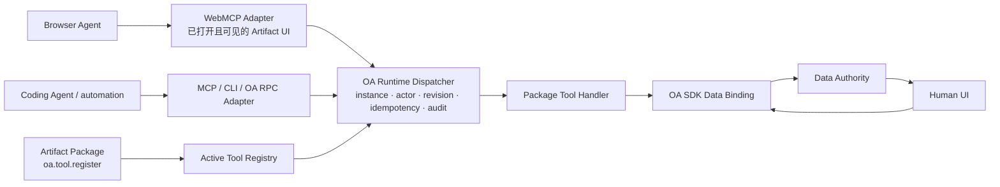

# WebMCP 当前状态与 Open Artifacts Tool 注册边界（2026-07-30）

> 调研截止：2026-07-30（Asia/Shanghai）
>
> 问题：WebMCP 目前是否已足够成熟，能否直接作为 Open Artifacts（OA）的 Tool 注册协议？
>
> 证据范围：仅使用 W3C / Web Machine Learning Community Group（WebML CG）与 WebMCP 官方仓库、Chrome / Chromium、Microsoft Edge 的官方资料或源码，以及 MCP 官方规范作对照。没有把第三方兼容性数据库或媒体报道当作证据。
>
> 标记：**[已核验]** 可直接由所链一手资料支持；**[推断]** 基于已核验事实给出的 OA 架构判断；**[未知]** 一手资料未足以确认，不能反向写成“不支持”。

## 结论

**[推断] WebMCP 应成为 Active Instance 中已打开 Artifact UI 的浏览器 Tool Adapter（并且值得优先验证），但不应成为 Artifact Package 的唯一注册协议、Dispatcher 或 Instance 协议。**

它很好地解决“浏览器中、正在显示的页面如何把语义动作交给浏览器 Agent”：Tool 是页面 JavaScript 或 HTML form 的一部分，复用 live DOM、页面状态与用户登录会话。它没有定义 OA 必须持有的 Instance、actor、revision、幂等键、审计、持久任务、Data 变化订阅或跨浏览器/跨进程 transport。更重要的是，当前仍是 Community Group 草案和 Chromium/Edge Origin Trial，且规范与 Chrome 已文档化实现的 in-page invocation API 仍有差异。



**建议的决策：** Package 只通过 scoped OA SDK 注册一次 Tool；所有 Agent adapter 都经由 Runtime-owned Tool Dispatcher，Human UI 与 Tool Handler 则复用同一个 OA SDK Data Binding / Data Authority。WebMCP adapter 以 feature detection 注册可用 Tool，向 Runtime 传递取消信号和 browser-origin 调用来源；Runtime 自己注入、验证和记录 instance / actor / `baseRevision` / `idempotencyKey`，并返回 OA 定义的稳定结果 envelope。

## 1. 成熟度、治理和浏览器可用性

| 问题              | 截止日证据                                                                                                                                                                                                                                                                                                                                                                                                                                                                                                                                                                                                                                                                                                                              | OA 判断                                                                                                                                        |
| ----------------- | --------------------------------------------------------------------------------------------------------------------------------------------------------------------------------------------------------------------------------------------------------------------------------------------------------------------------------------------------------------------------------------------------------------------------------------------------------------------------------------------------------------------------------------------------------------------------------------------------------------------------------------------------------------------------------------------------------------------------------------- | ---------------------------------------------------------------------------------------------------------------------------------------------- |
| 治理归属          | **[已核验]** 2026-07-28 的 WebMCP 是由 [WebML CG 发布的 Draft Community Group Report](https://webmachinelearning.github.io/webmcp/#sotd)；该状态页明确说它既不是 W3C Standard，也不在 W3C Standards Track。W3C 还说明 Community Group 是社区运行的，W3C 托管不代表 W3C Membership 或 staff 立场。[WebML CG 页面](https://www.w3.org/community/webmachinelearning/)                                                                                                                                                                                                                                                                                                                                                                      | 不是可作为长期 Package ABI 的已定标准。必须隔离在 adapter 后。                                                                                 |
| 草案活跃度        | **[已核验]** 当前报告日期为 2026-07-28；其 declarative 章节仍写明 “entirely a TODO”，多个关键问题仍在官方 [WebMCP repository](https://github.com/webmachinelearning/webmcp#open-questions) 追踪（output schema、streaming、progress、user prompting、service worker）。                                                                                                                                                                                                                                                                                                                                                                                                                                                                 | **[推断]** API 形态仍会变化，尤其不能把 experimental-only 字段写进 artifact manifest 的兼容性承诺。                                            |
| Chrome / Chromium | **[已核验]** Chrome 官方在 [Origin Trial 公告](https://developer.chrome.com/blog/ai-webmcp-origin-trial) 中称 Chrome **149** 可报名 WebMCP OT；OT 是限时实验。官方 [overview](https://developer.chrome.com/docs/ai/webmcp) 给本地开发 flag：`chrome://flags/#enable-webmcp-testing`。Chrome 文档还说明 `navigator.modelContext` 在 Chrome **150** 已废弃，应使用 `document.modelContext`。[Imperative API](https://developer.chrome.com/docs/ai/webmcp/imperative-api) Chromium 的 [Intent to Experiment](https://groups.google.com/a/chromium.org/g/blink-dev/c/gmYffo5WOE8/m/OJxuQRP3AAAJ) 把 OT 列为 M149–156，桌面/Android/WebView 的 M157 为 _estimated shipping milestone_，并写明 TAG review pending、Gecko/WebKit “No signal”。 | 生产代码必须 `if ('modelContext' in document)` 逐项 feature detect，不能以版本号或“estimated shipping”替代检测；`navigator` 仅可作临时兼容层。 |
| Edge              | **[已核验]** Microsoft 的 [Edge 150（2026-07）release notes](https://learn.microsoft.com/en-us/microsoft-edge/web-platform/release-notes/150) 把 WebMCP 列为可注册的 **Origin Trial**，描述为为 browser agent 注册 Tool。其 [OT 页面](https://developer.microsoft.com/en-us/microsoft-edge/origin-trials/trials/0b76fe60-b266-458e-a285-04e375c0c31a) 给出到期日 **2026-11-17**，并明确可能不稳定、随时改变或终止，要求 feature detection / graceful degradation。                                                                                                                                                                                                                                                                      | Edge 也不是稳定承诺；应与 Chrome 一样走 optional adapter。                                                                                     |
| 其他浏览器        | **[已核验]** Chromium Intent 对 Gecko 与 WebKit 记录为 “No signal”；本次限定检索也没有找到 Firefox 或 Safari 厂商的一手实现、OT 或版本公告。                                                                                                                                                                                                                                                                                                                                                                                                                                                                                                                                                                                            | 这不是“不支持”的证明；但也不能把跨浏览器可用性当作产品前提。必须保留非-WebMCP path。                                                           |

## 2. 2026-07-30 的 API：页面注册与调用并非同一层标准化

### 2.1 Imperative：最适合 OA 映射的部分

**[已核验]** 当前 WebMCP Draft 的规范入口是安全上下文中的 `document.modelContext`，其 IDL 含 `registerTool(tool, options)`、`getTools(options)` 与 `toolchange`；注册项是 `name`、可选 `title`、`description`、JSON Schema `inputSchema`、`execute(input) => Promise<any>`，以及 `readOnlyHint` 与 `untrustedContentHint`。[规范 API / IDL](https://webmachinelearning.github.io/webmcp/#api) [Tool dictionary](https://webmachinelearning.github.io/webmcp/#dictdef-modelcontexttool)

**[已核验]** 工具名字在规范中要求 1–128 字符，且限制为 ASCII 字母数字、`_`、`-`、`.`；重复、空 name/description 或非法 input schema 的注册会 reject。[规范 supporting concepts](https://webmachinelearning.github.io/webmcp/#supporting-concepts) [registerTool](https://webmachinelearning.github.io/webmcp/#dom-modelcontext-registertool)

**[已核验]** `registerTool(..., {signal})` 的 `AbortSignal` 只表示“abort 即注销该 Tool”；不等于取消正在执行的业务操作。[规范 options](https://webmachinelearning.github.io/webmcp/#dictdef-modelcontextregistertooloptions)

**[已核验]** 规范为 in-page JS agent 定义 `getTools()`：默认仅当前 document / frame tree 中可访问的 same-origin Tool；`fromOrigins` 能显式请求指定安全 origin 的 Tool。返回项有 name/title/description/stringified `inputSchema`、origin、Window、annotations。[规范 getTools](https://webmachinelearning.github.io/webmcp/#dom-modelcontext-gettools) [Chrome imperative API](https://developer.chrome.com/docs/ai/webmcp/imperative-api#discover-tools)

### 2.2 规范草案与 Chrome 文档的 invocation 差异

| 表面                                                                     | 已核验状态                                                                                                                                                                                                                                                                                                                                                                                                                                                                                                                      | 影响                                                                                                                                                                      |
| ------------------------------------------------------------------------ | ------------------------------------------------------------------------------------------------------------------------------------------------------------------------------------------------------------------------------------------------------------------------------------------------------------------------------------------------------------------------------------------------------------------------------------------------------------------------------------------------------------------------------- | ------------------------------------------------------------------------------------------------------------------------------------------------------------------------- |
| 2026-07-28 WebMCP Draft                                                  | `ModelContext` IDL 只有 `registerTool`、`getTools`、`ontoolchange`；规范明确说 `getTools()` 面向 in-page JS agent，而 browser agent 另走 user-agent 的内部机制。规范全文没有 `executeTool`。它也明确说 browser agent 接收 Tool 的格式可由浏览器自选 MCP、私有 function calling 等。[IDL](https://webmachinelearning.github.io/webmcp/#modelcontext-interface) [agent interaction](https://webmachinelearning.github.io/webmcp/#page-observations)                                                                               | browser-agent discovery / transport 不是跨浏览器 WebMCP wire protocol。OA 不能假设一个外部 Coding Agent 仅凭 page registration 就能调用 Tool。                            |
| Chrome / Blink implementation（以及 Chrome 开发者文档，2026-07-01 更新） | Chrome 文档已公开 `document.modelContext.executeTool(tool, jsonString, {signal})`；导航时返回 `null`；该 execution 的 `AbortSignal` 可取消 pending tool execution。[Chrome imperative API](https://developer.chrome.com/docs/ai/webmcp/imperative-api#execute-tool) Chromium Blink IDL 将返回类型写为 `Promise<DOMString?>`，输入为 JSON string。[Blink IDL snapshot](https://chromium.googlesource.com/chromium/src/+/4d13fa083267fd7c4df2701d5472cbf7edd19a91/third_party/blink/renderer/core/script_tools/model_context.idl) | **[推断]** 可把它用于 Chrome/Edge in-page Agent PoC，但它是 Chromium implementation/documented API，尚不是 OA 可依赖的跨浏览器 ABI；adapter 要隔离此分歧并测试 fallback。 |

**[已核验]** Chromium 的实现源码已随规范迁移：一个 Chromium 提交说明将 `modelContext` 从 `navigator` 移到 `document`，暂时保留旧入口并给 console warning；Blink IDL 中也可见 `AbortSignal`、`exposedTo`、`fromOrigins` 等具体接口。[Chromium migration CL](https://chromium.googlesource.com/external/github.com/web-platform-tests/wpt/+/8fe4fa01ce521ea03e09d978e905af1d25b8d410) [Blink IDL snapshot](https://chromium.googlesource.com/chromium/src/+/4d13fa083267fd7c4df2701d5472cbf7edd19a91/third_party/blink/renderer/core/script_tools/model_context.idl)

### 2.3 Declarative：适合普通 Form，不是 OA 的通用注册面

**[已核验]** Chrome 的 Declarative API 将 `<form toolname="…" tooldescription="…">` 转成 Tool；form controls 合成 input schema，`toolparamdescription` 补参数含义。Agent 调用会把 form 带到焦点并填值，form 仍对用户可见。[Chrome declarative API](https://developer.chrome.com/docs/ai/webmcp/declarative-api)

**[已核验]** `SubmitEvent.respondWith(Promise<any>)` 可把表单结果序列化回 model；浏览器会发 `toolactivated` / `toolcancel`，并用 `:tool-form-active` / `:tool-submit-active` 提供可见状态。[Chrome declarative execution](https://developer.chrome.com/docs/ai/webmcp/declarative-api#handle-tool-responses)

**[推断]** OA 可把它作为设置页、确认页等 form UI 的可选 progressive enhancement；视频时间线、画布操作或跨状态事务仍应从 OA semantic Tool 映射到 imperative API，而不是由 form schema 反推领域命令。

## 3. Discovery、结果、取消、streaming、schema、capability 与版本

| 能力                                    | WebMCP 截止日                                                                                                                                                                                                                                                                                                                                                                                                                                                                                                                                                                                                                                                                                                     | 对 OA 的结论                                                                                                                                      |
| --------------------------------------- | ----------------------------------------------------------------------------------------------------------------------------------------------------------------------------------------------------------------------------------------------------------------------------------------------------------------------------------------------------------------------------------------------------------------------------------------------------------------------------------------------------------------------------------------------------------------------------------------------------------------------------------------------------------------------------------------------------------------- | ------------------------------------------------------------------------------------------------------------------------------------------------- |
| Discovery / dynamic registry            | **[已核验]** 页面和可获授权 frame 可 `getTools()`，注册/注销触发 `toolchange`；browser agent observation 至少含 tool map，但 observation 时机、额外页面数据和暴露格式都 implementation-defined。[规范](https://webmachinelearning.github.io/webmcp/#page-observations)                                                                                                                                                                                                                                                                                                                                                                                                                                            | 可以投影 Runtime 当前可用 Tool；但 `toolchange` 是“Tool 列表变了”，不是 artifact state change feed。                                              |
| Call / result                           | **[已核验]** 规范 callback 是 `Promise<any>`；Chrome 的 in-page `executeTool` 接受 JSON 字符串并在 Blink IDL 中返回 `Promise<DOMString?>`（导航时 `null`）。[规范 callback](https://webmachinelearning.github.io/webmcp/#dictdef-modelcontexttool) [Chrome execution](https://developer.chrome.com/docs/ai/webmcp/imperative-api#execute-tool) [Blink IDL](https://chromium.googlesource.com/chromium/src/+/4d13fa083267fd7c4df2701d5472cbf7edd19a91/third_party/blink/renderer/core/script_tools/model_context.idl)                                                                                                                                                                                              | Runtime 需要自定义稳定的 success/error envelope 与 output validation，不能把 implementation-specific string/裸 `any` 当 Package result contract。 |
| Cancellation                            | **[已核验]** 注册 signal 取消注册；Chrome execution signal 取消 pending execution；declarative path 有 user cancel event。规范中没有 OA 所需的 durable `taskId`、reconnect 或 final-state query。                                                                                                                                                                                                                                                                                                                                                                                                                                                                                                                 | 将 browser abort 映射给 Runtime `AbortSignal`，但 Runtime 仍须判断业务能否取消、记录 outcome、提供后续查询。                                      |
| Streaming / progress                    | **[已核验]** 规范没有 streaming 或 progress API；官方仓库把 transferable/streamable I/O 与 tool progress reporting 列为 open questions。[WebMCP repo](https://github.com/webmachinelearning/webmcp#open-questions)                                                                                                                                                                                                                                                                                                                                                                                                                                                                                                | 不能用 WebMCP 表达视频生成、导出等可靠进度协议；OA Runtime 需 own task/progress/change stream。                                                   |
| Input / output schema                   | **[已核验]** 有 JSON Schema `inputSchema`；规范 Tool callback 返回 `any`，没有 `outputSchema`；原生 input/output validation 与 output schema 仍是官方 open questions。[规范 Tool dictionary](https://webmachinelearning.github.io/webmcp/#dictdef-modelcontexttool) [official open questions](https://github.com/webmachinelearning/webmcp#open-questions)                                                                                                                                                                                                                                                                                                                                                        | OA 必须自有 input + output schema、schema version 与验证，adapter 只下投 inputSchema 与提示 annotations。                                         |
| Tool capabilities / version negotiation | **[已核验]** 当前 WebMCP Tool metadata 只有 title、description、input schema、两种 hint 和 origin exposure；规范没有 capability handshake、协议版本协商、Tool version、cursor/pagination 或 resource model。                                                                                                                                                                                                                                                                                                                                                                                                                                                                                                      | Package / Runtime 要有自己的 contract version 与 adapter capability matrix；不要把浏览器 feature availability 当作 Package version。              |
| MCP 对照                                | **[已核验]** MCP 2025-11-25 已定义 `tools/list`/`tools/call`、`tools.listChanged` capability、structured/multimodal content、optional `outputSchema`，以及 errors；Resources 另有读取/订阅模型，Tasks / Progress / Cancellation 另有协议面。[MCP Tools](https://modelcontextprotocol.io/specification/2025-11-25/server/tools) [Resources](https://modelcontextprotocol.io/specification/2025-11-25/server/resources) [Tasks](https://modelcontextprotocol.io/specification/2025-11-25/basic/utilities/tasks) [Progress](https://modelcontextprotocol.io/specification/2025-11-25/basic/utilities/progress) [Cancellation](https://modelcontextprotocol.io/specification/2025-11-25/basic/utilities/cancellation) | MCP 更接近页外 adapter 的 transport/features；但 OA 仍不能把 revision、idempotency、actor、audit 让任一 adapter 代管。                            |

## 4. 安全边界和生命周期

**[已核验]** WebMCP 是 Document / visible browsing-context 语义。Chrome 明说 Tool 在 JavaScript 中处理，必须有 tab 或 WebView，不能 headless 调用；client/browser 必须访问站点才能知道 tools。WebMCP 还要求 origin-isolated document：`document.domain` 启用（例如 `Origin-Agent-Cluster: ?0`）会禁用 API。[Chrome limitations and security](https://developer.chrome.com/docs/ai/webmcp#limitations) [Chrome origin isolation](https://developer.chrome.com/docs/ai/webmcp#origin-isolation)

**[已核验]** `tools` Permissions Policy 默认 allowlist 是 `self`；跨 origin iframe 需 host 明确 `allow="tools"`，Tool owner 还要通过 `exposedTo` 同意目标 origin，consumer 再以 `fromOrigins` 请求。安全 origin 是必需条件。[Chrome iframe rules](https://developer.chrome.com/docs/ai/webmcp/imperative-api#cross-origin-iframes) [spec policy](https://webmachinelearning.github.io/webmcp/#permissions-policy-integration)

**[已核验]** 规范把工具描述/参数/输出中的 prompt injection、工具描述与真实副作用不一致、过度参数化泄露、跨站上下文和 private browsing 风险都列为风险；尤其明确目前没有验证 Tool implementation 与 description 一致的机制。`readOnlyHint` 和 `untrustedContentHint` 是给 agent 的 metadata，不是授权、审计或行为保证。[WebMCP security](https://webmachinelearning.github.io/webmcp/#security-and-privacy-considerations) [misrepresentation gap](https://webmachinelearning.github.io/webmcp/#misrepresentation-of-intent) [untrusted annotation](https://webmachinelearning.github.io/webmcp/#untrusted-annotation-for-tool-responses)

**[推断]** 对 OA 而言，browser origin / iframe policy 是隔离 Artifact UI 的必要第一层，但不是 Runtime authorization。OA 还需要：

1. 由 Runtime，而非 model arguments，绑定 `instanceId`、authenticated principal / actor 与授权范围；
2. 所有 mutation 强制 `baseRevision` + `idempotencyKey`，原子地推进 authority revision，冲突返回结构化 `REVISION_CONFLICT`；
3. 对高风险 Tool 保留 Runtime approval policy、可审计 decision 和过期 / re-check 规则；
4. 对 Tool metadata / output 做 prompt-injection boundary treatment，不因 `readOnlyHint` 放松后端授权；
5. 让页面刷新/关闭只注销 browser adapter registration，而不是销毁 Artifact Instance、审计或持久任务。

## 5. OA 适配合同：应复用什么、必须自有什么

| OA 需要的责任                                              | WebMCP 是否拥有                                                                        | 推荐归属                                                                                                                                                                                     |
| ---------------------------------------------------------- | -------------------------------------------------------------------------------------- | -------------------------------------------------------------------------------------------------------------------------------------------------------------------------------------------- |
| 注册并向 live UI 的 browser agent 暴露语义 Tool            | **[已核验] 是，实验性且 tab-bound**                                                    | WebMCP adapter；Runtime 根据 Active Instance 的 Registry 决定当前可见 Tool。                                                                                                                 |
| Browser Agent 与其他 Agent adapter 复用同一 Tool Handler   | **[推断] 可做到，但非 WebMCP 强制**                                                    | WebMCP / MCP / CLI → Runtime dispatcher → Package handler，禁止 WebMCP callback 内再写一套业务逻辑。Human UI 不必调用 Tool，但必须与 Handler 复用同一 OA SDK Data Binding / Data Authority。 |
| 当前 Instance Data snapshot / history / state subscription | **[已核验] 否**；只有 tool list 的 `toolchange`，page observation 不是跨实现 state API | OA Data Authority / Data API / change feed；WebMCP 可暴露 read-only Tool 作为降级读取面。                                                                                                    |
| revision、CAS conflict、idempotency                        | **[已核验] 否**                                                                        | Runtime authority。                                                                                                                                                                          |
| actor、Instance、多 client 关联与 audit                    | **[已核验] 否**；规范基线仅假设 agent 继承浏览器 identity/auth context                 | Runtime identity/Instance/audit context；adapter 不信任 caller 自报 actor。                                                                                                                  |
| durable task、progress、resume                             | **[已核验] 否**                                                                        | Runtime Task model；WebMCP Tool 可创建任务或读取其状态。                                                                                                                                     |
| output contract、schema version、multimodal/stream         | **[已核验] 否或未固化**                                                                | OA Tool contract；MCP adapter 可投影较丰富的 MCP result。                                                                                                                                    |
| 页外 CLI / MCP host / headless automation                  | **[已核验] 否**                                                                        | MCP / OA RPC / CLI adapter；浏览器仅作 live verification 或 optional actuation。                                                                                                             |

### 最小映射（示意，不是现有 API）

```ts
// Package: register once through the instance-scoped OA SDK.
const packageToolDefinition = {
  name: 'timeline.trim',
  title: 'Trim timeline item',
  description: 'Trim one timeline item to a new time range.',
  inputSchema: TrimInput,
  outputSchema: TrimOutput,
  effects: {
    data: 'write',
  },
  handler(input, context) {
    // context comes from OA Runtime, never from LLM supplied fields.
  },
};
const registration = oa.tool.register(packageToolDefinition);

// Runtime-owned browser adapter: project the Active Tool Registry.
const registeredTool = runtime.toolRegistry.get(boundInstance, 'timeline.trim');
await document.modelContext.registerTool(
  {
    name: registeredTool.name,
    title: registeredTool.title,
    description: registeredTool.description,
    inputSchema: registeredTool.inputSchema,
    annotations: {
      readOnlyHint: registeredTool.effects.data !== 'write',
    },
    execute: (input) =>
      runtime.callTool({
        instance: boundInstance,
        tool: registeredTool.name,
        input,
        transport: 'webmcp',
        // Runtime derives actor, base revision policy and audit record.
      }),
  },
  { signal: registrationAbort.signal },
);
```

**[推断]** 第一轮 Video Editor 验收应只证明 adapter 闭环，而非宣布 WebMCP 是系统协议：`project.read` / `timeline.read` 回读 authority snapshot；`timeline.trim` 带 Runtime revision 控制改变同一 UI；刷新后重注册；禁用/不可用 WebMCP 时 human UI 与 MCP/CLI adapter 不退化。对于任何 mutation，视觉变化和随后 authoritative read-back 应是两个不同的验收证据。

## 最终判断

**采用，但以 Adapter 方式采用。** WebMCP 的核心价值是把 agent 从脆弱的 DOM 猜测和点击序列，提升为对正在显示的 Artifact UI 的语义 Tool 调用；这恰好服务 OA 的协作体验。它的规范等级、浏览器覆盖、tab 生命周期、browser-agent transport 和结果/任务模型又明确不足以承载 OA Runtime。

因此 OA 的稳定边界应是：**Package 通过 scoped OA SDK 注册 semantic Tools，并通过 Data Binding 使用 Instance Data；Runtime / Daemon 统一 Data authority 与 Tool dispatcher；WebMCP、MCP、CLI 是 Tool adapter，Human UI 与 Tool Handler 则通过同一个 OA SDK / Data Authority 收敛。**

## 一手来源索引

- [WebMCP Draft Community Group Report（2026-07-28）](https://webmachinelearning.github.io/webmcp/)
- [WebMCP 官方仓库 / Explainer / open questions](https://github.com/webmachinelearning/webmcp)
- [W3C Web Machine Learning Community Group](https://www.w3.org/community/webmachinelearning/)
- [Chrome WebMCP overview](https://developer.chrome.com/docs/ai/webmcp)
- [Chrome Imperative API](https://developer.chrome.com/docs/ai/webmcp/imperative-api)
- [Chrome Declarative API](https://developer.chrome.com/docs/ai/webmcp/declarative-api)
- [Chrome WebMCP Origin Trial announcement](https://developer.chrome.com/blog/ai-webmcp-origin-trial)
- [Chromium Intent to Experiment（OT 范围、估计里程碑、跨引擎信号）](https://groups.google.com/a/chromium.org/g/blink-dev/c/gmYffo5WOE8/m/OJxuQRP3AAAJ)
- [Chromium / Blink modelContext IDL snapshot](https://chromium.googlesource.com/chromium/src/+/4d13fa083267fd7c4df2701d5472cbf7edd19a91/third_party/blink/renderer/core/script_tools/model_context.idl)
- [Microsoft Edge 150 Web Platform release notes](https://learn.microsoft.com/en-us/microsoft-edge/web-platform/release-notes/150)
- [Microsoft Edge WebMCP Origin Trial](https://developer.microsoft.com/en-us/microsoft-edge/origin-trials/trials/0b76fe60-b266-458e-a285-04e375c0c31a)
- [MCP official Tools specification (2025-11-25)](https://modelcontextprotocol.io/specification/2025-11-25/server/tools)
- [MCP official Resources specification (2025-11-25)](https://modelcontextprotocol.io/specification/2025-11-25/server/resources)
- [MCP official Tasks specification (2025-11-25)](https://modelcontextprotocol.io/specification/2025-11-25/basic/utilities/tasks)
- [MCP official Progress specification (2025-11-25)](https://modelcontextprotocol.io/specification/2025-11-25/basic/utilities/progress)
- [MCP official Cancellation specification (2025-11-25)](https://modelcontextprotocol.io/specification/2025-11-25/basic/utilities/cancellation)
